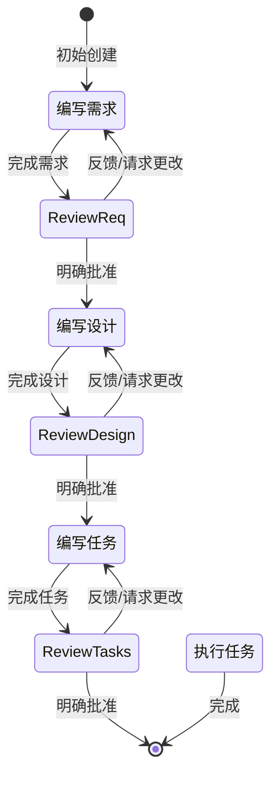

# Kiro Spec 工作流指南

## 概述

Spec 是一种结构化的方式来构建和记录功能。通过迭代式工作流，将想法转化为需求、设计和任务列表。

## 工作流阶段

### 1. 需求收集阶段

基于功能想法生成 EARS 格式的初始需求，然后与用户迭代完善。

关键约束：
- 必须创建 `.kiro/specs/{feature_name}/requirements.md` 文件
- 必须基于用户的粗略想法生成初始版本，不要先问一系列问题
- 必须使用以下格式：
  - 清晰的介绍部分总结功能
  - 分层编号的需求列表
  - 每个需求包含用户故事和验收标准（EARS 格式）

需求文档格式示例：
```md
# 需求文档

## 介绍
[介绍文本]

## 需求

### 需求 1
**用户故事：** 作为 [角色]，我想要 [功能]，以便 [收益]

#### 验收标准
1. 当 [事件] 时，系统应 [响应]
2. 如果 [前提条件]，系统应 [响应]
```

审核流程：
- 更新需求文档后，必须使用 'userInput' 工具询问用户
- 使用原因字符串：'spec-requirements-review'
- 必须在收到明确批准后才能进入设计阶段

### 2. 设计文档阶段

用户批准需求后，基于需求开发全面的设计文档。

关键约束：
- 必须创建 `.kiro/specs/{feature_name}/design.md` 文件
- 必须识别需要研究的领域
- 必须在对话中构建研究上下文（不创建单独的研究文件）
- 必须包含以下部分：
  - 概述
  - 架构
  - 组件和接口
  - 数据模型
  - 错误处理
  - 测试策略

审核流程：
- 更新设计文档后，必须使用 'userInput' 工具询问用户
- 使用原因字符串：'spec-design-review'
- 必须在收到明确批准后才能进入任务列表阶段

### 3. 任务列表阶段

用户批准设计后，创建基于需求和设计的可执行任务清单。

关键约束：
- 必须创建 `.kiro/specs/{feature_name}/tasks.md` 文件
- 必须格式化为带复选框的编号列表（最多两级层次）
- 每个任务必须包含：
  - 涉及编写、修改或测试代码的明确目标
  - 任务下的附加信息（子项目符号）
  - 对需求文档的具体引用

任务格式示例：
```md
# 实施计划

- [ ] 1. 设置项目结构和核心接口
  - 创建模型、服务、仓库和 API 组件的目录结构
  - 定义建立系统边界的接口
  - _需求：1.1_

- [ ] 2. 实现数据模型和验证
- [ ] 2.1 创建核心数据模型接口和类型
  - 编写所有数据模型的 TypeScript 接口
  - 实现数据完整性验证函数
  - _需求：2.1, 3.3, 1.2_
```

任务必须：
- 只包含编码代理可执行的任务（编写代码、创建测试等）
- 不包含用户测试、部署、性能指标收集等非编码活动
- 每个任务都是离散的、可管理的编码步骤
- 增量构建在前面的步骤之上

审核流程：
- 更新任务文档后，必须使用 'userInput' 工具询问用户
- 使用原因字符串：'spec-tasks-review'
- 必须在收到明确批准后才算完成

## 任务执行指南

执行任务时：
- 执行任何任务前，始终确保已读取 requirements.md、design.md 和 tasks.md
- 查看任务列表中的任务详情
- 如果任务有子任务，始终从子任务开始
- 一次只专注于一个任务，不要实现其他任务的功能
- 根据任务中指定的需求验证实现
- 完成任务后停止，让用户审核，不要自动继续下一个任务

## 重要执行指令

- 当希望用户审核某个阶段的文档时，必须使用 'userInput' 工具
- 必须让用户审核 3 个 spec 文档（需求、设计、任务）后才能进入下一阶段
- 每次文档更新或修订后，必须明确要求用户批准
- 必须在收到明确批准（"是"、"批准"或等效肯定回应）后才能进入下一阶段
- 如果用户提供反馈，必须进行修改，然后再次明确要求批准
- 必须继续反馈-修订循环，直到用户明确批准文档
- 必须按顺序遵循工作流步骤
- 必须一次只执行一个任务，完成后不要自动移动到下一个任务

## 工作流状态图


