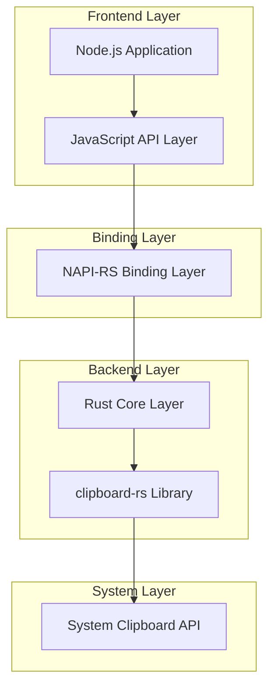
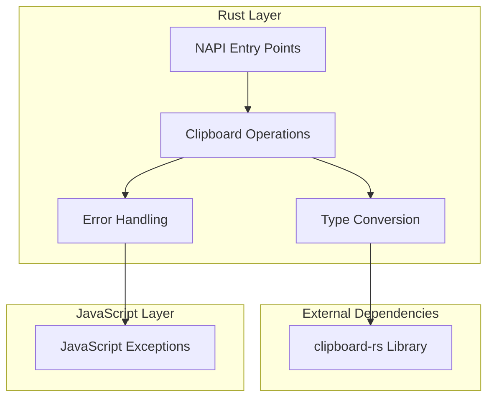

# Clipboard-RS Node.js 绑定技术架构文档

## 1. 架构设计



## 2. 技术描述

* **Frontend**: Node.js + TypeScript 类型定义

* **Binding**: <napi-rs@2.x> + napi-derive

* **Backend**: Rust + clipboard-rs\@0.8

* **Build Tools**: @napi-rs/cli + cargo

## 3. 项目结构

```
clipboard-rs-node/
├── src/
│   └── lib.rs              # Rust 源码入口
├── index.js                # JavaScript 入口文件
├── index.d.ts              # TypeScript 类型定义
├── package.json            # Node.js 包配置
├── Cargo.toml              # Rust 项目配置
├── build.rs                # 构建脚本
├── README.md               # 项目文档
└── __test__/               # 测试文件
    ├── clipboard.spec.js
    └── fixtures/
```

## 4. API 定义

### 4.1 核心 API

**剪贴板读取相关**

```typescript
// 读取文本
function readText(): string | null

// 读取图片
function readImage(): Buffer | null

// 读取文件路径
function readFiles(): string[] | null
```

**剪贴板写入相关**

```typescript
// 写入文本
function writeText(text: string): boolean

// 写入图片
function writeImage(imageBuffer: Buffer): boolean

// 写入文件路径
function writeFiles(filePaths: string[]): boolean
```

**类型检测相关**

```typescript
// 检测是否包含文本
function hasText(): boolean

// 检测是否包含图片
function hasImage(): boolean

// 检测是否包含文件
function hasFiles(): boolean
```

### 4.2 TypeScript 类型定义

```typescript
export interface ClipboardData {
  text?: string;
  image?: Buffer;
  files?: string[];
}

export type ClipboardFormat = 'text' | 'image' | 'files';

export interface ClipboardError extends Error {
  code: string;
  platform?: string;
}

// 主要 API 导出
export function readText(): string | null;
export function readImage(): Buffer | null;
export function readFiles(): string[] | null;
export function writeText(text: string): boolean;
export function writeImage(imageBuffer: Buffer): boolean;
export function writeFiles(filePaths: string[]): boolean;
export function hasText(): boolean;
export function hasImage(): boolean;
export function hasFiles(): boolean;
```

## 5. Rust 实现架构



## 6. 核心配置文件

### 6.1 Cargo.toml

```toml
[package]
name = "clipboard-rs-node"
version = "0.1.0"
edition = "2021"

[lib]
crate-type = ["cdylib"]

[dependencies]
napi = { version = "2.16", default-features = false, features = ["napi4"] }
napi-derive = "2.16"
clipboard-rs = "0.8"

[build-dependencies]
napi-build = "2.1"

[profile.release]
lto = true
codegen-units = 1
panic = "abort"
```

### 6.2 package.json

```json
{
  "name": "clipboard-rs-node",
  "version": "0.1.0",
  "description": "High-performance clipboard operations for Node.js using Rust",
  "main": "index.js",
  "types": "index.d.ts",
  "scripts": {
    "build": "napi build --platform --release",
    "build:debug": "napi build --platform",
    "test": "node __test__/clipboard.spec.js",
    "prepublishOnly": "npm run build"
  },
  "napi": {
    "name": "clipboard-rs-node",
    "triples": {
      "defaults": true,
      "additional": [
        "x86_64-pc-windows-msvc",
        "i686-pc-windows-msvc",
        "aarch64-apple-darwin",
        "x86_64-apple-darwin",
        "x86_64-unknown-linux-gnu",
        "aarch64-unknown-linux-gnu"
      ]
    }
  },
  "devDependencies": {
    "@napi-rs/cli": "^2.18.0"
  },
  "keywords": [
    "clipboard",
    "rust",
    "napi",
    "cross-platform",
    "native"
  ],
  "license": "MIT"
}
```

### 6.3 build.rs

```rust
fn main() {
  napi_build::setup();
}
```

## 7. 核心 Rust 实现示例

### 7.1 lib.rs 主要结构

```rust
use napi::bindgen_prelude::*;
use napi_derive::napi;
use clipboard_rs::{Clipboard, ClipboardContext};

#[napi]
pub fn read_text() -> Result<Option<String>> {
    let mut ctx = ClipboardContext::new()
        .map_err(|e| Error::from_reason(format!("Failed to create clipboard context: {}", e)))?;
    
    match ctx.get_text() {
        Ok(text) => Ok(Some(text)),
        Err(_) => Ok(None),
    }
}

#[napi]
pub fn write_text(text: String) -> Result<bool> {
    let mut ctx = ClipboardContext::new()
        .map_err(|e| Error::from_reason(format!("Failed to create clipboard context: {}", e)))?;
    
    match ctx.set_text(text) {
        Ok(_) => Ok(true),
        Err(e) => Err(Error::from_reason(format!("Failed to write text: {}", e))),
    }
}

#[napi]
pub fn read_image() -> Result<Option<Buffer>> {
    let mut ctx = ClipboardContext::new()
        .map_err(|e| Error::from_reason(format!("Failed to create clipboard context: {}", e)))?;
    
    match ctx.get_image() {
        Ok(image_data) => Ok(Some(image_data.into())),
        Err(_) => Ok(None),
    }
}

#[napi]
pub fn write_image(image_buffer: Buffer) -> Result<bool> {
    let mut ctx = ClipboardContext::new()
        .map_err(|e| Error::from_reason(format!("Failed to create clipboard context: {}", e)))?;
    
    let image_data: Vec<u8> = image_buffer.into();
    match ctx.set_image(image_data) {
        Ok(_) => Ok(true),
        Err(e) => Err(Error::from_reason(format!("Failed to write image: {}", e))),
    }
}

#[napi]
pub fn has_text() -> Result<bool> {
    let ctx = ClipboardContext::new()
        .map_err(|e| Error::from_reason(format!("Failed to create clipboard context: {}", e)))?;
    
    Ok(ctx.has_text())
}
```

## 8. 构建和部署流程

### 8.1 开发环境设置

```bash
# 安装 Rust
curl --proto '=https' --tlsv1.2 -sSf https://sh.rustup.rs | sh

# 安装 Node.js 依赖
npm install

# 构建项目
npm run build

# 运行测试
npm test
```

### 8.2 跨平台编译

```bash
# Windows
npm run build -- --target x86_64-pc-windows-msvc

# macOS
npm run build -- --target x86_64-apple-darwin
npm run build -- --target aarch64-apple-darwin

# Linux
npm run build -- --target x86_64-unknown-linux-gnu
```

### 8.3 发布流程

```bash
# 构建所有平台
npm run build:all

# 运行测试
npm test

# 发布到 npm
npm publish
```

