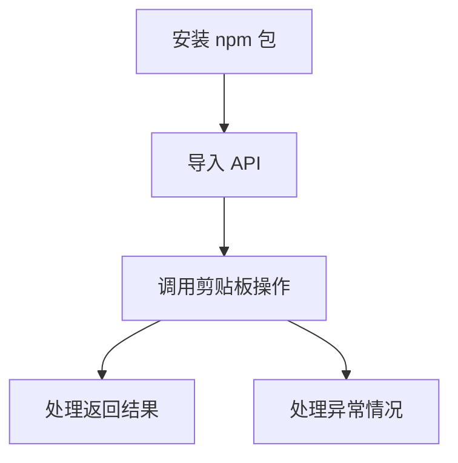

# Clipboard-RS Node.js 绑定项目需求文档

## 1. 产品概述

本项目旨在将 Rust 底层的 clipboard-rs 库封装为 Node.js 模块，通过 napi-rs 框架实现高性能的跨平台剪贴板操作功能。

该项目解决了 Node.js 生态中缺乏高性能、功能完整的剪贴板操作库的问题，为 Node.js 开发者提供了一个可靠的剪贴板管理解决方案。

目标是创建一个性能优异、功能丰富、易于使用的 Node.js 剪贴板库，支持文本、图片、文件等多种数据类型的读写操作。

## 2. 核心功能

### 2.1 用户角色

| 角色 | 使用方式 | 核心权限 |
|------|----------|----------|
| Node.js 开发者 | npm 安装使用 | 可以在 Node.js 项目中调用所有剪贴板 API |
| 库维护者 | 源码开发维护 | 可以修改 Rust 源码、发布新版本、维护文档 |

### 2.2 功能模块

本项目包含以下核心模块：

1. **剪贴板读取模块**：支持读取文本、图片、文件路径等多种格式的剪贴板内容
2. **剪贴板写入模块**：支持将文本、图片、文件路径等数据写入剪贴板
3. **类型检测模块**：检测当前剪贴板中的数据类型
4. **错误处理模块**：统一的错误处理和异常管理

### 2.3 功能详情

| 模块名称 | 功能名称 | 功能描述 |
|----------|----------|----------|
| 剪贴板读取模块 | 读取文本 | 从剪贴板读取纯文本内容，返回字符串或 null |
| 剪贴板读取模块 | 读取图片 | 从剪贴板读取图片数据，返回 Buffer 或 null |
| 剪贴板读取模块 | 读取文件路径 | 从剪贴板读取文件路径列表，返回字符串数组或 null |
| 剪贴板写入模块 | 写入文本 | 将文本内容写入剪贴板，返回操作成功状态 |
| 剪贴板写入模块 | 写入图片 | 将图片 Buffer 写入剪贴板，返回操作成功状态 |
| 剪贴板写入模块 | 写入文件路径 | 将文件路径列表写入剪贴板，返回操作成功状态 |
| 类型检测模块 | 检测数据类型 | 检测当前剪贴板中的数据类型（文本/图片/文件） |
| 错误处理模块 | 异常捕获 | 统一处理 Rust 层面的错误并转换为 JavaScript 异常 |

## 3. 核心流程

### 开发者使用流程

1. 开发者通过 npm 安装 clipboard-rs-node 包
2. 在 Node.js 项目中导入相关 API
3. 调用读取或写入方法操作剪贴板
4. 处理返回结果或异常

### 库维护流程

1. 维护者修改 Rust 源码
2. 使用 napi-rs 编译生成 Node.js 绑定
3. 运行测试确保功能正常
4. 发布新版本到 npm

## 4. 用户界面设计

### 4.1 设计风格

本项目为 Node.js 库，主要通过 API 接口提供服务，设计重点在于：

- **API 设计**：简洁直观的函数命名，符合 JavaScript 命名规范
- **类型定义**：完整的 TypeScript 类型定义，提供良好的开发体验
- **错误处理**：统一的错误格式，便于调试和处理
- **文档风格**：清晰的 API 文档，包含详细的使用示例

### 4.2 API 设计概览

| API 名称 | 参数类型 | 返回类型 | 描述 |
|----------|----------|----------|------|
| readText() | 无 | string \| null | 读取剪贴板文本内容 |
| readImage() | 无 | Buffer \| null | 读取剪贴板图片数据 |
| readFiles() | 无 | string[] \| null | 读取剪贴板文件路径 |
| writeText(text) | string | boolean | 写入文本到剪贴板 |
| writeImage(buffer) | Buffer | boolean | 写入图片到剪贴板 |
| writeFiles(paths) | string[] | boolean | 写入文件路径到剪贴板 |
| hasText() | 无 | boolean | 检测是否包含文本 |
| hasImage() | 无 | boolean | 检测是否包含图片 |
| hasFiles() | 无 | boolean | 检测是否包含文件 |

### 4.3 跨平台兼容性

项目支持 Windows、macOS 和 Linux 平台，通过 Rust 底层实现确保在不同操作系统上的一致性体验。所有 API 在各平台上保持相同的接口和行为。