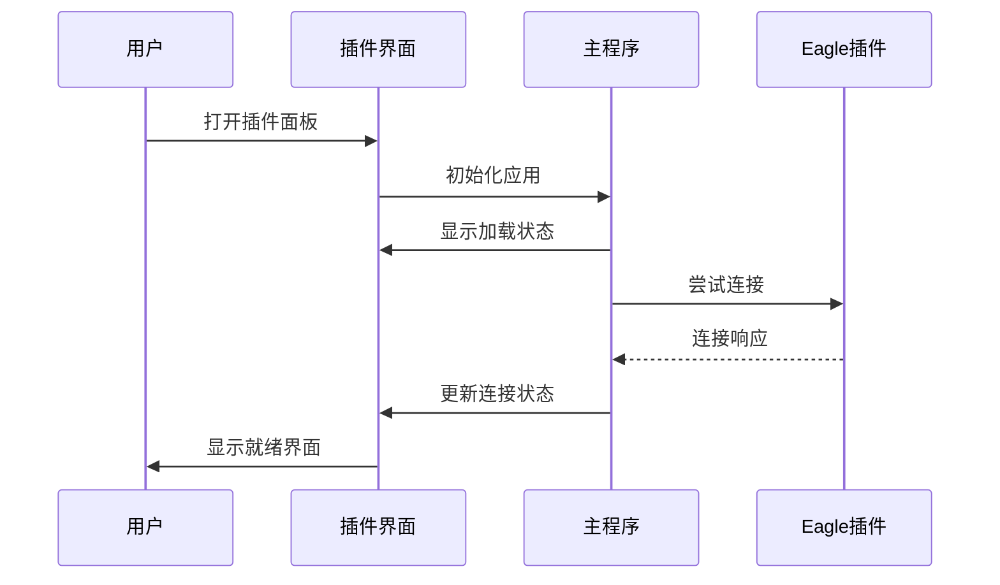

# AE插件UI交互指南

## 概述

本文档详细说明Eagle2Ae AE插件的用户界面交互流程、操作指南和最佳实践，包括最新的图层检测系统、弹窗交互机制以及Demo模式功能，帮助开发者理解用户操作逻辑和界面响应机制。

## 1. 插件启动和初始化流程

### 1.1 启动序列



### 1.2 初始化检查项

1. **CEP环境初始化**
   - 初始化CSInterface接口
   - 设置CEP调试模式
   - 加载扩展配置

2. **Eagle连接检测**
   - 自动发现Eagle端口（默认8080）
   - 建立HTTP通信连接
   - 获取Eagle基本信息和状态

3. **AE项目信息获取**
   - 通过ExtendScript读取当前项目状态
   - 获取活动合成信息
   - 更新项目信息显示

4. **拖拽系统初始化**
   - 设置全局拖拽事件监听器
   - 初始化拖拽视觉反馈系统
   - 配置文件类型检测机制

## 2. 连接状态管理

### 2.1 连接状态指示器

| 状态 | 颜色 | 显示文本 | 用户操作 |
|------|------|----------|----------|
| 未连接 | 灰色 | "未连接" | 点击测试连接 |
| 连接中 | 黄色 | "连接中..." | 等待连接完成 |
| 已连接 | 绿色 | "已连接 (XXms)" | 正常使用功能 |
| 连接失败 | 红色 | "连接失败" | 检查Eagle状态 |

### 2.2 连接测试流程

```javascript
// 连接测试逻辑
async function testConnection() {
    // 1. 更新UI状态为"连接中"
    updateConnectionStatus('connecting');
    
    try {
        // 2. 发送ping请求
        const startTime = Date.now();
        const response = await sendPingRequest();
        const pingTime = Date.now() - startTime;
        
        // 3. 更新为已连接状态
        updateConnectionStatus('connected', pingTime);
        
        // 4. 刷新Eagle信息
        await refreshEagleInfo();
        
    } catch (error) {
        // 5. 显示连接失败
        updateConnectionStatus('failed', error.message);
    }
}
```

## 3. 导入模式交互流程

### 3.1 导入模式选择

#### 直接导入模式
- **用户操作**: 点击"直接导入"按钮
- **UI响应**: 按钮高亮，其他模式取消选中
- **后台逻辑**: 设置导入模式为`direct`
- **适用场景**: 文件已在合适位置，无需移动

#### 项目旁复制模式
- **用户操作**: 点击"项目旁复制"按钮
- **UI响应**: 按钮高亮，可能弹出文件夹名称设置
- **配置选项**: 文件夹名称（默认：Eagle_Assets）
- **后台逻辑**: 计算项目文件旁边的目标路径

#### 指定文件夹模式
- **用户操作**: 点击"指定文件夹"按钮
- **UI响应**: 按钮高亮，弹出文件夹选择对话框
- **配置要求**: 必须设置有效的目标文件夹路径
- **路径验证**: 检查路径存在性和写入权限


## 4. 导入行为配置

> **核心文档**: 关于此功能的完整技术实现、数据流和代码示例，请参阅 [“导入行为”设置功能逻辑](../../panel-functions/import-behavior-settings.md)。

### 4.1 行为选项说明

此设置决定了素材在导入项目后，是否以及如何被添加到当前合成的时间轴中。

| 选项 | 值 | 功能描述 | 使用场景 |
|------|----|---------|---------|
| 不导入合成 | `no_import` | 仅将素材导入到项目面板，不执行任何时间轴操作。 | 批量导入大量素材，以便稍后手动整理和使用。 |
| 当前时间 | `current_time` | 将素材作为一个新图层，添加到当前合成中，其入点与时间轴的当前时间指示器对齐。 | 在视频的特定时间点精确插入视觉元素。 |
| 时间轴开始 | `timeline_start` | 将素材作为一个新图层，添加到当前合成中，其入点设置为 `0`。 | 适用于添加背景、水印或作为项目起始的基础图层。 |

### 4.2 行为选择逻辑

用户的选择会实时更新 `SettingsManager` 中的两个关键设置项：`addToComposition` (布尔值) 和 `timelineOptions.placement` (字符串)。

- 选择 **“不导入合成”** 会将 `addToComposition` 设置为 `false`。
- 选择 **“当前时间”** 或 **“时间轴开始”** 会将 `addToComposition` 设置为 `true`，并将 `timelineOptions.placement` 设置为对应的值 (`current_time` 或 `timeline_start`)。

### 4.3 设置传递与执行流程

时间轴设置从UI传递到ExtendScript的完整流程如下：

1.  **UI设置更新**: 用户在UI上选择后，`main.js` 中的监听器立即调用 `SettingsManager` 的 `updateField` 方法，将 `addToComposition` 和 `timelineOptions.placement` 的值实时保存到 `localStorage`。
2.  **参数构建**: 当导入开始时，`FileHandler.js` 从 `SettingsManager` 获取包含这两个设置的完整 `settings` 对象。
3.  **参数传递**: `FileHandler.js` 将整个 `settings` 对象序列化为JSON，并作为参数传递给 `hostscript.jsx` 中的 `importFilesWithSettings` 函数。
4.  **ExtendScript处理**: 在 `hostscript.jsx` 中：
    - 首先检查 `settings.addToComposition` 的值。如果为 `false`，则导入流程在将素材添加到项目面板后即告结束。
    - 如果为 `true`，脚本会继续将素材添加到当前合成，然后读取 `settings.timelineOptions.placement` 的值，并据此将新图层的 `startTime` 设置为 `comp.time` 或 `0`。

## 5. 文件拖拽交互系统

### 5.1 拖拽系统初始化

```javascript
// 拖拽系统设置 (setupDragAndDrop方法)
setupDragAndDrop() {
    try {
        // 防止默认拖拽行为
        document.addEventListener('dragover', (e) => {
            e.preventDefault();
            e.stopPropagation();
            // 添加视觉反馈
            document.body.classList.add('drag-over');
        });

        document.addEventListener('dragenter', (e) => {
            e.preventDefault();
            e.stopPropagation();
        });

        document.addEventListener('dragleave', (e) => {
            // 只有当拖拽完全离开窗口时才移除样式
            if (e.clientX === 0 && e.clientY === 0) {
                document.body.classList.remove('drag-over');
            }
        });

        // 处理文件拖拽
        document.addEventListener('drop', this.handleFileDrop.bind(this));
    } catch (error) {
        this.log(`设置拖拽监听失败: ${error.message}`, 'error');
    }
}
```

### 5.2 文件拖拽处理流程

#### 5.2.1 主要拖拽处理方法

```javascript
// 处理文件拖拽 (handleFileDrop方法)
async handleFileDrop(event) {
    event.preventDefault();
    event.stopPropagation();

    // 移除视觉反馈
    document.body.classList.remove('drag-over');

    try {
        const files = Array.from(event.dataTransfer.files);
        const items = Array.from(event.dataTransfer.items);
        
        if (files.length === 0 && items.length === 0) {
            this.showDropMessage('未检测到文件', 'warning');
            return;
        }

        // 检查是否包含文件夹
        const hasDirectories = items.some(item => 
            item.webkitGetAsEntry && item.webkitGetAsEntry()?.isDirectory
        );
        
        if (hasDirectories) {
            // 处理文件夹拖拽（可能包含序列帧）
            await this.handleDirectoryDrop(items, files);
        } else {
            // 处理普通文件拖拽
            await this.handleFilesDrop(files, event.dataTransfer);
        }
    } catch (error) {
        this.log(`处理拖拽失败: ${error.message}`, 'error');
        this.showDropMessage('拖拽处理失败', 'error');
    }
}
```

#### 5.2.2 Eagle拖拽识别机制

```javascript
// Eagle拖拽识别 (isEagleDrag方法)
isEagleDrag(dataTransfer, files) {
    try {
        // 方法1：检查文件路径特征
        const hasEaglePath = files.some(file => {
            const path = file.path || file.webkitRelativePath || '';
            const pathLower = path.toLowerCase();
            return pathLower.includes('eagle') ||
                   pathLower.includes('.eaglepack') ||
                   pathLower.includes('library.library') ||
                   (pathLower.includes('images') && pathLower.includes('library'));
        });

        // 方法2：检查自定义数据类型
        const hasEagleData = dataTransfer.types.some(type => {
            const typeLower = type.toLowerCase();
            return typeLower.includes('eagle') ||
                   typeLower.includes('x-eagle') ||
                   typeLower.includes('application/x-eagle');
        });

        // 方法3：检查拖拽来源信息
        const plainText = dataTransfer.getData('text/plain') || '';
        const plainTextLower = plainText.toLowerCase();
        const hasEagleMetadata = plainTextLower.includes('eagle') ||
                               plainTextLower.includes('.eaglepack') ||
                               plainTextLower.includes('library.library');

        return hasEaglePath || hasEagleData || hasEagleMetadata;
    } catch (error) {
        this.log(`Eagle拖拽检测失败: ${error.message}`, 'error');
        return false;
    }
}
```

### 5.3 拖拽视觉反馈系统

#### 5.3.1 CSS样式实现

```css
/* 拖拽悬停时的整体效果 */
body.drag-over {
    transition: all 0.3s ease;
}

/* 拖拽时的背景蒙版 */
body.drag-over::before {
    content: '';
    position: fixed;
    top: 0; left: 0; right: 0; bottom: 0;
    background: rgba(0, 0, 0, 0.6);
    backdrop-filter: blur(4px);
    z-index: 999;
    pointer-events: none;
    animation: fadeIn 0.3s ease;
}

/* 拖拽时的边框效果 */
body.drag-over::after {
    content: '';
    position: fixed;
    top: 8px; left: 8px; right: 8px; bottom: 8px;
    border: 2px dashed #3498db;
    border-radius: 12px;
    z-index: 1000;
    pointer-events: none;
    animation: dragPulse 1.5s ease-in-out infinite alternate;
}

/* 拖拽时的中央提示 */
.drag-overlay {
    position: fixed;
    top: 50%; left: 50%;
    transform: translate(-50%, -50%);
    text-align: center;
    z-index: 1002;
    pointer-events: none;
    opacity: 0;
    transition: opacity 0.3s ease;
}

body.drag-over .drag-overlay {
    opacity: 1;
}
```

#### 5.3.2 视觉反馈组件

1. **背景蒙版**: 半透明黑色背景，带模糊效果
2. **边框动画**: 蓝色虚线边框，脉冲动画效果
3. **中央提示**: 显示"+"图标和"拖拽文件到此处"文字
4. **状态消息**: 右上角滑入式消息提示

### 5.4 文件夹和序列帧处理

#### 5.4.1 文件夹拖拽处理

```javascript
// 处理文件夹拖拽 (handleDirectoryDrop方法)
async handleDirectoryDrop(items, files) {
    this.log('检测到文件夹拖拽，开始处理...', 'info');
    
    const allFiles = [];
    
    // 递归读取文件夹内容
    for (const item of items) {
        const entry = item.webkitGetAsEntry();
        if (entry) {
            const entryFiles = await this.readDirectoryEntry(entry);
            allFiles.push(...entryFiles);
        }
    }
    
    // 添加直接拖拽的文件
    allFiles.push(...files);
    
    if (allFiles.length === 0) {
        this.showDropMessage('文件夹中没有找到可导入的文件', 'warning');
        return;
    }
    
    // 分析文件类型和序列帧
    const analysis = this.analyzeDroppedFiles(allFiles);
    
    // 显示导入选项对话框
    this.showFileImportDialog(allFiles, analysis);
}
```

#### 5.4.2 文件分析和分类

```javascript
// 分析拖拽的文件 (analyzeDroppedFiles方法)
analyzeDroppedFiles(files) {
    const analysis = {
        total: files.length,
        categories: {
            image: [], video: [], audio: [],
            design: [], project: [], unknown: []
        },
        sequences: [],
        folders: new Set()
    };
    
    // 按文件夹分组
    const folderGroups = {};
    
    files.forEach(file => {
        const category = this.getFileCategory(file);
        analysis.categories[category].push(file);
        
        // 提取文件夹路径
        const path = file.fullPath || file.relativePath || file.webkitRelativePath || '';
        const folderPath = path.substring(0, path.lastIndexOf('/'));
        
        if (folderPath) {
            analysis.folders.add(folderPath);
            if (!folderGroups[folderPath]) {
                folderGroups[folderPath] = [];
            }
            folderGroups[folderPath].push(file);
        }
    });
    
    // 检测序列帧
    for (const [folderPath, folderFiles] of Object.entries(folderGroups)) {
        const sequence = this.detectImageSequence(folderFiles);
        if (sequence) {
            analysis.sequences.push(sequence);
        }
    }
    
    return analysis;
}
```

### 5.5 导入确认弹窗系统

#### 5.5.1 弹窗触发条件

弹窗会在以下情况下自动触发：

1. **文件夹拖拽**: 检测到文件夹结构时
2. **序列帧检测**: 发现图像序列时
3. **混合文件类型**: 包含多种文件类型时
4. **大量文件**: 文件数量超过阈值时
5. **非Eagle拖拽**: 普通文件拖拽需要确认时
6. **合成检查**: 当用户设置为添加到合成但当前无活动合成时

#### 5.5.2 合成检查机制

在拖拽导入过程中，系统会检查用户的合成设置和当前AE项目状态：

```javascript
// 合成检查逻辑
function checkCompositionStatus(settings) {
    // 检查用户是否设置了添加到合成
    if (settings.addToComposition) {
        // 获取当前活动合成
        const activeComp = app.project.activeItem;
        
        // 如果没有活动合成或活动项不是合成
        if (!activeComp || !(activeComp instanceof CompItem)) {
            return {
                needsConfirmation: true,
                reason: 'no_active_composition',
                message: '当前没有活动的合成，是否继续导入？'
            };
        }
    }
    
    return {
        needsConfirmation: false
    };
}
```

## 5. 文件拖拽交互系统

插件的拖拽导入功能是一个核心交互，它支持两种主要的拖拽来源：**从Eagle客户端拖拽**和**从操作系统直接拖拽文件/文件夹**。两者共享一套处理流水线，但入口和预处理步骤有所不同。

### 5.1 统一事件入口: `handleFileDrop`

所有拖拽操作的起点是 `main.js` 中的 `setupDragAndDrop()` 方法，它为整个插件面板注册了 `drop` 事件监听器，并统一由 `handleFileDrop()` 函数处理。

`handleFileDrop()` 的核心职责是作为**拖拽来源的路由器**。

```javascript
// 真实实现: AEExtension.handleFileDrop() in main.js
dropZone.addEventListener('drop', (e) => {
    e.preventDefault();
    e.stopPropagation();
    dropZone.classList.remove('drag-over');

    // 关键：检查拖拽事件是否来自Eagle
    if (this.isEagleDrag(e.dataTransfer)) {
        // 路径A: Eagle客户端拖拽
        this.handleEagleDragImport(e.dataTransfer);
    } else {
        // 路径B: 操作系统拖拽
        // 注意：此处的逻辑在真实代码中更为复杂，涉及文件夹读取
        // 此处为简化示意，实际会调用 handleDirectoryDrop 等
        const files = Array.from(e.dataTransfer.files);
        if (files.length > 0) {
            // 构造一个标准消息体，并进入通用处理流程
            const message = { files: files, isDragImport: true, source: 'os_drag' };
            this.handleImportFiles(message);
        }
    }
});
```

### 5.2 拖拽源识别: `isEagleDrag`

`handleFileDrop` 函数依赖 `isEagleDrag` 的返回值来区分来源。文档中旧的复杂实现已被废弃，当前代码中的实现非常简洁高效：

```javascript
// 真实实现: AEExtension.isEagleDrag() in main.js
isEagleDrag(dataTransfer) {
    if (!dataTransfer) return false;

    const types = dataTransfer.types;
    if (types.includes('text/uri-list')) {
        const url = dataTransfer.getData('text/uri-list');
        // 核心检查：只验证拖拽数据是否为 eagle:// 协议
        if (url.startsWith('eagle://')) {
            return true;
        }
    }
    return false;
}
```

### 5.3 路径A: Eagle客户端拖拽流程

此路径用于处理从Eagle客户端拖拽素材的场景，流程相对直接：

1.  **触发**: `isEagleDrag` 返回 `true`。
2.  **执行**: `handleEagleDragImport()` 函数被调用。
3.  **解析**: 该函数从 `dataTransfer` 中获取 `eagle://` 协议的URL，并调用 `parseEagleUrl()` 将URL中的数据解析成一个包含文件完整信息（路径、元数据等）的数组。
4.  **汇合**: 将解析出的文件数组打包成一个标准消息对象，然后直接调用 `handleImportFiles()`，进入通用的导入处理流水线。

### 5.4 路径B: 操作系统拖拽流程

此路径用于处理用户从桌面或文件管理器直接拖拽文件或文件夹的场景，流程更为复杂：

1.  **触发**: `isEagleDrag` 返回 `false`。
2.  **执行**: `handleDirectoryDrop()` (或类似的) 函数被调用。
3.  **文件读取**: 使用 `item.webkitGetAsEntry()` API 遍历所有拖入的项目，如果是文件夹，则**递归读取**其中所有的文件。
4.  **分析与检测**: 所有文件被收集后，传递给 `analyzeDroppedFiles()` 函数。此函数会：
    *   对文件进行分类（图像、视频等）。
    *   **调用 `detectImageSequence()` 对图像文件进行序列帧检测**。
5.  **用户确认**: 分析结果会通过 `showFileImportDialog()` 以一个自定义的HTML对话框呈现给用户，让用户选择导入方式（例如“作为序列导入”或“作为独立文件导入”）。
6.  **汇合**: 根据用户的选择，将相应的文件列表打包成一个标准消息对象，然后调用 `handleImportFiles()`，进入通用的导入处理流水线。

### 5.5 流程汇合与委托: `handleImportFiles`

`handleImportFiles` 是所有拖拽导入方式的最终汇合点。它的核心职责是：

1.  执行导入前的预检，例如检查当前AE中是否有活动的合成。
2.  从 `SettingsManager` 中获取最新的导入设置。
3.  将文件列表和设置参数，统一委托给 `FileHandler.js` 服务模块进行下一步的重度操作。

### 5.6 核心处理器: `FileHandler.js`

`FileHandler` 是实际执行文件操作的“工人”。在收到 `handleImportFiles` 的任务后，它会：

1.  **模式路由**: 调用 `processFilesByMode()`，根据用户的导入模式（`direct`, `project_adjacent`, `custom_folder`）选择不同的处理路径。
2.  **文件操作**: 如果导入模式需要，`FileHandler` 会负责将源文件复制到目标位置（例如项目文件旁的 `Eagle_Assets` 文件夹）。
3.  **调用JSX**: 当所有文件在物理磁盘上准备就绪后，`FileHandler` 会调用 `importFilesToAE()`，将**最终有效的文件路径列表**和相关设置打包成一个大型JSON对象，通过 `evalScript` 传递给 `hostscript.jsx` 中的 `importFilesWithSettings` 函数，完成在AE项目中的最终导入。
"/g, '\\"');
    const escapedMessage = message.replace(/"/g, '\\"').replace(/\n/g, '\\n');
    
    // 构建ExtendScript调用
    const confirmScript = `showPanelConfirmDialog("${escapedTitle}", "${escapedMessage}")`;
    
    return new Promise((resolve) => {
        csInterface.evalScript(confirmScript, (result) => {
            // 解析结果：0表示确认，1表示取消
            const confirmed = parseInt(result) === 0;
            resolve(confirmed);
        });
    });
}

// ExtendScript端实现 (dialog-warning.jsx)
function showPanelConfirmDialog(title, message, button1Text, button2Text) {
    try {
        // 创建Panel样式对话框
        var dialog = new Window("dialog", title || "确认");
        dialog.orientation = "column";
        dialog.alignChildren = "fill";
        dialog.spacing = 10;
        dialog.margins = 16;
        
        // 添加消息文本
        var messageGroup = dialog.add("group");
        messageGroup.orientation = "column";
        messageGroup.alignChildren = "left";
        
        var messageText = messageGroup.add("statictext", undefined, message || "请确认操作", {multiline: true});
        messageText.preferredSize.width = 350;
        
        // 添加按钮组
        var buttonGroup = dialog.add("group");
        buttonGroup.alignment = "center";
        buttonGroup.spacing = 10;
        
        var confirmBtn = buttonGroup.add("button", undefined, button1Text || "继续导入");
        var cancelBtn = buttonGroup.add("button", undefined, button2Text || "取消");
        
        // 设置按钮事件
        confirmBtn.onClick = function() {
            dialog.close(0); // 返回0表示确认
        };
        
        cancelBtn.onClick = function() {
            dialog.close(1); // 返回1表示取消
        };
        
        // 设置默认按钮和键盘快捷键
        confirmBtn.active = true;
        dialog.defaultElement = confirmBtn;
        dialog.cancelElement = cancelBtn;
        
        // 显示对话框并返回结果
        return dialog.show();
        
    } catch (error) {
        // 如果Panel创建失败，降级到原生confirm
        return confirm(message || "请确认操作") ? 0 : 1;
    }
}
```