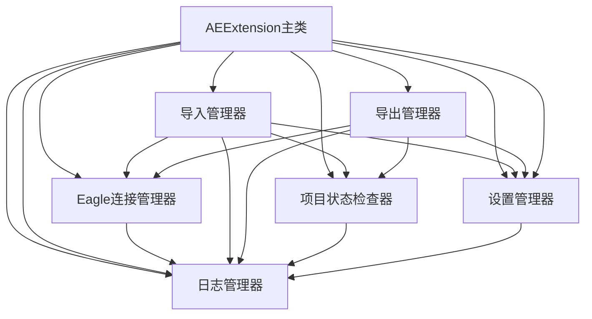

# AE 扩展 - 核心组件

欢迎查阅 Eagle2Ae AE 扩展的核心组件文档。本部分详细描述了扩展中各个核心组件的设计原理、技术实现和使用方法。

## 📚 核心组件目录

### 主要组件
- **[AE扩展主类](./ae-extension.md)** - 扩展的核心管理类，负责协调和管理所有组件
- **[Eagle连接管理器](./eagle-connection-manager.md)** - 管理与Eagle应用程序的连接状态
- **[导入管理器](./import-manager.md)** - 处理从Eagle素材库到AE的素材导入流程
- **[导出管理器](./export-manager.md)** - 处理从AE项目到Eagle素材库的素材导出流程

### 辅助组件
- **[项目状态检查器](./project-status-checker.md)** - 验证After Effects项目的当前状态
- **[设置管理器](./settings-manager.md)** - 管理扩展的所有配置设置
- **[日志管理器](./log-manager.md)** - 管理和记录扩展运行过程中的所有日志信息

## 🎯 组件架构

### 核心组件关系图



### 组件依赖关系

1. **AEExtension主类** - 作为核心协调器，依赖所有其他组件
2. **Eagle连接管理器** - 被导入管理器和导出管理器依赖，用于与Eagle通信
3. **项目状态检查器** - 被导入管理器和导出管理器依赖，用于验证项目状态
4. **设置管理器** - 被所有组件依赖，提供配置管理
5. **日志管理器** - 被所有组件依赖，提供日志记录功能
6. **导入管理器** - 依赖Eagle连接管理器、项目状态检查器、设置管理器
7. **导出管理器** - 依赖Eagle连接管理器、项目状态检查器、设置管理器

## 🛠️ 组件交互

### 事件驱动架构
所有核心组件都基于事件驱动架构设计，支持组件间的松耦合通信：

1. **状态变更事件** - 当组件状态发生变化时触发
2. **操作完成事件** - 当异步操作完成时触发
3. **错误事件** - 当发生错误时触发
4. **配置变更事件** - 当设置发生变化时触发

### 数据流设计
组件间的数据流遵循以下原则：

1. **单向数据流** - 数据从上层组件流向底层组件
2. **状态提升** - 共享状态由上层组件管理
3. **事件下沉** - 用户操作事件向上传递

## 📖 使用指南

### 组件初始化顺序

```javascript
// 1. 初始化日志管理器（最先）
const logManager = new LogManager(aeExtension);

// 2. 初始化设置管理器
const settingsManager = new SettingsManager(aeExtension);

// 3. 初始化项目状态检查器
const projectStatusChecker = new ProjectStatusChecker(aeExtension);

// 4. 初始化Eagle连接管理器
const eagleConnectionManager = new EagleConnectionManager(aeExtension);

// 5. 初始化导入管理器
const importManager = new ImportManager(aeExtension);

// 6. 初始化导出管理器
const exportManager = new ExportManager(aeExtension);

// 7. 初始化AE扩展主类（最后）
const aeExtension = new AEExtension();
```

### 组件间通信示例

```javascript
// 监听设置变更事件
settingsManager.addFieldListener('import.mode', (newValue, oldValue) => {
    // 当导入模式变更时，更新导入管理器的配置
    importManager.updateConfig({ mode: newValue });
});

// 监听连接状态变更
eagleConnectionManager.addConnectListener((connectionInfo) => {
    // 当Eagle连接建立时，启用相关功能
    importManager.enableEagleFeatures(true);
    exportManager.enableEagleFeatures(true);
});

// 监听项目状态变更
projectStatusChecker.addStatusChangeListener((status) => {
    // 当项目状态变更时，更新UI状态
    updateProjectStatusUI(status);
});
```

## 🎯 最佳实践

### 组件设计原则

1. **单一职责** - 每个组件只负责一个特定功能
2. **高内聚低耦合** - 组件内部功能紧密相关，组件间依赖最小化
3. **可测试性** - 组件设计便于单元测试和集成测试
4. **可扩展性** - 组件设计支持功能扩展和定制

### 性能优化建议

1. **合理使用缓存** - 对于频繁访问的数据使用缓存机制
2. **避免重复初始化** - 组件应支持单例模式或重用机制
3. **异步操作** - 耗时操作使用异步处理避免阻塞UI
4. **内存管理** - 及时清理事件监听器和定时器

### 错误处理策略

1. **统一错误处理** - 使用日志管理器记录所有错误
2. **优雅降级** - 组件应支持在部分功能不可用时的降级处理
3. **用户友好提示** - 错误信息应提供清晰的解决建议
4. **错误恢复机制** - 支持自动重试和手动恢复操作

---
**请使用左侧导航栏浏览各个核心组件的详细文档。**