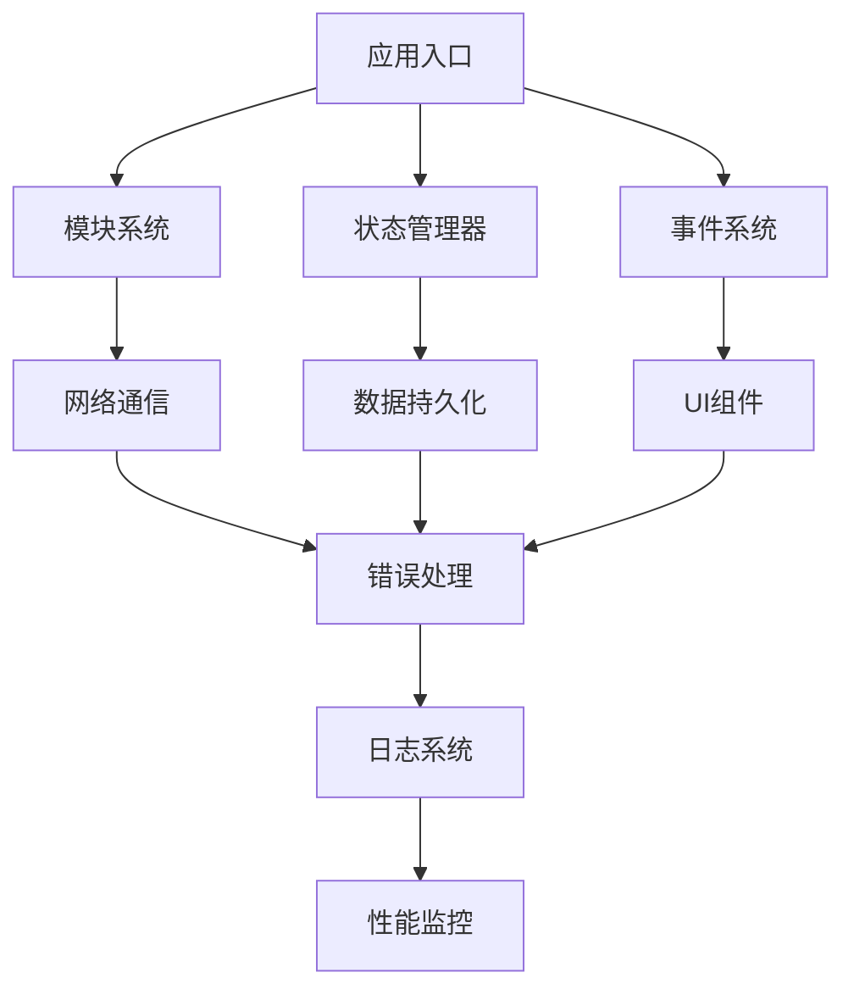

# JavaScript核心功能

欢迎查阅 Eagle2Ae AE 扩展的 JavaScript 核心功能文档。本部分详细描述了扩展中使用的现代化 JavaScript 框架和核心功能模块。

## 📚 核心功能目录

### 基础框架
- **[模块系统](./module-system.md)** - ES6模块的兼容性封装和支持
- **[状态管理](./state-management.md)** - 响应式状态管理功能
- **[事件系统](./event-system.md)** - 统一的事件处理机制
- **[网络通信](./network-communication.md)** - HTTP请求客户端和WebSocket支持

### 高级功能
- **[数据持久化](./data-persistence.md)** - 本地存储和IndexedDB支持
- **[性能优化](./performance-optimization.md)** - 虚拟滚动、懒加载等优化技术
- **[错误处理](./error-handling.md)** - 统一的错误处理和恢复机制
- **[日志系统](./logging-system.md)** - 详细的日志记录和调试功能

## 🎯 功能特点

### 现代化架构
- 基于ES6+标准的现代化JavaScript实现
- 模块化设计，支持按需加载
- 响应式编程模型，提高开发效率

### 高性能优化
- 虚拟滚动支持大数据列表渲染
- 懒加载机制优化资源加载
- 内存泄漏防护和自动清理机制
- 请求缓存和重试机制

### 完善的监控体系
- 详细的性能监控和统计
- 完整的错误追踪和日志记录
- 实时的状态变更追踪

## 🛠️ 技术实现概述

### 核心组件关系



### 设计原则

1. **单一职责** - 每个模块只负责一个特定功能
2. **高内聚低耦合** - 模块内部功能紧密相关，模块间依赖最小化
3. **可测试性** - 所有模块都支持单元测试和集成测试
4. **可扩展性** - 支持插件机制和功能扩展

## 📖 使用指南

### 基础使用

```javascript
// 1. 模块导入
import { loadModule, defineModule } from './core/module-system.js';

// 2. 状态管理
import { setState, getState, subscribe } from './core/state-management.js';

// 3. 事件处理
import { on, emit, off } from './core/event-system.js';

// 4. 网络请求
import { get, post, request } from './core/network-communication.js';
```

### 高级功能

```javascript
// 1. 状态订阅
const unsubscribe = subscribe('user.profile', (data) => {
    console.log('用户资料变更:', data);
});

// 2. 事件监听
on('app:ready', () => {
    console.log('应用已就绪');
});

// 3. HTTP请求拦截
addRequestInterceptor((config) => {
    config.headers.Authorization = `Bearer ${getToken()}`;
    return config;
});

// 4. 性能监控
const stats = getPerformanceStats();
console.log('性能统计:', stats);
```

## 🎯 最佳实践

### 开发建议

1. **模块化开发** - 使用ES6模块系统组织代码
2. **状态驱动** - 优先使用状态管理而非直接DOM操作
3. **事件驱动** - 组件间通信使用事件系统
4. **错误处理** - 统一使用错误处理模块

### 性能优化

1. **合理使用缓存** - 对于频繁访问的数据使用缓存机制
2. **避免重复请求** - 使用请求去重和缓存策略
3. **异步操作** - 耗时操作使用异步处理避免阻塞UI
4. **内存管理** - 及时清理事件监听器和定时器

### 调试技巧

1. **启用详细日志** - 在开发环境中启用详细日志输出
2. **使用监控工具** - 利用性能监控功能定位性能瓶颈
3. **错误追踪** - 通过错误处理系统快速定位问题
4. **状态追踪** - 使用状态管理器的变更历史功能

---
**请使用左侧导航栏浏览各个核心功能的详细文档。**