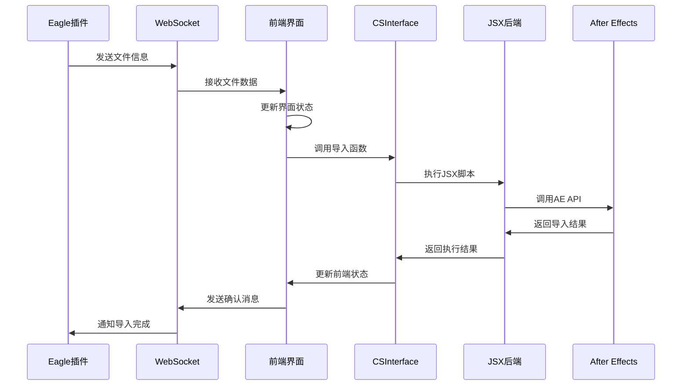
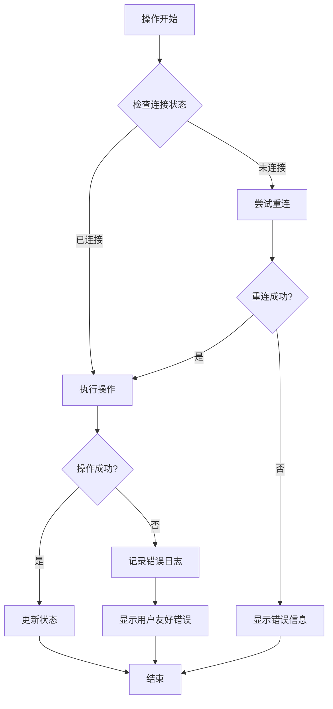

# CEP 扩展架构设计

## 概述

Eagle2Ae-Ae 是基于 Adobe CEP (Common Extensibility Platform) 框架开发的 After Effects 扩展，采用模块化架构设计，实现了前端界面与 ExtendScript 后端的分离，以及与 Eagle 插件的高效通信。

## 整体架构

### 架构图

```
┌─────────────────────────────────────────────────────────────────────────────┐
│                           After Effects                                    │
│  ┌─────────────────────────────────────────────────────────────────────┐    │
│  │                      Eagle2Ae CEP 扩展 v2.1.1                      │    │
│  │                                                                     │    │
│  │  ┌─────────────┐  ┌─────────────┐  ┌─────────────┐  ┌─────────────┐  │    │
│  │  │   前端界面   │  │   通信模块   │  │   文件处理   │  │   设置管理   │  │    │
│  │  │ (HTML/JS)   │  │(双协议支持) │  │   (多模式)   │  │   (JSON)    │  │    │
│  │  │             │  │             │  │             │  │             │  │    │
│  │  │ • 用户交互   │  │ • WebSocket │  │ • 直接导入   │  │ • 用户偏好   │  │    │
│  │  │ • 状态显示   │  │ • HTTP轮询  │  │ • 项目旁复制 │  │ • 导入配置   │  │    │
│  │  │ • 日志面板   │  │ • 端口广播  │  │ • 自定义路径 │  │ • 缓存管理   │  │    │
│  │  │ • 拖拽支持   │  │ • 自动重连  │  │ • 静默模式   │  │             │  │    │
│  │  └─────────────┘  └─────────────┘  └─────────────┘  └─────────────┘  │    │
│  │         │                │                │                │         │    │
│  │         └────────────────┼────────────────┼────────────────┘         │    │
│  │                          ▼                ▼                          │    │
│  │  ┌─────────────────────────────────────────────────────────────────┐  │    │
│  │  │                    AEExtension 主控制器                        │  │    │
│  │  │                                                                 │  │    │
│  │  │  ┌─────────────┐  ┌─────────────┐  ┌─────────────┐  ┌─────────┐  │  │    │
│  │  │  │ 轮询管理器   │  │ 连接监控器   │  │ 日志管理器   │  │ 音效播放 │  │  │    │
│  │  │  │PollingMgr   │  │ConnectionMon│  │ LogManager  │  │SoundPlay│  │  │    │
│  │  │  └─────────────┘  └─────────────┘  └─────────────┘  └─────────┘  │  │    │
│  │  └─────────────────────────────────────────────────────────────────┘  │    │
│  │                                    │                                   │    │
│  │                                    ▼                                   │    │
│  │  ┌─────────────────────────────────────────────────────────────────┐  │    │
│  │  │                  CSInterface 桥接层                             │  │    │
│  │  │              (前端 ↔ ExtendScript 通信)                        │  │    │
│  │  └─────────────────────────────────────────────────────────────────┘  │    │
│  │                                    │                                   │    │
│  │                                    ▼                                   │    │
│  │  ┌─────────────────────────────────────────────────────────────────┐  │    │
│  │  │                ExtendScript 后端 (JSX) v2.1.1                  │  │    │
│  │  │                                                                 │  │    │
│  │  │  ┌─────────────┐  ┌─────────────┐  ┌─────────────┐  ┌─────────┐  │  │    │
│  │  │  │ 文件导入器   │  │ 项目管理器   │  │ 对话框系统   │  │ 序列帧   │  │  │    │
│  │  │  │importFiles  │  │getProjectInf│  │showWarning  │  │ 识别器   │  │  │    │
│  │  │  │             │  │             │  │Dialog       │  │         │  │  │    │
│  │  │  │ • 多格式支持 │  │ • 项目状态   │  │ • 用户提示   │  │ • 自动检测│  │  │    │
│  │  │  │ • 中文文件名 │  │ • 合成信息   │  │ • 错误处理   │  │ • 帧率设置│  │  │    │
│  │  │  │ • 批量导入   │  │ • 路径获取   │  │             │  │         │  │  │    │
│  │  │  └─────────────┘  └─────────────┘  └─────────────┘  └─────────┘  │  │    │
│  │  └─────────────────────────────────────────────────────────────────┘  │    │
│  └─────────────────────────────────────────────────────────────────────┘    │
└─────────────────────────────────────────────────────────────────────────────┘
                                      │
                                      ▼ (双协议通信)
                    ┌─────────────────────────────────────┐
                    │            通信协议选择              │
                    │                                     │
                    │  WebSocket (ws://localhost:8080)   │
                    │  ├─ 实时双向通信                     │
                    │  ├─ 自动重连机制                     │
                    │  └─ 心跳检测                        │
                    │                                     │
                    │  HTTP 轮询 (http://localhost:8080)  │
                    │  ├─ 兼容性更好                       │
                    │  ├─ 防火墙友好                       │
                    │  └─ 500ms 轮询间隔                   │
                    └─────────────────────────────────────┘
                                      │
                                      ▼
┌─────────────────────────────────────────────────────────────────────────────┐
│                            Eagle 插件                                      │
│                                                                             │
│  ┌─────────────┐  ┌─────────────┐  ┌─────────────┐  ┌─────────────────────┐ │
│  │ WebSocket   │  │ HTTP 服务器  │  │ 文件管理器   │  │    数据库接口        │ │
│  │ 服务器       │  │             │  │             │  │                     │ │
│  │             │  │ • 轮询端点   │  │ • 文件监控   │  │ • Eagle 数据库       │ │
│  │ • 实时通信   │  │ • 状态检查   │  │ • 路径解析   │  │ • 标签管理          │ │
│  │ • 消息路由   │  │ • 端口广播   │  │ • 元数据提取 │  │ • 搜索功能          │ │
│  └─────────────┘  └─────────────┘  └─────────────┘  └─────────────────────┘ │
└─────────────────────────────────────────────────────────────────────────────┘
```

### 核心组件

#### 1. 前端界面层 (Frontend Layer)
- **技术栈**: HTML5, CSS3, JavaScript ES6+
- **主要功能**:
  - 用户交互界面 (拖拽、点击、设置)
  - 实时状态显示 (连接状态、导入进度)
  - 日志面板 (AE日志、Eagle日志切换)
  - 剪贴板粘贴支持 (Ctrl+V/Cmd+V)
  - 拖拽文件导入
- **特点**: 响应式设计、实时状态更新、多语言支持

#### 2. 通信模块 (Communication Module)
- **双协议支持**:
  - **WebSocket模式**: `Eagle2AeWebSocketClient`
    - 实时双向通信
    - 自动重连机制 (最大5次)
    - 心跳检测 (30秒间隔)
    - 消息处理器映射
  - **HTTP轮询模式**: `PollingManager`
    - 500ms轮询间隔
    - 兼容性更好
    - 防火墙友好
    - 消息去重机制
- **端口管理**:
  - 动态端口分配 (8080-8089)
  - 端口广播机制
  - 自动端口发现
- **特点**: 故障转移、负载均衡、统计监控

#### 3. AEExtension 主控制器
- **核心职责**: 统一管理所有子模块
- **子模块管理**:
  - `PollingManager`: HTTP轮询管理
  - `ConnectionMonitor`: 连接质量监控
  - `LogManager`: 日志管理和分类
  - `SettingsManager`: 用户设置管理
  - `FileHandler`: 文件处理核心逻辑
  - `SoundPlayer`: 音效播放支持
- **生命周期管理**: 初始化、运行、清理
- **错误处理**: 统一异常捕获和处理

#### 4. 文件处理模块 (FileHandler)
- **导入模式**:
  - `DIRECT`: 直接导入 (使用原始路径)
  - `PROJECT_ADJACENT`: 项目旁复制
  - `CUSTOM_FOLDER`: 自定义文件夹
- **特殊功能**:
  - 静默模式 (拖拽导入时)
  - 临时文件处理 (剪贴板导入)
  - 合成状态检查
  - 文件名处理和标签支持
- **错误处理**: 详细的错误信息和用户反馈

#### 5. CSInterface 桥接层
- **技术**: Adobe CSInterface.js
- **职责**: 前端与 ExtendScript 通信桥梁
- **通信方式**: 
  - 异步调用 (`evalScript`)
  - JSON参数序列化
  - 错误处理和超时管理
- **特点**: 类型安全、参数验证

#### 6. ExtendScript 后端 (JSX Layer)
- **版本**: v2.1.1 - 强制中文文件名解码
- **核心函数**:
  - `testExtendScriptConnection()`: 连接测试
  - `getProjectInfo()`: 项目信息获取
  - `importFiles()`: 文件导入处理
- **特殊功能**:
  - 中文文件名强制解码
  - 序列帧自动识别
  - 对话框系统 (`dialog-warning.jsx`)
  - 多格式文件支持
- **错误处理**: 详细的JSON错误返回

## 模块详细设计

### 前端界面模块

#### 组件结构
```javascript
// 主要组件
├── App.js                 // 应用主组件
├── ConnectionStatus.js    // 连接状态组件
├── FileList.js           // 文件列表组件
├── ImportSettings.js     // 导入设置组件
├── LogPanel.js           // 日志面板组件
└── StatusBar.js          // 状态栏组件
```

#### 状态管理
```javascript
/**
 * 应用状态管理
 */
const AppState = {
    connection: {
        status: 'disconnected', // connected, connecting, disconnected
        url: 'ws://localhost:8080',
        retryCount: 0
    },
    files: [],
    settings: {
        importMode: 'footage',
        createComposition: true,
        organizeFolders: true
    },
    logs: []
};
```

### 通信模块设计

#### WebSocket 客户端
```javascript
/**
 * WebSocket 通信管理器
 */
class WebSocketClient {
    constructor(url, options = {}) {
        this.url = url;
        this.options = {
            reconnectInterval: 3000,
            maxReconnectAttempts: 5,
            ...options
        };
        this.ws = null;
        this.reconnectCount = 0;
        this.messageQueue = [];
    }

    /**
     * 建立连接
     */
    connect() {
        // 连接实现
    }

    /**
     * 发送消息
     * @param {Object} message - 消息对象
     */
    send(message) {
        // 发送实现
    }

    /**
     * 自动重连
     */
    reconnect() {
        // 重连实现
    }
}
```

#### 消息协议
```javascript
/**
 * 标准消息格式
 */
const MessageFormat = {
    type: 'string',      // 消息类型: 'file_transfer', 'status', 'error'
    data: 'object',      // 消息数据
    timestamp: 'number', // 时间戳
    id: 'string'        // 消息ID (用于响应匹配)
};
```

### ExtendScript 后端模块

#### 文件导入器
```javascript
/**
 * 文件导入管理器
 * @param {Array} files - 文件列表
 * @param {Object} settings - 导入设置
 */
function importFiles(files, settings) {
    try {
        var project = app.project;
        var importedItems = [];
        
        for (var i = 0; i < files.length; i++) {
            var file = files[i];
            var importedItem = importSingleFile(file, settings);
            importedItems.push(importedItem);
        }
        
        return {
            success: true,
            items: importedItems
        };
    } catch (error) {
        return {
            success: false,
            error: error.toString()
        };
    }
}
```

#### 项目管理器
```javascript
/**
 * 项目管理器
 */
var ProjectManager = {
    /**
     * 创建文件夹结构
     */
    createFolderStructure: function(folderName) {
        // 实现文件夹创建逻辑
    },
    
    /**
     * 组织导入的素材
     */
    organizeFootage: function(items, settings) {
        // 实现素材组织逻辑
    },
    
    /**
     * 创建合成
     */
    createComposition: function(items, settings) {
        // 实现合成创建逻辑
    }
};
```

## 数据流设计

### 文件导入流程



### 错误处理流程



## 性能优化策略

### 前端优化
- **虚拟滚动**: 大量文件列表的性能优化
- **防抖处理**: 用户输入和状态更新的优化
- **内存管理**: 及时清理事件监听器和定时器

### 通信优化
- **消息批处理**: 批量发送小消息减少网络开销
- **压缩传输**: 大数据传输时使用压缩
- **连接池**: 复用 WebSocket 连接

### ExtendScript 优化
- **批量操作**: 减少单个文件操作的开销
- **进度反馈**: 长时间操作的进度显示
- **错误恢复**: 部分失败时的恢复机制

## 安全考虑

### 数据安全
- **本地通信**: 仅使用本地网络通信
- **文件验证**: 导入前验证文件类型和大小
- **权限控制**: 最小权限原则

### 代码安全
- **输入验证**: 所有外部输入的验证
- **错误处理**: 避免敏感信息泄露
- **资源清理**: 防止内存泄漏

## 扩展性设计

### 插件架构
- **模块化设计**: 功能模块可独立开发和测试
- **配置驱动**: 通过配置文件控制功能开关
- **事件系统**: 基于事件的松耦合架构

### API 设计
- **版本控制**: API 版本管理和向后兼容
- **标准化**: 统一的接口规范
- **文档化**: 完整的 API 文档

## 部署架构

### 文件结构
```
Eagle2Ae-Ae/
├── CSXS/
│   └── manifest.xml        # CEP 扩展配置
├── js/
│   ├── main.js            # 主应用逻辑
│   ├── websocket-client.js # WebSocket 客户端
│   ├── services/          # 服务层
│   └── utils/             # 工具函数
├── jsx/
│   ├── hostscript.jsx     # 主 JSX 脚本
│   └── dialog-warning.jsx # 对话框脚本
├── public/
│   ├── css/               # 样式文件
│   ├── images/            # 图片资源
│   └── sounds/            # 音频资源
└── index.html             # 主界面
```

### 配置管理
- **环境配置**: 开发/生产环境的配置分离
- **用户配置**: 用户偏好设置的持久化
- **系统配置**: 系统级别的配置管理

## 监控和日志

### 日志系统
- **分级日志**: DEBUG, INFO, WARN, ERROR
- **结构化日志**: JSON 格式的日志记录
- **日志轮转**: 防止日志文件过大

### 性能监控
- **操作耗时**: 关键操作的性能监控
- **内存使用**: 内存使用情况监控
- **错误统计**: 错误发生频率统计

## 更新记录

| 日期 | 版本 | 更新内容 | 作者 |
|------|------|----------|------|
| 2024-01-05 | 1.0 | 初始架构设计文档 | 开发团队 |

---

**相关文档**:
- [通信协议设计](./communication-protocol.md)
- [UI组件设计](./ui-component-design.md)
- [安全考虑](./security-considerations.md)