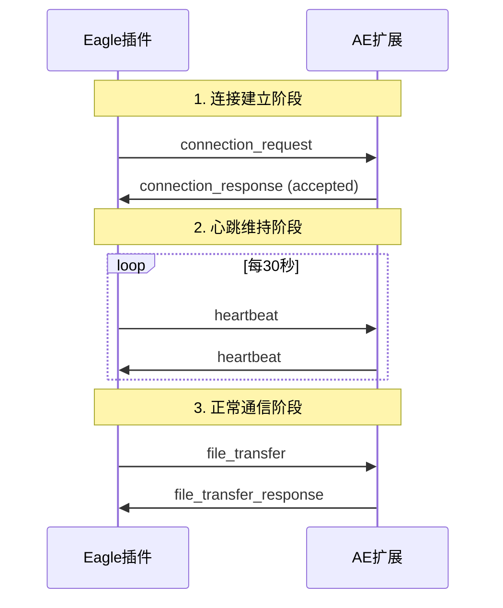
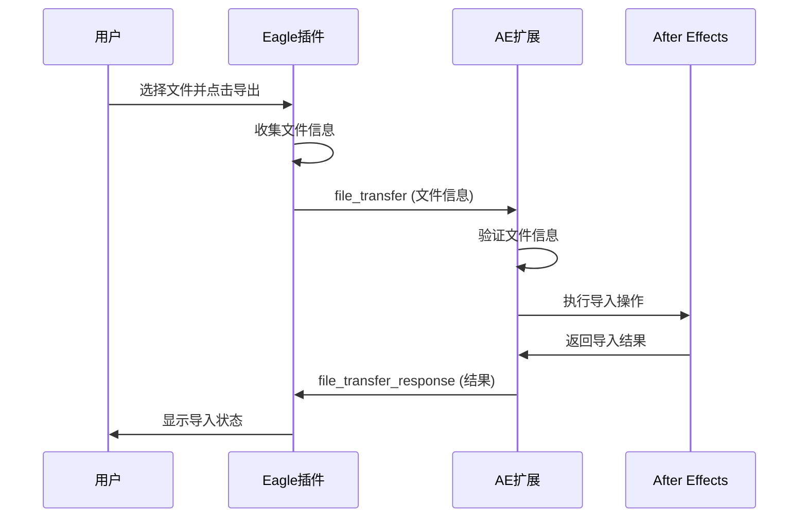
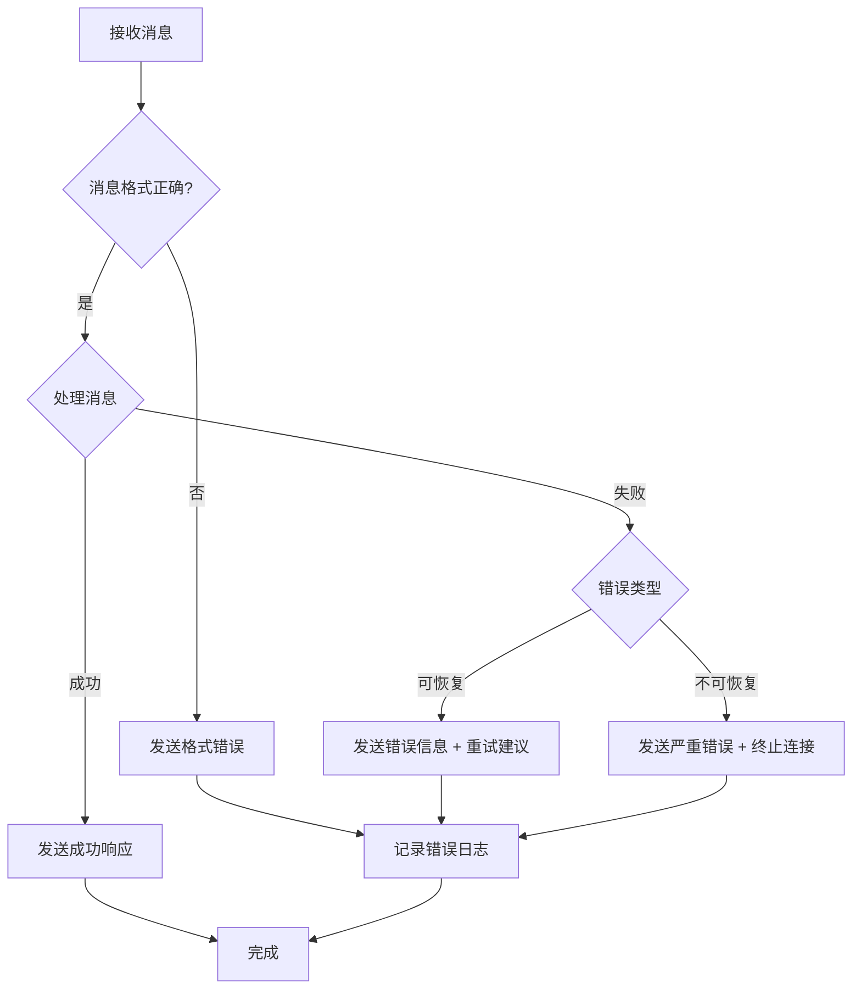

# 通信协议设计

## 概述

Eagle2Ae 系统采用双向通信协议，实现 Eagle 插件与 After Effects CEP 扩展之间的实时数据传输。协议设计遵循简单、可靠、高效的原则，支持文件传输、状态同步和错误处理。

## 协议架构

### 通信层次

```
┌─────────────────────────────────────────────────────────────┐
│                    应用层 (Application Layer)               │
│  ┌─────────────────┐              ┌─────────────────┐      │
│  │   Eagle 插件     │              │   AE CEP 扩展    │      │
│  └─────────────────┘              └─────────────────┘      │
└─────────────────────────────────────────────────────────────┘
                              │
                              ▼
┌─────────────────────────────────────────────────────────────┐
│                    消息层 (Message Layer)                   │
│  ┌─────────────────────────────────────────────────────┐    │
│  │  JSON 消息格式 + 消息路由 + 错误处理                │    │
│  └─────────────────────────────────────────────────────┘    │
└─────────────────────────────────────────────────────────────┘
                              │
                              ▼
┌─────────────────────────────────────────────────────────────┐
│                    传输层 (Transport Layer)                 │
│  ┌─────────────────┐              ┌─────────────────┐      │
│  │   WebSocket      │              │      HTTP       │      │
│  │   (主要协议)      │              │    (备用协议)     │      │
│  └─────────────────┘              └─────────────────┘      │
└─────────────────────────────────────────────────────────────┘
                              │
                              ▼
┌─────────────────────────────────────────────────────────────┐
│                    网络层 (Network Layer)                   │
│                      TCP/IP (本地网络)                      │
└─────────────────────────────────────────────────────────────┘
```

### 协议特性

- **双向通信**: 支持客户端和服务端的双向消息传递
- **实时性**: WebSocket 提供低延迟的实时通信
- **可靠性**: 消息确认机制和自动重连
- **扩展性**: 模块化的消息类型设计
- **安全性**: 本地网络通信，避免外部网络风险

## 消息格式规范

### 基础消息结构

```javascript
/**
 * 标准消息格式
 */
const MessageFormat = {
    // 消息头部
    type: 'string',           // 消息类型
    version: 'string',        // 协议版本
    id: 'string',            // 消息唯一标识
    timestamp: 'number',      // 时间戳 (Unix timestamp)
    
    // 消息体
    data: 'object',          // 消息数据
    
    // 可选字段
    replyTo: 'string',       // 回复消息的ID
    error: 'object',         // 错误信息
    metadata: 'object'       // 元数据
};
```

### 消息示例

```javascript
// 文件传输消息
{
    "type": "file_transfer",
    "version": "1.0",
    "id": "msg_001",
    "timestamp": 1704441600000,
    "data": {
        "files": [
            {
                "path": "/Users/username/Pictures/image1.jpg",
                "name": "image1.jpg",
                "size": 1024000,
                "type": "image/jpeg",
                "metadata": {
                    "width": 1920,
                    "height": 1080,
                    "tags": ["landscape", "nature"]
                }
            }
        ],
        "settings": {
            "importMode": "footage",
            "createComposition": true,
            "organizeFolders": true
        }
    }
}

// 状态响应消息
{
    "type": "status_response",
    "version": "1.0",
    "id": "msg_002",
    "timestamp": 1704441601000,
    "replyTo": "msg_001",
    "data": {
        "status": "success",
        "imported": 1,
        "failed": 0,
        "details": {
            "projectItems": [
                {
                    "name": "image1.jpg",
                    "id": 123,
                    "folder": "Eagle Import"
                }
            ]
        }
    }
}
```

## 消息类型定义

### 1. 连接管理消息

#### 连接建立 (connection_request)
```javascript
{
    "type": "connection_request",
    "data": {
        "clientType": "eagle_plugin", // 或 "ae_extension"
        "version": "1.0.2",
        "capabilities": ["file_transfer", "status_sync"]
    }
}
```

#### 连接确认 (connection_response)
```javascript
{
    "type": "connection_response",
    "data": {
        "status": "accepted", // 或 "rejected"
        "serverVersion": "1.0.2",
        "supportedCapabilities": ["file_transfer", "status_sync"]
    }
}
```

#### 心跳检测 (heartbeat)
```javascript
{
    "type": "heartbeat",
    "data": {
        "timestamp": 1704441600000
    }
}
```

### 2. 文件传输消息

#### 拖拽导入请求 (drag_import)
```javascript
{
    "type": "drag_import",
    "data": {
        "files": [
            {
                "path": "string",      // 文件绝对路径
                "name": "string",      // 文件名
                "size": "number",      // 文件大小 (字节)
                "type": "string",      // MIME 类型
                "isSequence": "boolean", // 是否为序列帧
                "sequenceInfo": {       // 序列帧信息 (可选)
                    "startFrame": "number",
                    "endFrame": "number",
                    "frameRate": "number"
                },
                "metadata": "object"   // Eagle元数据
            }
        ],
        "dragContext": {
            "sourceApp": "eagle",
            "dragType": "file_drag",
            "timestamp": "number"
        },
        "aeContext": {
            "hasActiveComposition": "boolean",
            "compositionName": "string",
            "projectItemCount": "number"
        }
    }
}
```

#### 文件传输请求 (file_transfer)
```javascript
{
    "type": "file_transfer",
    "data": {
        "files": [
            {
                "path": "string",      // 文件绝对路径
                "name": "string",      // 文件名
                "size": "number",      // 文件大小 (字节)
                "type": "string",      // MIME 类型
                "checksum": "string",  // 文件校验和 (可选)
                "metadata": "object"   // 文件元数据
            }
        ],
        "settings": {
            "importMode": "footage|composition",
            "createComposition": "boolean",
            "organizeFolders": "boolean",
            "targetFolder": "string",
            "addToComposition": "boolean"  // 是否添加到当前合成
        }
    }
}
```

#### 文件传输响应 (file_transfer_response)
```javascript
{
    "type": "file_transfer_response",
    "data": {
        "status": "success|partial|failed",
        "imported": "number",
        "failed": "number",
        "details": {
            "successItems": [
                {
                    "originalPath": "string",
                    "projectItemId": "number",
                    "name": "string",
                    "folder": "string"
                }
            ],
            "failedItems": [
                {
                    "originalPath": "string",
                    "error": "string",
                    "errorCode": "string"
                }
            ]
        }
    }
}
```

### 3. 状态同步消息

#### 状态查询 (status_query)
```javascript
{
    "type": "status_query",
    "data": {
        "queryType": "connection|project|system"
    }
}
```

#### 状态响应 (status_response)
```javascript
{
    "type": "status_response",
    "data": {
        "connection": {
            "status": "connected",
            "uptime": 3600000,
            "lastActivity": 1704441600000
        },
        "project": {
            "name": "My Project",
            "itemCount": 25,
            "activeComposition": "Main Comp"
        },
        "system": {
            "aeVersion": "2024",
            "platform": "windows",
            "memory": {
                "used": 2048,
                "available": 6144
            }
        }
    }
}
```

### 4. 错误处理消息

#### 对话框确认请求 (dialog_confirm)
```javascript
{
    "type": "dialog_confirm",
    "data": {
        "dialogType": "import_confirm|composition_check",
        "title": "string",
        "message": "string",
        "buttons": [
            {
                "text": "string",
                "action": "confirm|cancel|custom",
                "default": "boolean"
            }
        ],
        "context": {
            "fileCount": "number",
            "hasActiveComposition": "boolean",
            "compositionName": "string",
            "importMode": "string"
        }
    }
}
```

#### 对话框确认响应 (dialog_response)
```javascript
{
    "type": "dialog_response",
    "data": {
        "buttonIndex": "number",  // 用户选择的按钮索引
        "buttonText": "string",   // 按钮文本
        "confirmed": "boolean",   // 是否确认
        "timestamp": "number",    // 响应时间戳
        "userSettings": {         // 用户可能修改的设置
            "addToComposition": "boolean",
            "createNewComposition": "boolean",
            "rememberChoice": "boolean"
        }
    }
}
```

#### 错误通知 (error)
```javascript
{
    "type": "error",
    "data": {
        "code": "string",        // 错误代码
        "message": "string",     // 错误描述
        "details": "object",     // 详细信息
        "severity": "warning|error|critical",
        "recoverable": "boolean"
    },
    "error": {
        "stack": "string",       // 错误堆栈 (开发模式)
        "context": "object"      // 错误上下文
    }
}
```

## 通信流程

### 连接建立流程



### 文件传输流程



### 错误处理流程



## 协议实现

### WebSocket 服务端 (Eagle 插件)

```javascript
/**
 * WebSocket 服务器实现
 */
class WebSocketServer {
    constructor(port = 8080) {
        this.port = port;
        this.server = null;
        this.clients = new Map();
        this.messageHandlers = new Map();
    }

    /**
     * 启动服务器
     */
    start() {
        const WebSocket = require('ws');
        this.server = new WebSocket.Server({ port: this.port });
        
        this.server.on('connection', (ws, req) => {
            const clientId = this.generateClientId();
            this.clients.set(clientId, {
                ws: ws,
                connected: Date.now(),
                lastActivity: Date.now()
            });
            
            ws.on('message', (data) => {
                this.handleMessage(clientId, data);
            });
            
            ws.on('close', () => {
                this.clients.delete(clientId);
            });
        });
    }

    /**
     * 处理接收到的消息
     */
    handleMessage(clientId, data) {
        try {
            const message = JSON.parse(data);
            const handler = this.messageHandlers.get(message.type);
            
            if (handler) {
                handler(clientId, message);
            } else {
                this.sendError(clientId, 'UNKNOWN_MESSAGE_TYPE', 
                    `Unknown message type: ${message.type}`);
            }
        } catch (error) {
            this.sendError(clientId, 'INVALID_JSON', 
                'Invalid JSON format');
        }
    }

    /**
     * 发送消息
     */
    sendMessage(clientId, message) {
        const client = this.clients.get(clientId);
        if (client && client.ws.readyState === WebSocket.OPEN) {
            client.ws.send(JSON.stringify(message));
            client.lastActivity = Date.now();
        }
    }
}
```

### WebSocket 客户端 (AE 扩展)

```javascript
/**
 * WebSocket 客户端实现
 */
class WebSocketClient {
    constructor(url, options = {}) {
        this.url = url;
        this.options = {
            reconnectInterval: 3000,
            maxReconnectAttempts: 5,
            heartbeatInterval: 30000,
            ...options
        };
        
        this.ws = null;
        this.reconnectCount = 0;
        this.connected = false;
        this.messageHandlers = new Map();
        this.pendingMessages = [];
    }

    /**
     * 连接到服务器
     */
    connect() {
        return new Promise((resolve, reject) => {
            try {
                this.ws = new WebSocket(this.url);
                
                this.ws.onopen = () => {
                    this.connected = true;
                    this.reconnectCount = 0;
                    this.startHeartbeat();
                    this.sendPendingMessages();
                    resolve();
                };
                
                this.ws.onmessage = (event) => {
                    this.handleMessage(event.data);
                };
                
                this.ws.onclose = () => {
                    this.connected = false;
                    this.stopHeartbeat();
                    this.attemptReconnect();
                };
                
                this.ws.onerror = (error) => {
                    reject(error);
                };
            } catch (error) {
                reject(error);
            }
        });
    }

    /**
     * 发送消息
     */
    send(type, data, options = {}) {
        const message = {
            type: type,
            version: '1.0',
            id: this.generateMessageId(),
            timestamp: Date.now(),
            data: data,
            ...options
        };
        
        if (this.connected && this.ws.readyState === WebSocket.OPEN) {
            this.ws.send(JSON.stringify(message));
        } else {
            this.pendingMessages.push(message);
        }
        
        return message.id;
    }
}
```

## 错误代码定义

### 连接错误 (1000-1099)
- `1001`: CONNECTION_REFUSED - 连接被拒绝
- `1002`: CONNECTION_TIMEOUT - 连接超时
- `1003`: AUTHENTICATION_FAILED - 认证失败
- `1004`: VERSION_MISMATCH - 版本不匹配

### 消息错误 (1100-1199)
- `1101`: INVALID_MESSAGE_FORMAT - 消息格式无效
- `1102`: UNKNOWN_MESSAGE_TYPE - 未知消息类型
- `1103`: MESSAGE_TOO_LARGE - 消息过大
- `1104`: MISSING_REQUIRED_FIELD - 缺少必需字段

### 文件操作错误 (1200-1299)
- `1201`: FILE_NOT_FOUND - 文件不存在
- `1202`: FILE_ACCESS_DENIED - 文件访问被拒绝
- `1203`: UNSUPPORTED_FILE_TYPE - 不支持的文件类型
- `1204`: FILE_SIZE_EXCEEDED - 文件大小超限
- `1205`: IMPORT_FAILED - 导入失败

### 系统错误 (1300-1399)
- `1301`: INSUFFICIENT_MEMORY - 内存不足
- `1302`: DISK_SPACE_LOW - 磁盘空间不足
- `1303`: SYSTEM_BUSY - 系统繁忙
- `1304`: OPERATION_CANCELLED - 操作被取消

## 性能优化

### 消息压缩
```javascript
/**
 * 大消息压缩处理
 */
function compressMessage(message) {
    const messageStr = JSON.stringify(message);
    if (messageStr.length > 1024) { // 1KB 以上压缩
        return {
            compressed: true,
            data: compress(messageStr) // 使用 gzip 压缩
        };
    }
    return message;
}
```

### 消息批处理
```javascript
/**
 * 消息批处理
 */
class MessageBatcher {
    constructor(batchSize = 10, flushInterval = 100) {
        this.batchSize = batchSize;
        this.flushInterval = flushInterval;
        this.batch = [];
        this.timer = null;
    }

    add(message) {
        this.batch.push(message);
        
        if (this.batch.length >= this.batchSize) {
            this.flush();
        } else if (!this.timer) {
            this.timer = setTimeout(() => this.flush(), this.flushInterval);
        }
    }

    flush() {
        if (this.batch.length > 0) {
            this.sendBatch(this.batch);
            this.batch = [];
        }
        
        if (this.timer) {
            clearTimeout(this.timer);
            this.timer = null;
        }
    }
}
```

## 安全考虑

### 消息验证
```javascript
/**
 * 消息安全验证
 */
function validateMessage(message) {
    // 1. 格式验证
    if (!message.type || !message.version || !message.id) {
        throw new Error('Missing required fields');
    }
    
    // 2. 大小限制
    const messageSize = JSON.stringify(message).length;
    if (messageSize > 10 * 1024 * 1024) { // 10MB 限制
        throw new Error('Message too large');
    }
    
    // 3. 类型验证
    const allowedTypes = ['connection_request', 'file_transfer', 'status_query'];
    if (!allowedTypes.includes(message.type)) {
        throw new Error('Invalid message type');
    }
    
    return true;
}
```

### 访问控制
```javascript
/**
 * 本地网络访问控制
 */
function isLocalConnection(remoteAddress) {
    const localAddresses = [
        '127.0.0.1',
        '::1',
        'localhost'
    ];
    
    return localAddresses.includes(remoteAddress) ||
           remoteAddress.startsWith('192.168.') ||
           remoteAddress.startsWith('10.') ||
           remoteAddress.startsWith('172.');
}
```

## 测试策略

### 单元测试
- 消息格式验证测试
- 错误处理测试
- 连接管理测试

### 集成测试
- 端到端通信测试
- 文件传输测试
- 错误恢复测试

### 性能测试
- 大文件传输测试
- 并发连接测试
- 长时间运行测试

## 更新记录

| 日期 | 版本 | 更新内容 | 作者 |
|------|------|----------|------|
| 2024-01-05 | 1.0 | 初始通信协议设计 | 开发团队 |

---

**相关文档**:
- [CEP扩展架构设计](./cep-extension-architecture.md)
- [UI组件设计](./ui-component-design.md)
- [WebSocket API参考](../api/websocket-api.md)