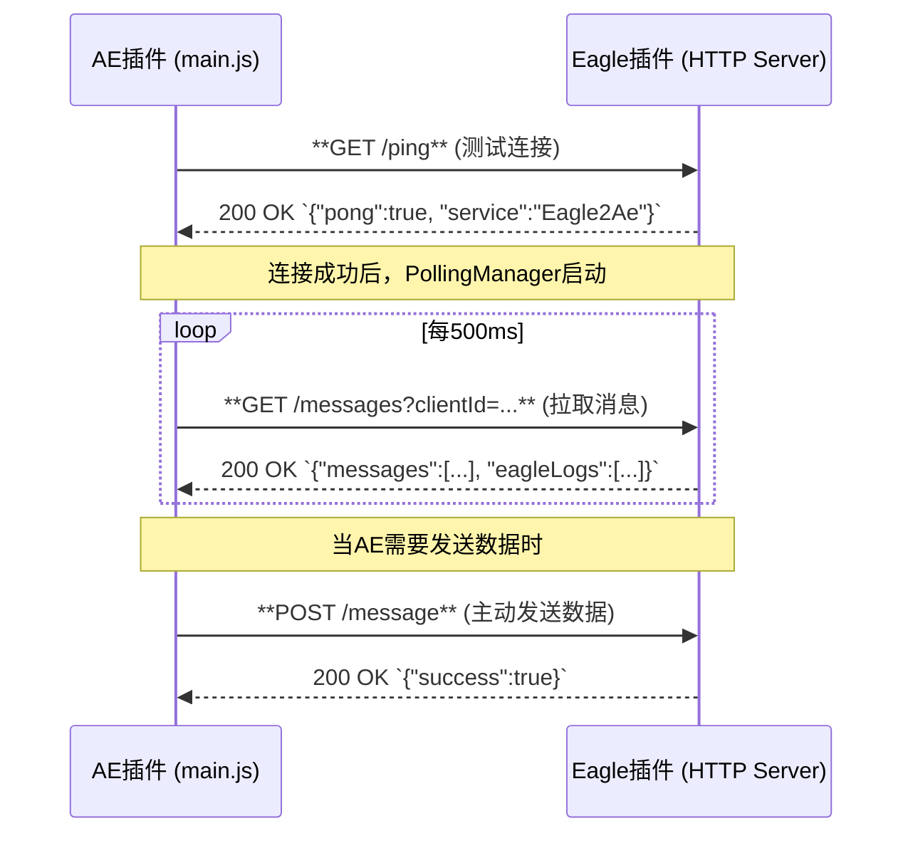

# 通信协议设计

## 1. 概述

Eagle2Ae 系统采用双向通信协议，实现 Eagle 插件与 After Effects CEP 扩展之间的本地数据交换。协议设计遵循简单、可靠、高效的原则。

## 2. 核心架构：HTTP轮询 + 备用方案

尽管代码库中包含了WebSocket的实现，但当前版本（如此代码库所示）的通信架构**以HTTP轮询为核心**。这是一个经过验证的、兼容性最好的稳定方案。

- **主要模式：HTTP轮询 (HTTP Polling)**
  - **描述**: AE插件作为客户端，以固定的时间间隔（500ms）向Eagle插件（作为HTTP服务器）发送请求，以“拉取”最新的消息和状态。这是一个单向的请求-响应模式。
  - **状态**: **当前版本中唯一启用的通信方式**。
  - **实现**: 由 `main.js` 中的 `PollingManager` 类驱动。

- **备用模式：WebSocket**
  - **描述**: 一个更现代的、基于WebSocket的实时双向通信方案。代码已在 `js/websocket-client.js` 中实现，包括心跳和自动重连机制。
  - **状态**: **当前版本中默认禁用**。`main.js` 的构造函数中 `this.useWebSocket` 被设置为 `false`。

- **端口管理：固定端口**
  - **描述**: 插件间的通信端口。代码中包含一个 `PortDiscovery.js` 服务，用于自动发现端口。
  - **状态**: **当前版本中默认禁用**。插件默认使用固定的端口号（`8080`），或用户在设置中指定的值。

## 3. HTTP 轮询工作流

整个通信流程围绕着AE插件作为客户端，主动向Eagle插件服务端发起的一系列HTTP请求。



### 3.1 连接流程

- 当用户点击“连接”按钮时，AE插件会调用 `connectHttp()` 函数，该函数向Eagle插件发送一个 `GET /ping` 请求。
- Eagle插件返回一个包含 `"pong":true` 的JSON，即表示连接成功。

### 3.2 数据接收流程

- 连接成功后，`PollingManager` 会被激活。
- 它会以500毫秒的间隔，不断调用 `pollMessages()` 函数，该函数向Eagle插件发送 `GET /messages` 请求。
- Eagle插件的 `/messages` 端点会返回一个JSON，其中包含一个 `messages` 数组（例如，从Eagle导出的文件信息）和一个 `eagleLogs` 数组（Eagle插件侧的日志）。
- AE插件收到响应后，会处理 `messages` 数组中的每条消息，并更新 `eagleLogs` 队列。

### 3.3 数据发送流程

- 当AE插件需要主动向Eagle发送信息时（例如，在“导出到Eagle”功能中），它会调用 `sendToEagle()` 函数。
- 该函数会将需要发送的数据作为JSON荷载，向Eagle插件的 `POST /message` 端点发起请求。

## 4. 核心消息载荷 (Payload)

在当前的HTTP轮询机制下，消息结构非常简化。以下是关键的 `data` 对象示例。

### 导出/导入文件消息

这是最核心的消息类型，用于从一端向另一端发送文件列表以进行导入。当AE插件执行“导出到Eagle”时，它会向Eagle插件的 `POST /message` 端点发送此结构。

```javascript
// 当AE向Eagle发送数据时，其POST请求的body体中的`data`字段
{
    // 文件信息数组
    files: [
        {
            path: "C:/Users/.../AppData/Local/Temp/ae_export/layer1.png", // 渲染出的临时文件路径
            name: "layer1.png", // 文件名
            tags: ["AE导出", "MyProject.aep", "Main Comp"], // JS自动丰富的标签
            annotation: "从AE项目 \"MyProject.aep\" 的合成 \"Main Comp\" 中导出。" // JS自动丰富的注释
        }
    ],
    // 其他上下文信息
    source: "ae_export"
}
```

---

**相关文档**:
- [通信 API 参考](../api/communication-api.md)
- [CEP扩展架构设计](./cep-extension-architecture.md)
