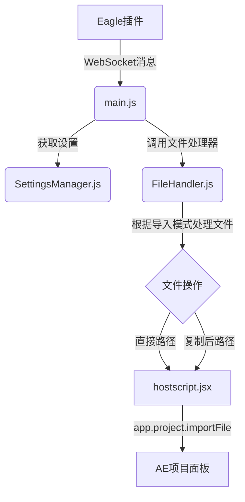

# 导入逻辑技术文档

## 概述

本文档详细描述了Eagle2Ae CEP扩展中的文件导入逻辑，涵盖从接收Eagle消息到在After Effects中创建素材的完整流程。重点介绍三种核心导入模式及其文件处理策略，以及新增的错误处理和恢复机制。

## 1. 导入系统架构

导入系统的核心由 `FileHandler.js` 模块驱动，它与 `SettingsManager.js` 和 `hostscript.jsx` 紧密协作，完成整个导入流程。

- **`main.js`**: 接收来自Eagle的WebSocket消息，作为流程的起点。
- **`SettingsManager.js`**: 提供当前用户设置，尤其是**导入模式 (`mode`)**。
- **`FileHandler.js`**: 根据导入模式，执行相应的文件操作（如复制、路径计算），并准备最终要导入AE的路径列表。
- **`hostscript.jsx`**: 接收 `FileHandler.js` 处理后的文件路径列表，并调用After Effects的 `app.project.importFile()` 方法执行最终的导入。

## 2. 设置与持久化

### 2.1 设置存储
所有与导入相关的设置都由 `SettingsManager.js` 模块统一管理。这些设置被保存在浏览器的 `localStorage` 中，键名为 `eagle2ae-import-settings`。这确保了用户配置在关闭和重新打开插件后依然存在。

### 2.2 实时更新
在高级设置面板中，当用户切换导入模式时，其选择会**立即**被持久化。

- **事件**: 用户点击导入模式单选框 (`<input type="radio" name="import-mode">`)。
- **处理**: `main.js` 中的事件监听器被触发。
- **核心逻辑**: 调用 `this.settingsManager.updateField('mode', radio.value, false)`。
- **结果**: `SettingsManager` 将新的模式值（如 `'project_adjacent'`）更新到内存中的设置对象，并立即将其完整地写回 `localStorage`。此过程是实时的，无需用户点击面板右下角的"保存设置"按钮。

## 3. 导入模式详解

导入模式决定了从Eagle接收到的文件在导入AE项目之前如何被处理。这是文件管理的核心策略。

### 3.1 直接导入 (`direct`)

- **描述**: 此模式直接使用Eagle素材库中的原始文件路径进行导入。
- **文件操作**: 不涉及任何文件的复制或移动。`FileHandler.js` 直接将从Eagle消息中获得的文件路径传递给 `hostscript.jsx`。
- **优点**:
    - **速度最快**: 没有文件I/O开销，导入过程非常迅速。
    - **节省空间**: 不会产生重复的文件副本。
- **缺点**:
    - **文件管理风险**: 如果Eagle库中的原始文件被移动、重命名或删除，AE项目中的素材链接将会丢失。
    - **不适用于团队协作**: 除非所有协作者都能访问完全相同的Eagle库路径（例如通过网络驱动器），否则项目将无法在其他机器上正常打开。
- **适用场景**: 个人项目，或用户有非常规范和稳定的文件管理流程。

### 3.2 项目旁复制 (`project_adjacent`)

- **描述**: 此模式是**默认选项**。它会将文件从Eagle库复制到当前AE项目文件（`.aep`）旁边的一个指定子文件夹中，然后再执行导入。
- **文件操作**:
    1.  `FileHandler.js` 首先通过 `hostscript.jsx` 检查当前AE项目是否已保存。如果未保存，流程将中止并提示用户。
    2.  获取项目文件所在目录。
    3.  根据用户设置（默认为 `Eagle_Assets`），在项目目录旁创建这个子文件夹（如果尚不存在）。
    4.  将文件从Eagle库路径**复制**到这个新的子文件夹中。
    5.  `FileHandler.js` 将**复制后**的新文件路径传递给 `hostscript.jsx` 进行导入。
- **优点**:
    - **项目自包含**: 所有导入的素材都与 `.aep` 文件存储在一起，便于项目归档、迁移和团队协作。
    - **链接稳定**: 只要项目文件夹被整体移动，素材链接就不会丢失。
- **缺点**:
    - **占用额外空间**: 每个导入的文件都会创建一个副本。
    - **导入稍慢**: 因为涉及文件复制操作，所以比"直接导入"耗时。
- **适用场景**: 绝大多数标准工作流程，特别是团队协作和需要长期维护的项目。

### 3.3 指定文件夹 (`custom_folder`)

- **描述**: 此模式会将所有文件复制到一个用户预先设定的、固定的全局文件夹中，然后再执行导入。
- **文件操作**:
    1.  `FileHandler.js` 从 `SettingsManager` 获取用户设定的目标文件夹路径。
    2.  如果该文件夹不存在，系统会尝试创建它。
    3.  将文件从Eagle库路径**复制**到这个指定的目标文件夹中。
    4.  `FileHandler.js` 将**复制后**的新文件路径传递给 `hostscript.jsx` 进行导入。
- **优点**:
    - **集中管理**: 所有通过此插件导入的素材都被集中存放在一个地方，便于统一管理或清理。
    - **路径可预测**: 导入后的素材路径是固定的，便于其他工具或脚本进行交互。
- **缺点**:
    - **项目分散**: 素材文件与 `.aep` 项目文件物理上是分离的，归档和迁移项目时需要同时处理项目文件和这个全局素材文件夹。
    - **占用额外空间**: 同样会创建文件副本。
- **适用场景**: 用户希望将所有外部导入的素材与项目文件分离，并进行集中化管理。

## 4. 错误处理与恢复机制

### 4.1 Unicode字符处理

在处理包含非ASCII字符（如中文）的文件路径时，系统会遇到After Effects无法正确处理Unicode字符的问题。

- **问题表现**: "ExtendScript: 文件处理错误: Error: After Effects错误: 无法转换 Unicode 字符。"
- **解决方案**: 
    1. 在`hostscript.jsx`中增强错误处理机制，即使导入失败也继续处理。
    2. 实现错误恢复机制，在导入失败后尝试在项目中查找同名素材。

### 4.2 重复导入检查

为避免重复导入相同文件到项目面板中，系统实现了重复导入检查机制。

- **实现方式**: 在导入前先检查项目中是否已存在同名素材。
- **检查逻辑**: 遍历项目中的所有素材项，比较文件名是否相同。
- **处理策略**: 如果项目中已存在同名素材，则跳过导入步骤，直接使用现有素材。

### 4.3 调试日志增强

为更好地诊断导入过程中的问题，系统增强了调试日志功能。

- **实现方式**: 在`FileHandler.js`的`handleImportRequest`函数返回结果中添加`debug`字段，将ExtendScript的调试日志传递回main.js。
- **日志内容**: 包含导入过程中的详细步骤和错误信息，便于问题排查。

---
**最后更新**: 2025年9月18日