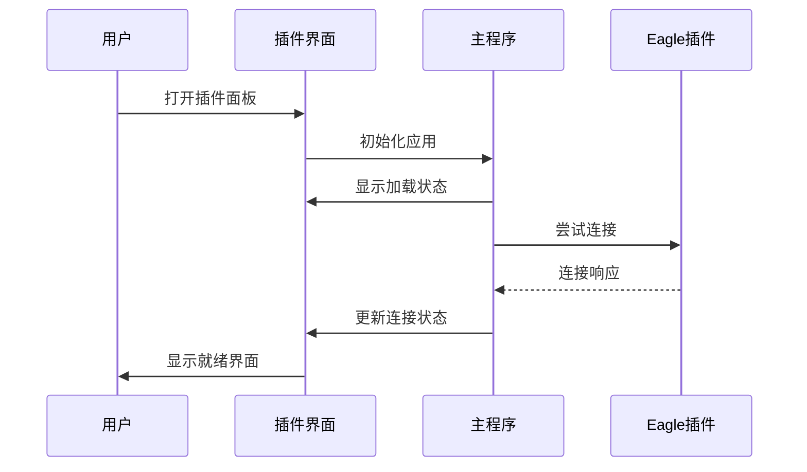
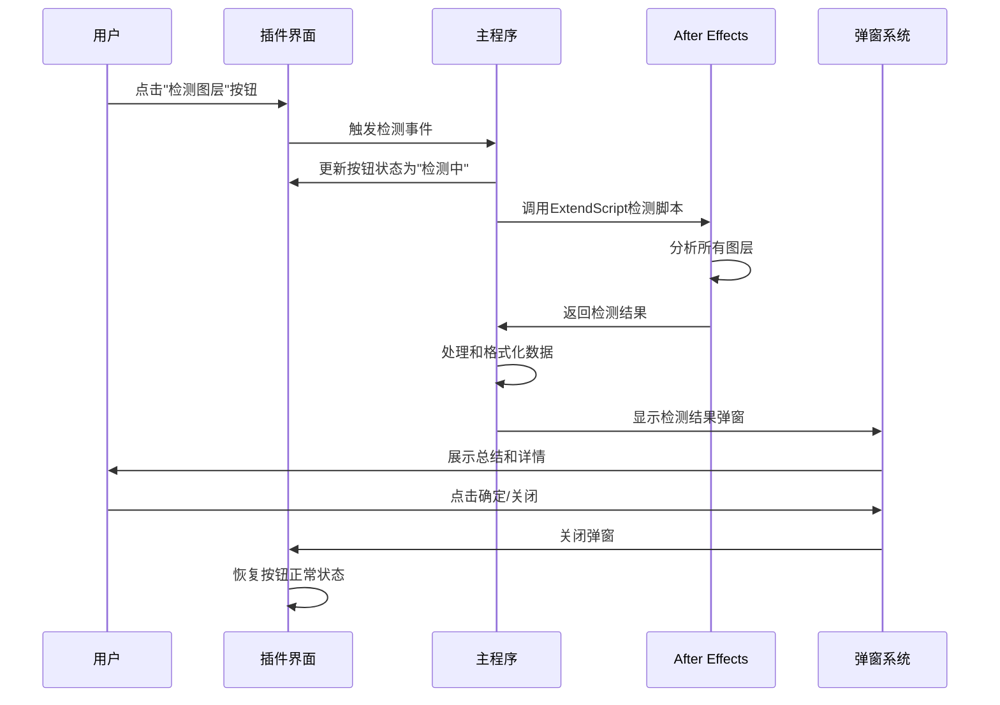

# AE插件UI交互指南

## 概述

本文档详细说明Eagle2Ae AE插件的用户界面交互流程、操作指南和最佳实践，包括最新的图层检测系统、弹窗交互机制以及Demo模式功能，帮助开发者理解用户操作逻辑和界面响应机制。

## 1. 插件启动和初始化流程

### 1.1 启动序列



### 1.2 初始化检查项

1. **CEP环境初始化**
   - 初始化CSInterface接口
   - 设置CEP调试模式
   - 加载扩展配置

2. **Eagle连接检测**
   - 自动发现Eagle端口（默认8080）
   - 建立HTTP通信连接
   - 获取Eagle基本信息和状态

3. **AE项目信息获取**
   - 通过ExtendScript读取当前项目状态
   - 获取活动合成信息
   - 更新项目信息显示

4. **拖拽系统初始化**
   - 设置全局拖拽事件监听器
   - 初始化拖拽视觉反馈系统
   - 配置文件类型检测机制

## 2. 连接状态管理

### 2.1 连接状态指示器

| 状态 | 颜色 | 显示文本 | 用户操作 |
|------|------|----------|----------|
| 未连接 | 灰色 | "未连接" | 点击测试连接 |
| 连接中 | 黄色 | "连接中..." | 等待连接完成 |
| 已连接 | 绿色 | "已连接 (XXms)" | 正常使用功能 |
| 连接失败 | 红色 | "连接失败" | 检查Eagle状态 |

### 2.2 连接测试流程

```javascript
// 连接测试逻辑
async function testConnection() {
    // 1. 更新UI状态为"连接中"
    updateConnectionStatus('connecting');
    
    try {
        // 2. 发送ping请求
        const startTime = Date.now();
        const response = await sendPingRequest();
        const pingTime = Date.now() - startTime;
        
        // 3. 更新为已连接状态
        updateConnectionStatus('connected', pingTime);
        
        // 4. 刷新Eagle信息
        await refreshEagleInfo();
        
    } catch (error) {
        // 5. 显示连接失败
        updateConnectionStatus('failed', error.message);
    }
}
```

## 3. 导入模式交互流程

### 3.1 导入模式选择

#### 直接导入模式
- **用户操作**: 点击"直接导入"按钮
- **UI响应**: 按钮高亮，其他模式取消选中
- **后台逻辑**: 设置导入模式为`direct`
- **适用场景**: 文件已在合适位置，无需移动

#### 项目旁复制模式
- **用户操作**: 点击"项目旁复制"按钮
- **UI响应**: 按钮高亮，可能弹出文件夹名称设置
- **配置选项**: 文件夹名称（默认：Eagle_Assets）
- **后台逻辑**: 计算项目文件旁边的目标路径

#### 指定文件夹模式
- **用户操作**: 点击"指定文件夹"按钮
- **UI响应**: 按钮高亮，弹出文件夹选择对话框
- **配置要求**: 必须设置有效的目标文件夹路径
- **路径验证**: 检查路径存在性和写入权限

### 3.2 模式配置对话框

#### 项目旁复制设置
```html
<!-- 文件夹名称选择 -->
<select id="project-folder-preset-select">
    <option value="Eagle_Assets">Eagle_Assets</option>
    <option value="Eagle_Import">Eagle_Import</option>
    <option value="Source_Files">Source_Files</option>
    <option value="Assets">Assets</option>
    <option value="Import">Import</option>
    <option value="custom">自定义...</option>
</select>

<!-- 自定义输入框 -->
<input type="text" id="project-custom-folder-input" 
       placeholder="或输入自定义文件夹名">
```

#### 指定文件夹设置
- **路径输入**: 支持手动输入或浏览选择
- **最近路径**: 显示最近使用的文件夹列表
- **路径验证**: 实时验证路径有效性
- **权限检查**: 确保目标文件夹可写

## 4. 导入行为配置

### 4.1 行为选项说明

| 选项 | 值 | 功能描述 | 使用场景 |
|------|----|---------|---------|
| 不导入合成 | `no_import` | 仅导入到项目面板 | 批量导入，稍后手动添加 |
| 当前时间 | `current_time` | 放置在时间指针位置 | 在特定时间点添加素材 |
| 时间轴开始 | `timeline_start` | 放置在0秒位置 | 背景或基础层素材 |

### 4.2 行为选择逻辑

```javascript
// 导入行为处理
function handleImportBehavior(behavior, files) {
    switch(behavior) {
        case 'no_import':
            // 仅导入到项目，不添加到合成
            return importToProjectOnly(files);
            
        case 'current_time':
            // 在当前时间添加到合成
            const currentTime = getCurrentTime();
            return importToComposition(files, currentTime);
            
        case 'timeline_start':
            // 在时间轴开始处添加
            return importToComposition(files, 0);
    }
}
```

### 4.3 时间轴设置实现细节

#### 4.3.1 设置检查逻辑

在v2.1.2版本中修复了时间轴设置的检查逻辑错误：

```javascript
// 修复前（错误的检查逻辑）
if (settings.timelineOptions.enabled) {
    // 这里只检查enabled字段，无法区分具体的placement模式
}

// 修复后（正确的检查逻辑）
if (settings.timelineOptions.placement === 'current_time') {
    // 正确检查placement字段，确保在current_time模式下执行
    layer.startTime = targetComp.time;
    console.log('[时间轴设置] 图层放置在当前时间:', targetComp.time);
} else if (settings.timelineOptions.placement === 'timeline_start') {
    // timeline_start模式下放置在0秒位置
    layer.startTime = 0;
    console.log('[时间轴设置] 图层放置在时间轴开始');
}
```

#### 4.3.2 设置传递流程

时间轴设置从UI传递到ExtendScript的完整流程：

1. **UI设置获取**: 从SettingsManager获取timelineOptions配置
2. **设置合并**: 在main.js中合并本地设置和消息设置
3. **参数传递**: 通过FileHandler将设置传递给ExtendScript
4. **ExtendScript处理**: 在hostscript.jsx中根据placement值执行相应逻辑

#### 4.3.3 调试和验证

为确保时间轴设置正确工作，可以通过以下方式验证：

```javascript
// 在ExtendScript中添加调试日志
console.log('[调试] timelineOptions设置:', JSON.stringify(settings.timelineOptions));
console.log('[调试] placement模式:', settings.timelineOptions.placement);
console.log('[调试] 当前合成时间:', targetComp.time);
```

## 5. 文件拖拽交互系统

### 5.1 拖拽系统初始化

```javascript
// 拖拽系统设置 (setupDragAndDrop方法)
setupDragAndDrop() {
    try {
        // 防止默认拖拽行为
        document.addEventListener('dragover', (e) => {
            e.preventDefault();
            e.stopPropagation();
            // 添加视觉反馈
            document.body.classList.add('drag-over');
        });

        document.addEventListener('dragenter', (e) => {
            e.preventDefault();
            e.stopPropagation();
        });

        document.addEventListener('dragleave', (e) => {
            // 只有当拖拽完全离开窗口时才移除样式
            if (e.clientX === 0 && e.clientY === 0) {
                document.body.classList.remove('drag-over');
            }
        });

        // 处理文件拖拽
        document.addEventListener('drop', this.handleFileDrop.bind(this));
    } catch (error) {
        this.log(`设置拖拽监听失败: ${error.message}`, 'error');
    }
}
```

### 5.2 文件拖拽处理流程

#### 5.2.1 主要拖拽处理方法

```javascript
// 处理文件拖拽 (handleFileDrop方法)
async handleFileDrop(event) {
    event.preventDefault();
    event.stopPropagation();

    // 移除视觉反馈
    document.body.classList.remove('drag-over');

    try {
        const files = Array.from(event.dataTransfer.files);
        const items = Array.from(event.dataTransfer.items);
        
        if (files.length === 0 && items.length === 0) {
            this.showDropMessage('未检测到文件', 'warning');
            return;
        }

        // 检查是否包含文件夹
        const hasDirectories = items.some(item => 
            item.webkitGetAsEntry && item.webkitGetAsEntry()?.isDirectory
        );
        
        if (hasDirectories) {
            // 处理文件夹拖拽（可能包含序列帧）
            await this.handleDirectoryDrop(items, files);
        } else {
            // 处理普通文件拖拽
            await this.handleFilesDrop(files, event.dataTransfer);
        }
    } catch (error) {
        this.log(`处理拖拽失败: ${error.message}`, 'error');
        this.showDropMessage('拖拽处理失败', 'error');
    }
}
```

#### 5.2.2 Eagle拖拽识别机制

```javascript
// Eagle拖拽识别 (isEagleDrag方法)
isEagleDrag(dataTransfer, files) {
    try {
        // 方法1：检查文件路径特征
        const hasEaglePath = files.some(file => {
            const path = file.path || file.webkitRelativePath || '';
            const pathLower = path.toLowerCase();
            return pathLower.includes('eagle') ||
                   pathLower.includes('.eaglepack') ||
                   pathLower.includes('library.library') ||
                   (pathLower.includes('images') && pathLower.includes('library'));
        });

        // 方法2：检查自定义数据类型
        const hasEagleData = dataTransfer.types.some(type => {
            const typeLower = type.toLowerCase();
            return typeLower.includes('eagle') ||
                   typeLower.includes('x-eagle') ||
                   typeLower.includes('application/x-eagle');
        });

        // 方法3：检查拖拽来源信息
        const plainText = dataTransfer.getData('text/plain') || '';
        const plainTextLower = plainText.toLowerCase();
        const hasEagleMetadata = plainTextLower.includes('eagle') ||
                               plainTextLower.includes('.eaglepack') ||
                               plainTextLower.includes('library.library');

        return hasEaglePath || hasEagleData || hasEagleMetadata;
    } catch (error) {
        this.log(`Eagle拖拽检测失败: ${error.message}`, 'error');
        return false;
    }
}
```

### 5.3 拖拽视觉反馈系统

#### 5.3.1 CSS样式实现

```css
/* 拖拽悬停时的整体效果 */
body.drag-over {
    transition: all 0.3s ease;
}

/* 拖拽时的背景蒙版 */
body.drag-over::before {
    content: '';
    position: fixed;
    top: 0; left: 0; right: 0; bottom: 0;
    background: rgba(0, 0, 0, 0.6);
    backdrop-filter: blur(4px);
    z-index: 999;
    pointer-events: none;
    animation: fadeIn 0.3s ease;
}

/* 拖拽时的边框效果 */
body.drag-over::after {
    content: '';
    position: fixed;
    top: 8px; left: 8px; right: 8px; bottom: 8px;
    border: 2px dashed #3498db;
    border-radius: 12px;
    z-index: 1000;
    pointer-events: none;
    animation: dragPulse 1.5s ease-in-out infinite alternate;
}

/* 拖拽时的中央提示 */
.drag-overlay {
    position: fixed;
    top: 50%; left: 50%;
    transform: translate(-50%, -50%);
    text-align: center;
    z-index: 1002;
    pointer-events: none;
    opacity: 0;
    transition: opacity 0.3s ease;
}

body.drag-over .drag-overlay {
    opacity: 1;
}
```

#### 5.3.2 视觉反馈组件

1. **背景蒙版**: 半透明黑色背景，带模糊效果
2. **边框动画**: 蓝色虚线边框，脉冲动画效果
3. **中央提示**: 显示"+"图标和"拖拽文件到此处"文字
4. **状态消息**: 右上角滑入式消息提示

### 5.4 文件夹和序列帧处理

#### 5.4.1 文件夹拖拽处理

```javascript
// 处理文件夹拖拽 (handleDirectoryDrop方法)
async handleDirectoryDrop(items, files) {
    this.log('检测到文件夹拖拽，开始处理...', 'info');
    
    const allFiles = [];
    
    // 递归读取文件夹内容
    for (const item of items) {
        const entry = item.webkitGetAsEntry();
        if (entry) {
            const entryFiles = await this.readDirectoryEntry(entry);
            allFiles.push(...entryFiles);
        }
    }
    
    // 添加直接拖拽的文件
    allFiles.push(...files);
    
    if (allFiles.length === 0) {
        this.showDropMessage('文件夹中没有找到可导入的文件', 'warning');
        return;
    }
    
    // 分析文件类型和序列帧
    const analysis = this.analyzeDroppedFiles(allFiles);
    
    // 显示导入选项对话框
    this.showFileImportDialog(allFiles, analysis);
}
```

#### 5.4.2 文件分析和分类

```javascript
// 分析拖拽的文件 (analyzeDroppedFiles方法)
analyzeDroppedFiles(files) {
    const analysis = {
        total: files.length,
        categories: {
            image: [], video: [], audio: [],
            design: [], project: [], unknown: []
        },
        sequences: [],
        folders: new Set()
    };
    
    // 按文件夹分组
    const folderGroups = {};
    
    files.forEach(file => {
        const category = this.getFileCategory(file);
        analysis.categories[category].push(file);
        
        // 提取文件夹路径
        const path = file.fullPath || file.relativePath || file.webkitRelativePath || '';
        const folderPath = path.substring(0, path.lastIndexOf('/'));
        
        if (folderPath) {
            analysis.folders.add(folderPath);
            if (!folderGroups[folderPath]) {
                folderGroups[folderPath] = [];
            }
            folderGroups[folderPath].push(file);
        }
    });
    
    // 检测序列帧
    for (const [folderPath, folderFiles] of Object.entries(folderGroups)) {
        const sequence = this.detectImageSequence(folderFiles);
        if (sequence) {
            analysis.sequences.push(sequence);
        }
    }
    
    return analysis;
}
```

### 5.5 导入确认弹窗系统

#### 5.5.1 弹窗触发条件

弹窗会在以下情况下自动触发：

1. **文件夹拖拽**: 检测到文件夹结构时
2. **序列帧检测**: 发现图像序列时
3. **混合文件类型**: 包含多种文件类型时
4. **大量文件**: 文件数量超过阈值时
5. **非Eagle拖拽**: 普通文件拖拽需要确认时
6. **合成检查**: 当用户设置为添加到合成但当前无活动合成时

#### 5.5.2 合成检查机制

在拖拽导入过程中，系统会检查用户的合成设置和当前AE项目状态：

```javascript
// 合成检查逻辑
function checkCompositionStatus(settings) {
    // 检查用户是否设置了添加到合成
    if (settings.addToComposition) {
        // 获取当前活动合成
        const activeComp = app.project.activeItem;
        
        // 如果没有活动合成或活动项不是合成
        if (!activeComp || !(activeComp instanceof CompItem)) {
            return {
                needsConfirmation: true,
                reason: 'no_active_composition',
                message: '当前没有活动的合成，是否继续导入？'
            };
        }
    }
    
    return {
        needsConfirmation: false
    };
}
```

#### 5.5.3 Panel样式确认对话框实现

系统使用ExtendScript的Panel样式对话框来显示确认信息，提供更专业的用户体验：

```javascript
// CEP扩展端调用 (main.js)
function showImportConfirmDialog(title, message) {
    // 对字符串进行转义处理
    const escapedTitle = title.replace(/"/g, '\\"');
    const escapedMessage = message.replace(/"/g, '\\"').replace(/\n/g, '\\n');
    
    // 构建ExtendScript调用
    const confirmScript = `showPanelConfirmDialog("${escapedTitle}", "${escapedMessage}")`;
    
    return new Promise((resolve) => {
        csInterface.evalScript(confirmScript, (result) => {
            // 解析结果：0表示确认，1表示取消
            const confirmed = parseInt(result) === 0;
            resolve(confirmed);
        });
    });
}

// ExtendScript端实现 (dialog-warning.jsx)
function showPanelConfirmDialog(title, message, button1Text, button2Text) {
    try {
        // 创建Panel样式对话框
        var dialog = new Window("dialog", title || "确认");
        dialog.orientation = "column";
        dialog.alignChildren = "fill";
        dialog.spacing = 10;
        dialog.margins = 16;
        
        // 添加消息文本
        var messageGroup = dialog.add("group");
        messageGroup.orientation = "column";
        messageGroup.alignChildren = "left";
        
        var messageText = messageGroup.add("statictext", undefined, message || "请确认操作", {multiline: true});
        messageText.preferredSize.width = 350;
        
        // 添加按钮组
        var buttonGroup = dialog.add("group");
        buttonGroup.alignment = "center";
        buttonGroup.spacing = 10;
        
        var confirmBtn = buttonGroup.add("button", undefined, button1Text || "继续导入");
        var cancelBtn = buttonGroup.add("button", undefined, button2Text || "取消");
        
        // 设置按钮事件
        confirmBtn.onClick = function() {
            dialog.close(0); // 返回0表示确认
        };
        
        cancelBtn.onClick = function() {
            dialog.close(1); // 返回1表示取消
        };
        
        // 设置默认按钮和键盘快捷键
        confirmBtn.active = true;
        dialog.defaultElement = confirmBtn;
        dialog.cancelElement = cancelBtn;
        
        // 显示对话框并返回结果
        return dialog.show();
        
    } catch (error) {
        // 如果Panel创建失败，降级到原生confirm
        return confirm(message || "请确认操作") ? 0 : 1;
    }
}
```
```

#### 5.5.3 用户选择处理逻辑

```javascript
// 绑定对话框事件
bindDialogEvents(dialog, files, analysis, hasSequences, folderCount) {
    document.getElementById('drag-confirm-yes').onclick = async () => {
        dialog.remove();
        // 根据检测结果选择导入方式
        if (hasSequences) {
            await this.handleImportAction(files, analysis, 'sequences');
        } else if (folderCount > 0) {
            await this.handleImportAction(files, analysis, 'folders');
        } else {
            await this.handleImportAction(files, analysis, 'all');
        }
    };
    
    document.getElementById('drag-confirm-no').onclick = () => {
        dialog.remove();
        this.showDropMessage('已取消导入', 'info');
    };
}

// 处理导入操作 (handleImportAction方法)
async handleImportAction(files, analysis, action) {
    let filesToImport = [];
    
    switch (action) {
        case 'all':
            filesToImport = files;
            break;
        case 'sequences':
            // 导入所有序列帧（以序列为单位）
            await this.handleSequenceImport(analysis.sequences);
            return;
        case 'folders':
            // 导入文件夹（以文件夹为单位）
            await this.handleFolderImport(analysis, files);
            return;
        default:
            filesToImport = files;
    }
    
    if (filesToImport.length === 0) {
        this.showDropMessage('没有文件需要导入', 'warning');
        return;
    }
    
    // 普通文件导入
    await this.handleNonEagleDragImport(filesToImport);
}
```

### 5.6 拖拽反馈消息系统

#### 5.6.1 消息显示机制

```javascript
// 显示拖拽反馈消息 (showDropMessage方法)
showDropMessage(message, type = 'info') {
    try {
        const dropMessage = document.createElement('div');
        dropMessage.className = `drop-message drop-message-${type}`;
        dropMessage.innerHTML = `
            <div class="drop-message-content">
                <span class="drop-message-icon">${this.getDropMessageIcon(type)}</span>
                <span class="drop-message-text">${message}</span>
            </div>
        `;
        
        document.body.appendChild(dropMessage);
        
        // 显示动画
        setTimeout(() => {
            dropMessage.classList.add('drop-message-show');
        }, 10);
        
        // 自动隐藏
        const hideDelay = type === 'error' ? 5000 : 3000;
        setTimeout(() => {
            dropMessage.classList.remove('drop-message-show');
            setTimeout(() => {
                if (dropMessage.parentNode) {
                    dropMessage.parentNode.removeChild(dropMessage);
                }
            }, 300);
        }, hideDelay);
        
    } catch (error) {
        console.error('显示拖拽消息失败:', error);
    }
}

// 获取消息图标
getDropMessageIcon(type) {
    const icons = {
        'info': 'ℹ️',
        'success': '✅',
        'warning': '⚠️',
        'error': '❌',
        'processing': '🔄'
    };
    return icons[type] || 'ℹ️';
}
```

#### 5.6.2 消息类型和样式

| 消息类型 | 图标 | 颜色 | 显示时长 | 用途 |
|---------|------|------|----------|------|
| info | ℹ️ | 蓝色 | 3秒 | 一般信息提示 |
| success | ✅ | 绿色 | 3秒 | 成功操作反馈 |
| warning | ⚠️ | 橙色 | 3秒 | 警告信息 |
| error | ❌ | 红色 | 5秒 | 错误信息 |
| processing | 🔄 | 橙色 | 持续 | 处理中状态 |

### 5.7 Eagle vs 普通文件拖拽区别

#### 5.7.1 Eagle文件拖拽特点

```javascript
// 处理Eagle拖拽导入 (handleEagleDragImport方法)
async handleEagleDragImport(files) {
    try {
        // 设置拖拽导入标志，防止播放连接音效
        this.isDragImporting = true;
        
        // 转换文件格式以匹配现有的导入接口
        const fileData = files.map(file => ({
            name: file.name,
            path: file.path || file.webkitRelativePath || file.name,
            size: file.size,
            type: file.type,
            lastModified: file.lastModified,
            isDragImport: true,
            originalFile: file
        }));

        // 构造消息对象，模拟Eagle扩展发送的消息格式
        const message = {
            type: 'export',
            files: fileData,
            source: 'drag_drop',
            timestamp: Date.now(),
            isDragImport: true
        };

        // 调用现有的文件处理流程
        const result = await this.handleImportFiles(message);

        // 成功时播放Eagle音效和显示提示
        if (result && result.success) {
            this.soundPlayer?.playEagleSound();
            this.showDropMessage('导入成功', 'success');
        }
    } catch (error) {
        this.log(`❌ Eagle拖拽导入失败: ${error.message}`, 'error');
        this.showDropMessage('❌ 导入失败', 'error');
    } finally {
        this.isDragImporting = false;
    }
}
```

#### 5.7.2 普通文件拖拽特点

```javascript
// 处理非Eagle文件拖拽导入 (handleNonEagleDragImport方法)
async handleNonEagleDragImport(files) {
    try {
        this.isDragImporting = true;
        
        // 转换文件格式
        const fileData = files.map(file => ({
            name: file.name,
            path: file.path || file.webkitRelativePath || file.name,
            size: file.size,
            type: file.type,
            lastModified: file.lastModified,
            isDragImport: true,
            isNonEagleFile: true // 标记为非Eagle文件
        }));

        // 构造消息对象
        const message = {
            type: 'import',
            files: fileData,
            source: 'file_drag_drop',
            timestamp: Date.now(),
            isDragImport: true
        };

        const result = await this.handleImportFiles(message);

        if (result && result.success) {
            this.showDropMessage('导入成功', 'success');
        }
    } catch (error) {
        this.log(`❌ 文件拖拽导入失败: ${error.message}`, 'error');
        this.showDropMessage('❌ 导入失败', 'error');
    } finally {
        this.isDragImporting = false;
    }
}
```

#### 5.7.3 主要区别对比

| 特性 | Eagle拖拽 | 普通文件拖拽 |
|------|-----------|-------------|
| **识别方式** | 路径特征、数据类型检测 | 排除法识别 |
| **处理流程** | 直接导入，无需确认 | 可能需要确认对话框 |
| **音效反馈** | 播放Eagle专用音效 | 无特殊音效 |
| **消息类型** | `export` 类型 | `import` 类型 |
| **文件标记** | `isDragImport: true` | `isNonEagleFile: true` |
| **路径处理** | 保持Eagle路径结构 | 标准化路径处理 |

## 6. 图层操作交互

### 6.1 检测图层功能

```javascript
// 图层检测流程
async function detectLayers() {
    try {
        // 1. 显示检测状态
        updateStatus('检测图层中...');
        
        // 2. 调用ExtendScript获取图层信息
        const layersData = await csInterface.evalScript('getCompositionLayers()');
        
        // 3. 解析图层数据
        const layers = JSON.parse(layersData);
        
        // 4. 更新UI显示
        updateLayersList(layers);
        
        // 5. 启用相关按钮
        enableLayerOperations(layers.length > 0);
        
    } catch (error) {
        showError('图层检测失败: ' + error.message);
    }
}
```

### 6.2 图层导出流程

1. **选择验证**: 检查是否有选中的图层
2. **路径确认**: 根据导出设置确定目标路径
3. **格式选择**: 支持多种导出格式
4. **进度显示**: 实时显示导出进度
5. **完成反馈**: 显示导出结果和文件位置

## 7. 设置面板交互

### 7.1 高级设置面板

#### 打开流程
1. 用户点击设置按钮（⚙️）
2. 显示模态设置面板
3. 加载当前设置值
4. 同步快速面板的选择状态

#### 设置同步机制
```javascript
// 双向同步设置
function syncSettings() {
    // 快速面板 → 高级设置
    syncQuickToAdvanced();
    
    // 高级设置 → 快速面板
    syncAdvancedToQuick();
}

// 实时同步
document.addEventListener('change', (e) => {
    if (e.target.matches('input[name^="quick-"]')) {
        syncQuickToAdvanced();
    } else if (e.target.matches('input[name^="advanced-"]')) {
        syncAdvancedToQuick();
    }
});
```

### 7.2 设置验证和保存

```javascript
// 设置验证
function validateSettings(settings) {
    const errors = [];
    
    // 验证端口号
    if (settings.port < 1024 || settings.port > 65535) {
        errors.push('端口号必须在1024-65535范围内');
    }
    
    // 验证自定义路径
    if (settings.importMode === 'custom_folder' && !settings.customPath) {
        errors.push('指定文件夹模式需要设置有效路径');
    }
    
    return errors;
}

// 保存设置
async function saveSettings() {
    const settings = collectSettingsFromUI();
    const errors = validateSettings(settings);
    
    if (errors.length > 0) {
        showValidationErrors(errors);
        return;
    }
    
    try {
        await settingsManager.saveSettings(settings);
        showSuccess('设置已保存');
        closeSettingsPanel();
    } catch (error) {
        showError('保存设置失败: ' + error.message);
    }
}
```

## 8. 日志系统交互

### 8.1 日志显示和切换

```javascript
// 日志源切换
function switchLogSource() {
    const currentSource = getCurrentLogSource();
    const newSource = currentSource === 'ae' ? 'eagle' : 'ae';
    
    // 更新标题显示
    updateLogTitle(newSource);
    
    // 加载对应日志
    loadLogs(newSource);
}

// 实时日志更新
function appendLogMessage(level, message, source = 'ae') {
    const timestamp = new Date().toLocaleTimeString();
    const logEntry = createLogEntry(timestamp, level, message);
    
    // 添加到对应的日志缓存
    logCache[source].push(logEntry);
    
    // 如果是当前显示的日志源，立即显示
    if (getCurrentLogSource() === source) {
        appendToLogOutput(logEntry);
        scrollToBottom();
    }
    
    // 更新状态面板的最新消息
    updateLatestMessage(message);
}
```

### 8.2 日志级别和样式

| 级别 | 颜色 | 图标 | 用途 |
|------|------|------|------|
| DEBUG | 灰色 | 🔍 | 调试信息 |
| INFO | 蓝色 | ℹ️ | 一般信息 |
| WARN | 橙色 | ⚠️ | 警告信息 |
| ERROR | 红色 | ❌ | 错误信息 |
| SUCCESS | 绿色 | ✅ | 成功信息 |

### 8.3 拖拽相关日志记录

```javascript
// 拖拽过程日志记录示例
this.log('检测到拖拽内容: 3 个文件, 3 个项目', 'info');
this.log('✅ 识别为Eagle拖拽 (3个文件)', 'success');
this.log('检测到文件夹拖拽，开始处理...', 'info');
this.log('文件夹中找到 15 个文件', 'info');
this.log('🚀 开始导入 3 个文件...', 'info');
this.log('✅ 导入完成！共 3 个文件已添加到合成', 'success');
```

## 9. 错误处理和用户反馈

### 9.1 拖拽相关错误处理

#### 9.1.1 拖拽检测错误
```javascript
// 拖拽系统错误处理
try {
    const files = Array.from(event.dataTransfer.files);
    const items = Array.from(event.dataTransfer.items);
    
    if (files.length === 0 && items.length === 0) {
        this.showDropMessage('未检测到文件', 'warning');
        return;
    }
    
    // 处理拖拽内容...
} catch (error) {
    this.log(`处理拖拽失败: ${error.message}`, 'error');
    this.showDropMessage('拖拽处理失败', 'error');
}
```

#### 9.1.2 文件夹读取错误
```javascript
// 文件夹递归读取错误处理
async readDirectoryEntry(entry) {
    try {
        if (entry.isFile) {
            return new Promise((resolve) => {
                entry.file((file) => {
                    file.fullPath = entry.fullPath;
                    file.relativePath = entry.fullPath;
                    resolve([file]);
                }, (error) => {
                    this.log(`读取文件失败: ${entry.fullPath}`, 'warning');
                    resolve([]); // 返回空数组而不是抛出错误
                });
            });
        } else if (entry.isDirectory) {
            // 处理文件夹读取...
        }
    } catch (error) {
        this.log(`读取目录条目失败: ${error.message}`, 'error');
        return [];
    }
}
```

#### 9.1.3 导入过程错误处理
```javascript
// 导入过程错误处理
async handleImportFiles(message) {
    try {
        // 防重复导入检查
        const importSignature = this.generateImportSignature(message);
        if (this.isRecentDuplicate(importSignature)) {
            this.log('检测到重复导入，已忽略', 'warning');
            return { success: false, reason: 'duplicate' };
        }
        
        // 执行导入逻辑...
        const result = await this.fileHandler.handleFiles(message.files, settings, projectInfo);
        
        if (!result.success) {
            throw new Error(result.error || '导入失败');
        }
        
        return result;
        
    } catch (error) {
        this.log(`❌ 导入失败: ${error.message}`, 'error');
        
        // 根据错误类型提供不同的用户反馈
        if (error.message.includes('项目路径')) {
            this.showDropMessage('❌ 请先保存AE项目', 'error');
        } else if (error.message.includes('权限')) {
            this.showDropMessage('❌ 文件访问权限不足', 'error');
        } else {
            this.showDropMessage('❌ 导入失败', 'error');
        }
        
        return { success: false, error: error.message };
    }
}
```

### 9.2 连接错误处理

#### 连接错误
```javascript
function handleConnectionError(error) {
    switch(error.type) {
        case 'TIMEOUT':
            showError('连接超时，请检查Eagle是否正在运行');
            break;
        case 'REFUSED':
            showError('连接被拒绝，请检查端口设置');
            break;
        case 'NETWORK':
            showError('网络错误，请检查网络连接');
            break;
        default:
            showError('连接失败: ' + error.message);
    }
}
```

#### 文件操作错误
```javascript
function handleFileError(error, operation) {
    const userFriendlyMessages = {
        'ENOENT': '文件或文件夹不存在',
        'EACCES': '没有访问权限',
        'ENOSPC': '磁盘空间不足',
        'EMFILE': '打开的文件过多'
    };
    
    const message = userFriendlyMessages[error.code] || error.message;
    showError(`${operation}失败: ${message}`);
}
```

### 9.2 用户反馈机制

#### 状态消息
- **成功**: 绿色背景，显示3秒后自动消失
- **警告**: 橙色背景，显示5秒后自动消失
- **错误**: 红色背景，需要用户手动关闭
- **信息**: 蓝色背景，显示2秒后自动消失

#### 进度指示
```javascript
// 进度条更新
function updateProgress(current, total, operation) {
    const percentage = Math.round((current / total) * 100);
    
    // 更新进度条
    updateProgressBar(percentage);
    
    // 更新状态文本
    updateStatus(`${operation}中... ${current}/${total} (${percentage}%)`);
    
    // 完成时的处理
    if (current === total) {
        setTimeout(() => {
            hideProgressBar();
            showSuccess(`${operation}完成`);
        }, 500);
    }
}
```

## 10. 性能优化和用户体验

### 10.1 响应性优化

```javascript
// 防抖处理用户输入
const debouncedSearch = debounce((query) => {
    performSearch(query);
}, 300);

// 节流处理拖拽事件
const throttledDragOver = throttle((e) => {
    updateDragFeedback(e);
}, 16); // 60fps

// 虚拟滚动处理大量日志
function implementVirtualScrolling() {
    // 只渲染可见区域的日志条目
    // 减少DOM节点数量
}
```

### 10.2 内存管理

```javascript
// 清理事件监听器
function cleanup() {
    // 移除所有事件监听器
    removeEventListeners();
    
    // 清理定时器
    clearAllTimers();
    
    // 释放大对象引用
    releaseReferences();
}

// 限制日志条目数量
function limitLogEntries() {
    const maxEntries = 1000;
    if (logEntries.length > maxEntries) {
        logEntries.splice(0, logEntries.length - maxEntries);
    }
}
```

## 11. 可访问性支持

### 11.1 键盘导航

```javascript
// 键盘快捷键
document.addEventListener('keydown', (e) => {
    // Ctrl+L: 清空日志
    if (e.ctrlKey && e.key === 'l') {
        e.preventDefault();
        clearLogs();
    }
    
    // Ctrl+R: 刷新连接
    if (e.ctrlKey && e.key === 'r') {
        e.preventDefault();
        testConnection();
    }
    
    // Escape: 关闭模态框
    if (e.key === 'Escape') {
        closeAllModals();
    }
});
```

### 11.2 屏幕阅读器支持

```html
<!-- ARIA标签 -->
<button id="test-connection-btn" 
        aria-label="测试与Eagle的连接状态"
        aria-describedby="connection-status">
    <div id="connection-status" aria-live="polite">
        连接状态: 未连接
    </div>
</button>

<!-- 状态更新 -->
<div id="status-announcer" 
     aria-live="assertive" 
     aria-atomic="true" 
     class="sr-only">
    <!-- 状态变化时的语音提示 -->
</div>
```

## 12. 拖拽系统技术细节

### 12.1 拖拽状态管理

#### 12.1.1 拖拽标志控制
```javascript
// 拖拽状态标志
this.isDragImporting = false; // 防止重复导入和音效播放

// 在拖拽开始时设置标志
async handleEagleDragImport(files) {
    this.isDragImporting = true;
    try {
        // 执行导入逻辑...
    } finally {
        this.isDragImporting = false; // 确保标志被重置
    }
}

// 在连接测试中检查拖拽状态
async testConnection() {
    if (this.isDragImporting) {
        // 拖拽导入过程中不播放连接音效
        return;
    }
    // 正常连接测试逻辑...
}
```

#### 12.1.2 防重复导入机制
```javascript
// 防重复导入
generateImportSignature(message) {
    const fileNames = message.files.map(f => f.name).sort().join('|');
    const timestamp = message.timestamp;
    return `${fileNames}_${timestamp}`;
}

isRecentDuplicate(signature) {
    const now = Date.now();
    const timeDiff = now - this.lastImportTime;
    
    // 5秒内的相同签名视为重复
    if (timeDiff < 5000 && this.lastImportSignature === signature) {
        return true;
    }
    
    this.lastImportSignature = signature;
    this.lastImportTime = now;
    return false;
}
```

### 12.2 文件类型检测

#### 12.2.1 文件分类逻辑
```javascript
// 文件类型检测 (getFileCategory方法)
getFileCategory(file) {
    const ext = file.name.toLowerCase().split('.').pop();
    
    const categories = {
        image: ['jpg', 'jpeg', 'png', 'gif', 'bmp', 'tiff', 'tga', 'psd', 'ai', 'svg'],
        video: ['mp4', 'avi', 'mov', 'mkv', 'wmv', 'flv', 'webm', 'm4v'],
        audio: ['mp3', 'wav', 'aac', 'flac', 'ogg', 'm4a', 'wma'],
        design: ['sketch', 'fig', 'xd', 'indd', 'eps'],
        project: ['aep', 'prproj', 'c4d', 'blend', 'ma', 'mb']
    };
    
    for (const [category, extensions] of Object.entries(categories)) {
        if (extensions.includes(ext)) {
            return category;
        }
    }
    
    return 'unknown';
}
```

#### 12.2.2 序列帧检测算法
```javascript
// 序列帧检测 (detectImageSequence方法)
detectImageSequence(files) {
    // 只检测图像文件
    const imageFiles = files.filter(file => this.getFileCategory(file) === 'image');
    
    if (imageFiles.length < 2) return null;
    
    // 按文件名排序
    imageFiles.sort((a, b) => a.name.localeCompare(b.name));
    
    // 提取数字模式
    const pattern = this.extractNumberPattern(imageFiles[0].name);
    if (!pattern) return null;
    
    // 验证序列连续性
    const sequence = this.validateSequence(imageFiles, pattern);
    
    if (sequence && sequence.files.length >= 2) {
        return {
            pattern: pattern.pattern,
            start: sequence.start,
            end: sequence.end,
            step: sequence.step,
            files: sequence.files,
            folder: this.extractFolderPath(imageFiles[0])
        };
    }
    
    return null;
}
```

### 12.3 性能优化策略

#### 12.3.1 文件夹读取优化
```javascript
// 批量读取文件夹内容，避免阻塞UI
async readDirectoryEntry(entry) {
    if (entry.isDirectory) {
        const reader = entry.createReader();
        const allEntries = [];
        let entries;
        
        // 循环读取所有文件，因为readEntries可能不会一次性返回所有文件
        do {
            entries = await new Promise((resolve) => {
                reader.readEntries(resolve, () => resolve([]));
            });
            allEntries.push(...entries);
            
            // 每读取一批后让出控制权，避免阻塞UI
            if (entries.length > 0) {
                await new Promise(resolve => setTimeout(resolve, 0));
            }
        } while (entries.length > 0);
        
        // 递归处理子条目
        const files = [];
        for (const childEntry of allEntries) {
            const childFiles = await this.readDirectoryEntry(childEntry);
            files.push(...childFiles);
        }
        
        return files;
    }
    
    // 处理文件条目...
}
```

#### 12.3.2 内存管理
```javascript
// 限制处理的文件数量，避免内存溢出
analyzeDroppedFiles(files) {
    const MAX_FILES = 1000; // 最大处理文件数
    
    if (files.length > MAX_FILES) {
        this.log(`文件数量过多 (${files.length})，仅处理前 ${MAX_FILES} 个`, 'warning');
        files = files.slice(0, MAX_FILES);
    }
    
    // 继续分析逻辑...
}
```

## 6. 图层检测系统交互流程

### 6.1 检测按钮交互设计

#### 6.1.1 按钮状态管理

| 状态 | 视觉表现 | 用户操作 | 系统响应 |
|------|----------|----------|----------|
| 就绪 | 正常按钮样式 | 可点击 | 开始检测流程 |
| 检测中 | 加载动画 + 禁用状态 | 不可点击 | 显示检测进度 |
| 完成 | 恢复正常状态 | 可点击 | 弹出结果总结 |
| 错误 | 错误提示样式 | 可点击重试 | 显示错误信息 |

#### 6.1.2 检测流程时序图



### 6.2 检测结果弹窗交互

#### 6.2.1 弹窗显示逻辑

```javascript
// 检测结果弹窗显示逻辑
function showDetectionSummaryDialog(summaryData) {
    // 环境检测：选择合适的弹窗实现
    if (isDemoMode()) {
        // Demo模式：使用JavaScript弹窗
        console.log('[Demo模式] 使用虚拟弹窗显示检测结果');
        showJavaScriptSummaryDialog(summaryData);
    } else {
        // CEP环境：使用ExtendScript弹窗
        console.log('[CEP模式] 调用ExtendScript弹窗');
        const script = `showLayerDetectionSummary(${JSON.stringify(summaryData)});`;
        csInterface.evalScript(script, handleDialogResult);
    }
}
```

#### 6.2.2 弹窗内容结构

**总结区域**:
- 时间戳 + 可导出图层统计
- 时间戳 + 不可导出图层统计  
- 时间戳 + 总体检测结果

**详情区域**:
- 分类标题（"图层详情"）
- 可导出图层列表（如有）
- 不可导出图层列表
- 每个图层显示：状态图标 + 类型标识 + 图层名称

**操作区域**:
- 确定按钮（主要操作）
- 关闭按钮（次要操作）
- 键盘快捷键支持（Enter/Esc）

### 6.3 Demo模式特殊交互

#### 6.3.1 Demo模式激活

**自动激活**（Web环境）:
```javascript
// 页面加载时自动检测环境
window.addEventListener('DOMContentLoaded', () => {
    if (!isCEPEnvironment()) {
        console.log('[自动检测] 非CEP环境，启用Demo模式');
        activateDemoMode('auto');
    }
});
```

**手动激活**（CEP环境彩蛋）:
```javascript
// 连续点击标题5次激活Demo模式
let clickCount = 0;
let clickTimer = null;

document.getElementById('app-title').addEventListener('click', () => {
    clickCount++;
    
    if (clickTimer) clearTimeout(clickTimer);
    
    if (clickCount >= 5) {
        console.log('[彩蛋触发] 手动启用Demo模式');
        activateDemoMode('manual');
        showEasterEggAnimation();
        clickCount = 0;
    } else {
        clickTimer = setTimeout(() => {
            clickCount = 0;
        }, 3000);
    }
});
```

#### 6.3.2 虚拟数据展示

**数据生成策略**:
```javascript
// 生成真实感的虚拟检测数据
function generateDemoDetectionData() {
    const demoLayers = [
        {
            name: "Snow Transitions HD 1 luma.mp4",
            type: "VideoLayer",
            exportable: false,
            reason: "视频素材，将导出第一帧",
            icon: "🎬"
        },
        {
            name: "flare green screen animation in full Hd 1920x1080p -- Royalty free -- F",
            type: "VideoLayer",
            exportable: false, 
            reason: "视频素材，将导出第一帧",
            icon: "🎬"
        }
        // 更多虚拟图层数据...
    ];
    
    // 基于实际数组长度计算统计
    const stats = calculateLayerStats(demoLayers);
    
    return {
        exportableSummary: `${getCurrentTimeString()} 可导出: 无`,
        nonExportableSummary: `${getCurrentTimeString()} 不可导出: 视频×${stats.nonExportable}`,
        totalSummary: `${getCurrentTimeString()} 总结: 共检测 ${stats.total} 个图层，${stats.exportable} 个可导出，${stats.nonExportable} 个不可导出`,
        layers: demoLayers,
        stats: stats
    };
}
```

### 6.4 错误处理和用户反馈

#### 6.4.1 常见错误场景

**无项目错误**:
```javascript
// 检测到无AE项目时的处理
if (!hasActiveProject()) {
    showErrorDialog({
        title: "检测失败",
        message: "请先打开一个After Effects项目",
        type: "warning",
        actions: ["确定"]
    });
    return;
}
```

**无合成错误**:
```javascript
// 检测到无活动合成时的处理
if (!hasActiveComposition()) {
    showErrorDialog({
        title: "检测失败", 
        message: "请先创建或选择一个合成",
        type: "warning",
        actions: ["确定"]
    });
    return;
}
```

**ExtendScript执行错误**:
```javascript
// ExtendScript执行失败时的降级处理
csInterface.evalScript(script, (result) => {
    if (!result || result.includes('Error')) {
        console.error('[检测失败] ExtendScript执行错误:', result);
        
        // 在Demo模式下显示虚拟结果
        if (isDemoMode()) {
            const demoData = generateDemoDetectionData();
            showJavaScriptSummaryDialog(demoData);
        } else {
            showErrorDialog({
                title: "检测失败",
                message: "图层检测过程中发生错误，请重试",
                type: "error",
                actions: ["重试", "取消"]
            });
        }
    }
});
```

#### 6.4.2 用户反馈机制

**进度指示**:
```javascript
// 检测进度反馈
function updateDetectionProgress(current, total) {
    const percentage = Math.round((current / total) * 100);
    const progressText = `正在检测图层... (${current}/${total})`;
    
    updateButtonText(progressText);
    updateProgressBar(percentage);
}
```

**成功反馈**:
```javascript
// 检测完成后的成功反馈
function showDetectionSuccess(stats) {
    showToast({
        message: `检测完成：共 ${stats.total} 个图层`,
        type: "success",
        duration: 3000
    });
}
```

### 6.5 性能优化和用户体验

#### 6.5.1 异步处理
```javascript
// 异步检测避免界面阻塞
async function performLayerDetection() {
    try {
        showLoadingState();
        
        // 分批处理大量图层
        const layers = await getLayers();
        const batchSize = 10;
        const results = [];
        
        for (let i = 0; i < layers.length; i += batchSize) {
            const batch = layers.slice(i, i + batchSize);
            const batchResults = await processBatch(batch);
            results.push(...batchResults);
            
            // 更新进度
            updateDetectionProgress(i + batch.length, layers.length);
            
            // 让出控制权，避免阻塞UI
            await new Promise(resolve => setTimeout(resolve, 10));
        }
        
        // 显示结果
        showDetectionResults(results);
        
    } catch (error) {
        handleDetectionError(error);
    } finally {
        hideLoadingState();
    }
}
```

#### 6.5.2 缓存机制
```javascript
// 检测结果缓存，避免重复检测
class DetectionCache {
    constructor() {
        this.cache = new Map();
        this.maxAge = 5 * 60 * 1000; // 5分钟过期
    }
    
    getCacheKey(projectPath, compName) {
        return `${projectPath}:${compName}:${Date.now()}`;
    }
    
    get(key) {
        const cached = this.cache.get(key);
        if (cached && Date.now() - cached.timestamp < this.maxAge) {
            return cached.data;
        }
        return null;
    }
    
    set(key, data) {
        this.cache.set(key, {
            data: data,
            timestamp: Date.now()
        });
    }
}
```

## 13. 测试和调试

### 13.1 拖拽功能测试要点

1. **基础拖拽测试**:
   - 单文件拖拽
   - 多文件拖拽
   - 文件夹拖拽
   - 混合内容拖拽

2. **Eagle拖拽识别测试**:
   - 从Eagle资源库拖拽
   - 从Eagle导出文件夹拖拽
   - 普通文件拖拽（应被识别为非Eagle）

3. **序列帧检测测试**:
   - 标准序列帧（001-100）
   - 非标准序列帧（不连续编号）
   - 混合文件夹（包含序列帧和其他文件）

4. **错误处理测试**:
   - 空拖拽
   - 无效文件类型
   - 权限不足的文件
   - 网络中断情况

5. **性能测试**:
   - 大量文件拖拽（>100个文件）
   - 深层文件夹结构
   - 大文件拖拽

### 13.2 调试工具和方法

#### 13.2.1 拖拽调试模式
```javascript
// 启用拖拽调试
localStorage.setItem('eagle2ae_drag_debug', 'true');

// 调试日志
function dragDebugLog(message, data) {
    if (localStorage.getItem('eagle2ae_drag_debug') === 'true') {
        console.log(`[拖拽调试] ${message}`, data);
    }
}

// 在拖拽处理中添加调试信息
async handleFileDrop(event) {
    dragDebugLog('拖拽事件触发', {
        files: event.dataTransfer.files.length,
        items: event.dataTransfer.items.length,
        types: event.dataTransfer.types
    });
    
    // 继续处理逻辑...
}
```

#### 13.2.2 性能监控
```javascript
// 性能监控工具
class PerformanceMonitor {
    static measure(operation, fn) {
        const start = performance.now();
        const result = fn();
        const end = performance.now();
        
        console.log(`[性能] ${operation}: ${(end - start).toFixed(2)}ms`);
        return result;
    }
    
    static async measureAsync(operation, fn) {
        const start = performance.now();
        const result = await fn();
        const end = performance.now();
        
        console.log(`[性能] ${operation}: ${(end - start).toFixed(2)}ms`);
        return result;
    }
}

// 使用示例
const analysis = PerformanceMonitor.measure('文件分析', () => {
    return this.analyzeDroppedFiles(files);
});
```

---

## 总结

本文档详细描述了Eagle2Ae AE插件的UI交互逻辑和用户体验设计。开发者应该：

1. **理解用户流程**: 掌握用户的操作习惯和期望
2. **注重反馈机制**: 确保每个操作都有适当的反馈
3. **处理边界情况**: 考虑各种异常情况和错误处理
4. **优化性能**: 保证界面响应流畅
5. **支持可访问性**: 确保所有用户都能正常使用

## 相关文档

- [UI组件详细说明](../api/ui-components.md)
- [开发环境设置](./setup-guide.md)
- [API参考文档](../api/api-reference.md)
- [架构设计文档](../architecture/system-design.md)