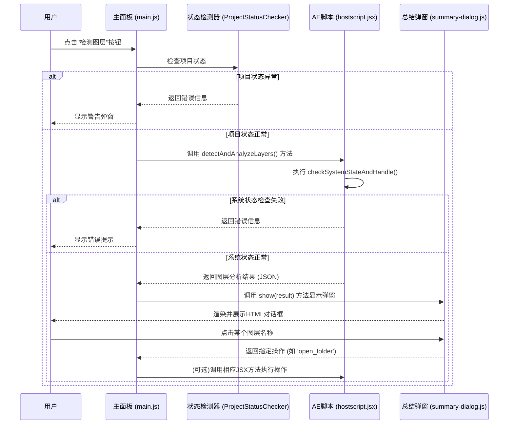

# "检测图层"按钮功能说明

## 1. 功能概述

"检测图层"是Eagle2Ae插件的核心辅助功能之一。它负责扫描当前活动合成中的所有图层，分析其类型和内容，并将结果呈现在一个自定义的总结对话框中，用户可以在该对话框中进行下一步操作，如快速打开文件所在位置或导出特定图层的单帧预览。

### 1.1 核心优化功能

该按钮经过系统性优化，具备以下智能检测和处理能力：

- **🔍 智能项目状态检测**: 自动检查项目是否打开，确保操作环境有效
- **⚠️ 统一错误处理系统**: 提供友好的中文错误提示和操作建议
- **🎭 演示模式支持**: 在CEP环境下自动切换到演示模式，使用虚拟数据
- **🔗 ExtendScript连接验证**: 确保JavaScript与JSX脚本的通信正常

## 2. 项目状态检测机制

### 2.1 检测流程

在执行图层检测之前，系统会进行以下状态验证：

```javascript
// 项目状态检测配置
const validationOptions = {
    requireProject: true,        // 必须打开项目
    requireComposition: false,   // 活动合成为可选
    requireSelectedLayers: false // 不要求选中图层
};
```

### 2.2 错误处理机制

当检测到项目状态异常时，系统会显示相应的警告弹窗：

| 错误类型 | 错误代码 | 弹窗提示 | 用户操作建议 |
|---------|---------|---------|-------------|
| 项目未打开 | `NO_PROJECT` | "当前没有打开的项目" | 请先打开或创建一个AE项目 |
| ExtendScript连接失败 | `CONNECTION_ERROR` | "脚本连接失败" | 检查CEP扩展是否正常加载 |

### 2.3 演示模式处理

```javascript
// 演示模式检测逻辑
if (this.isDemoMode()) {
    this.log('🎭 演示模式：使用虚拟图层数据', 'info');
    const demoData = this.generateDemoLayerData();
    this.showDetectionSummaryDialog(demoData);
    return;
}
```

## 2. 工作流程

该功能的实现跨越了CEP的JavaScript层、ExtendScript层以及一个自定义的HTML对话框UI，其端到端的工作流程如下：



## 3. 代码调用链详解

### 3.1 起点: `main.js`

当用户点击ID为 `detect-layers-btn` 的按钮时，`main.js` 中的 `detectLayers()` 方法被触发。

```javascript
// AEExtension.detectLayers() in main.js
async detectLayers() {
    this.log('🔍 开始检测图层...', 'info');
    
    try {
        // 1. 演示模式检测
        if (this.isDemoMode()) {
            this.log('🎭 演示模式：使用虚拟图层数据', 'info');
            const demoData = this.generateDemoLayerData();
            this.showDetectionSummaryDialog(demoData);
            return;
        }

        // 2. 项目状态检测
        const projectStatus = await this.projectStatusChecker.checkProjectStatus();
        if (!projectStatus.hasProject) {
            this.showUserMessage('请先打开一个After Effects项目', 'warning');
            return;
        }

        // 3. ExtendScript连接测试
        const connectionTest = await this.testExtendScriptConnection();
        if (!connectionTest.success) {
            this.showUserMessage('ExtendScript连接失败，请重启插件', 'error');
            return;
        }

        // 4. 调用ExtendScript执行检测
        const result = await this.executeExtendScript('detectAndAnalyzeLayers', {});

        if (result.success) {
            this.log(`✅ 图层检测完成，发现 ${result.totalLayers} 个图层`, 'success');
            
            // 5. 调用对话框显示结果
            this.showDetectionSummaryDialog(result);

        } else {
            // 错误处理
            this.log(`❌ 图层检测失败: ${result.error}`, 'error');
            this.showUserMessage(`检测失败: ${result.error}`, 'error');
        }
    } catch (error) {
        this.log(`❌ 检测图层时发生异常: ${error.message}`, 'error');
        this.showUserMessage('检测过程中发生错误，请重试', 'error');
    }
}
```

### 3.2 状态验证: `ProjectStatusChecker.js`

项目状态检测器负责验证After Effects的当前状态：

```javascript
// ProjectStatusChecker.checkProjectStatus()
async checkProjectStatus() {
    try {
        const result = await this.csInterface.evalScript(`
            (function() {
                return {
                    hasProject: app.project && app.project.file !== null,
                    hasComposition: app.project.activeItem instanceof CompItem,
                    projectSaved: app.project.file !== null,
                    hasUnsavedChanges: app.project.dirty
                };
            })()
        `);
        
        return JSON.parse(result);
    } catch (error) {
        return { hasProject: false, error: error.message };
    }
}
```

### 3.3 数据处理: `hostscript.jsx`

`detectAndAnalyzeLayers()` 函数在After Effects的宿主环境中运行，增加了系统状态检查：

```javascript
// hostscript.jsx - detectAndAnalyzeLayers()
function detectAndAnalyzeLayers() {
    try {
        // 1. 系统状态检查
        var systemCheck = checkSystemStateAndHandle({
            requireProject: true,
            requireComposition: false,
            requireSelectedLayers: false
        });
        
        if (!systemCheck.success) {
            return {
                success: false,
                error: systemCheck.error,
                errorType: systemCheck.errorType
            };
        }

        // 2. 执行图层检测逻辑
        var activeComp = app.project.activeItem;
        if (!activeComp || !(activeComp instanceof CompItem)) {
            return {
                success: false,
                error: "没有活动的合成",
                errorType: "NO_COMPOSITION"
            };
        }

        // 3. 遍历和分析图层
        var layers = [];
        for (var i = 1; i <= activeComp.numLayers; i++) {
            var layer = activeComp.layer(i);
            var layerInfo = analyzeLayer(layer);
            layers.push(layerInfo);
        }

        // 4. 返回分析结果
        return {
            success: true,
            totalLayers: layers.length,
            layers: layers,
            compositionName: activeComp.name,
            timestamp: new Date().toISOString()
        };

    } catch (error) {
        return {
            success: false,
            error: error.toString(),
            errorType: "SCRIPT_ERROR"
        };
    }
}
```

### 3.4 UI展示: `summary-dialog.js`

`main.js` 在获取到数据后，会实例化 `SummaryDialog` 类并调用其 `show(data)` 方法。这个类是整个交互的核心，它负责：

1.  **动态渲染**: 解析传入的图层数据，动态生成一个HTML模态对话框的DOM结构。
2.  **交互绑定**: 在渲染过程中，如果一个图层被标记为 `actionable: true`，它的`<li>`元素会被添加上 `.clickable` 样式，并被绑定一个点击事件。
3.  **事件处理**: 当用户点击可点击的图层名称时，`_handleLayerClick` 方法被触发。它会根据图层数据中的 `action` 类型（如 `open_folder`），通过Promise将一个包含操作指令的对象传递回 `main.js`。

## 4. 错误处理和用户反馈

### 4.1 错误类型定义

```javascript
// hostscript.jsx - 错误类型枚举
var ERROR_TYPES = {
    NO_PROJECT: 'NO_PROJECT',
    NO_COMPOSITION: 'NO_COMPOSITION',
    CONNECTION_ERROR: 'CONNECTION_ERROR',
    SCRIPT_ERROR: 'SCRIPT_ERROR'
};

var ERROR_MESSAGES = {
    NO_PROJECT: '当前没有打开的项目，请先打开或创建一个AE项目',
    NO_COMPOSITION: '没有活动的合成，请选择一个合成',
    CONNECTION_ERROR: 'ExtendScript连接失败，请重启插件',
    SCRIPT_ERROR: '脚本执行过程中发生错误'
};
```

### 4.2 用户友好提示

系统会根据不同的错误类型显示相应的中文提示信息：

- **项目未打开**: 显示操作建议，引导用户打开项目
- **连接失败**: 提供故障排除步骤
- **脚本错误**: 记录详细错误信息，向用户显示简化提示

## 5. 总结对话框中的交互

总结对话框是一个完全由HTML/CSS/JS构建的自定义UI，它提供了比原生弹窗更丰富的交互。

- **打开文件夹**: 如果图层是普通的素材文件（图片、视频等），点击其名称会触发 `open_folder` 操作，`main.js` 会调用相应的JSX脚本在操作系统中直接打开该文件所在的文件夹。

- **导出单帧**: 如果图层是 **预合成** 或 **设计文件**（如`.psd`），点击其名称会触发 `export_comp` 操作，`main.js` 会调用相应的JSX脚本，将该图层在当前时间点的画面渲染并导出一张PNG预览图。

- **信息提示**: 对于不可操作的图层（如纯色层），或将鼠标悬浮在任何图层名称上时，会显示一个包含该图层完整路径、尺寸等详细信息的Tooltip。

## 6. 性能优化和安全机制

### 6.1 性能优化

- **状态缓存**: 项目状态检测结果会被缓存，避免重复检查
- **异步处理**: 所有ExtendScript调用都使用异步模式，避免界面阻塞
- **错误恢复**: 检测失败时自动清理资源，保持系统稳定

### 6.2 安全机制

- **输入验证**: 所有用户输入和脚本返回值都经过验证
- **异常捕获**: 完整的try-catch机制确保错误不会导致插件崩溃
- **状态隔离**: 演示模式和正常模式完全隔离，避免数据混淆

---

**相关文档**:
- [UI组件说明](../api/ui-components.md)
- [函数功能映射](../api/function-mapping.md)
- [对话框系统](../development/dialog-system.md)
- [项目状态检测](../development/project-status-detection.md)
