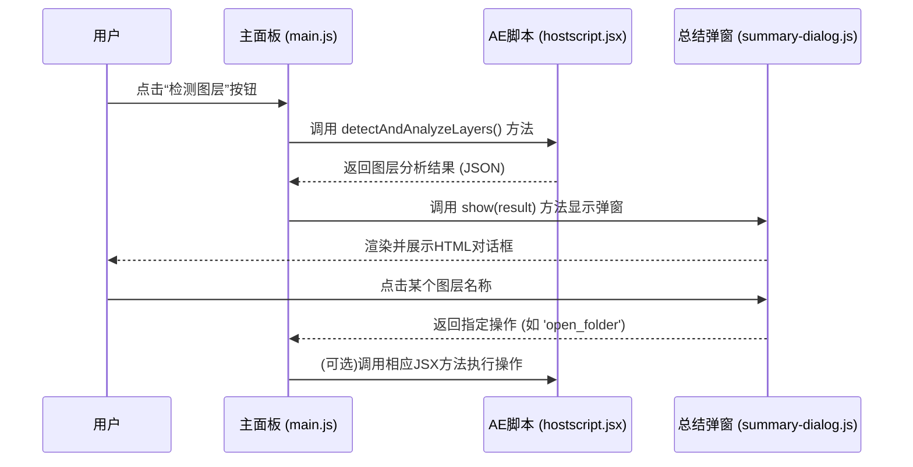

# “检测图层”按钮功能说明

## 1. 功能概述

“检测图层”是Eagle2Ae插件的核心辅助功能之一。它负责扫描当前活动合成中的所有图层，分析其类型和内容，并将结果呈现在一个自定义的总结对话框中，用户可以在该对话框中进行下一步操作，如快速打开文件所在位置或导出特定图层的单帧预览。

## 2. 工作流程

该功能的实现跨越了CEP的JavaScript层、ExtendScript层以及一个自定义的HTML对话框UI，其端到端的工作流程如下：



## 3. 代码调用链详解

### 3.1 起点: `main.js`

当用户点击ID为 `detect-layers-btn` 的按钮时，`main.js` 中的 `detectLayers()` 方法被触发。

```javascript
// AEExtension.detectLayers() in main.js
async detectLayers() {
    this.log('🔍 开始检测图层...', 'info');
    try {
        // 1. 调用ExtendScript执行检测
        const result = await this.executeExtendScript('detectAndAnalyzeLayers', {});

        if (result.success) {
            this.log(`✅ 图层检测完成，发现 ${result.totalLayers} 个图层`, 'success');
            
            // 2. 调用对话框显示结果
            this.showDetectionSummaryDialog(result);

        } else {
            // ...错误处理
        }
    } catch (error) {
        // ...错误处理
    }
}
```

### 3.2 数据处理: `hostscript.jsx`

`detectAndAnalyzeLayers()` 函数在After Effects的宿主环境中运行，负责：
1.  遍历当前活动合成 (`app.project.activeItem`) 的所有图层。
2.  分析每个图层的源 (`source`)，判断其是素材、合成还是其他类型。
3.  收集图层信息，如名称、尺寸、文件路径等。
4.  为每个图层确定是否“可操作” (`actionable`) 以及对应的操作类型 (`action`)。
5.  将所有分析数据打包成一个JSON字符串返回给JavaScript层。

### 3.3 UI展示: `summary-dialog.js`

`main.js` 在获取到数据后，会实例化 `SummaryDialog` 类并调用其 `show(data)` 方法。这个类是整个交互的核心，它负责：

1.  **动态渲染**: 解析传入的图层数据，动态生成一个HTML模态对话框的DOM结构。
2.  **交互绑定**: 在渲染过程中，如果一个图层被标记为 `actionable: true`，它的`<li>`元素会被添加上 `.clickable` 样式，并被绑定一个点击事件。
3.  **事件处理**: 当用户点击可点击的图层名称时，`_handleLayerClick` 方法被触发。它会根据图层数据中的 `action` 类型（如 `open_folder`），通过Promise将一个包含操作指令的对象传递回 `main.js`。

## 4. 总结对话框中的交互

总结对话框是一个完全由HTML/CSS/JS构建的自定义UI，它提供了比原生弹窗更丰富的交互。

- **打开文件夹**: 如果图层是普通的素材文件（图片、视频等），点击其名称会触发 `open_folder` 操作，`main.js` 会调用相应的JSX脚本在操作系统中直接打开该文件所在的文件夹。

- **导出单帧**: 如果图层是 **预合成** 或 **设计文件**（如`.psd`），点击其名称会触发 `export_comp` 操作，`main.js` 会调用相应的JSX脚本，将该图层在当前时间点的画面渲染并导出一张PNG预览图。

- **信息提示**: 对于不可操作的图层（如纯色层），或将鼠标悬浮在任何图层名称上时，会显示一个包含该图层完整路径、尺寸等详细信息的Tooltip。

---

**相关文档**:
- [UI组件说明](../api/ui-components.md)
- [函数功能映射](../api/function-mapping.md)
