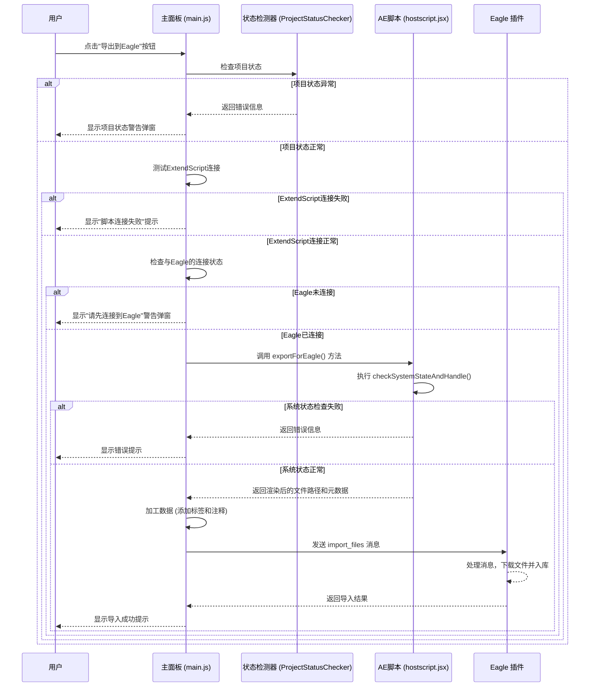

# "导出到Eagle"按钮功能说明

## 1. 功能概述

"导出到Eagle"按钮提供了一个从 After Effects 到 Eagle 的无缝工作流。它允许用户将AE合成中的图层（或整个合成）渲染为临时文件，并自动将这些文件连同丰富的元数据（如标签、注释）一起发送到 Eagle 插件，由Eagle完成最终的入库操作。这极大地简化了从AE中收集和管理素材的过程。

### 1.1 核心优化功能

该按钮经过全面优化，具备以下智能检测和处理能力：

- **🔗 双重连接检测**: 分别验证ExtendScript连接和Eagle应用连接状态
- **📋 项目状态预检查**: 在连接检查前验证项目和合成状态
- **⚠️ 分层错误提示**: 根据不同错误类型显示专门的提示弹窗
- **🛡️ 智能错误处理**: 避免无效操作，提供用户友好的错误信息

## 2. 项目状态检测机制

### 2.1 检测流程

在执行导出操作之前，系统会进行多层次的状态验证：

```javascript
// 项目状态检测配置
const validationOptions = {
    requireProject: true,        // 必须打开项目
    requireComposition: true,    // 必须有活动合成
    requireSelectedLayers: false // 不强制要求选中图层
};
```

### 2.2 双重连接检测

系统采用双重连接检测机制，确保完整的通信链路：

| 检测阶段 | 检测内容 | 失败处理 |
|---------|---------|---------|
| **第一层** | ExtendScript连接状态 | 显示"脚本连接失败"提示 |
| **第二层** | Eagle应用连接状态 | 显示"请先连接到Eagle"弹窗 |

### 2.3 错误处理优先级

```javascript
// 错误处理优先级顺序
1. 项目状态检查 (最高优先级)
2. ExtendScript连接验证
3. Eagle连接状态检查
4. 导出操作执行
```

## 3. 工作流程

该功能横跨AE插件、AE脚本和Eagle插件，其核心是一个"状态检测 -> AE渲染 -> JS加工 -> Eagle入库"的四段式流程。



## 4. 代码调用链详解

### 4.1 起点: `main.js`

当用户点击ID为 `export-to-eagle-btn` 的按钮后，`main.js` 中的 `exportToEagle()` 方法被触发：

```javascript
// AEExtension.exportToEagle() in main.js
async exportToEagle() {
    this.log('🦅 开始导出到Eagle...', 'info');
    
    try {
        // 1. 项目状态检测
        const projectStatus = await this.projectStatusChecker.checkProjectStatus();
        if (!projectStatus.hasProject) {
            this.showUserMessage('请先打开一个After Effects项目', 'warning');
            return;
        }
        
        if (!projectStatus.hasComposition) {
            this.showUserMessage('请先选择一个合成', 'warning');
            return;
        }

        // 2. ExtendScript连接测试
        const connectionTest = await this.testExtendScriptConnection();
        if (!connectionTest.success) {
            this.showUserMessage('ExtendScript连接失败，请重启插件', 'error');
            return;
        }

        // 3. Eagle连接状态检查
        if (this.connectionState !== CONNECTION_STATES.CONNECTED) {
            this.log('❌ Eagle未连接，显示连接提示', 'warn');
            this.showPanelWarning('请先连接到Eagle插件');
            return;
        }

        // 4. 获取用户导出设置
        const exportSettings = await this.getUserExportSettings();
        
        // 5. 调用ExtendScript执行导出
        const result = await this.executeExtendScript('exportForEagle', exportSettings);

        if (result.success) {
            this.log(`✅ 导出完成，共 ${result.exportedLayers.length} 个文件`, 'success');
            
            // 6. 构造文件列表并丰富元数据
            const filesToImport = result.exportedLayers.map(layer => ({
                path: layer.filePath,
                name: layer.fileName,
                // 自动添加标签
                tags: ['AE导出', result.projectName, result.compName],
                // 自动生成注释
                annotation: `从AE项目 "${result.projectName}" 的合成 "${result.compName}" 中导出。`
            }));

            // 7. 发送导入请求到Eagle
            const eagleResponse = await this.sendToEagle({
                type: 'import_files',
                data: {
                    files: filesToImport,
                    source: 'ae_export'
                }
            });

            if (eagleResponse.success) {
                this.showUserMessage('文件已成功导入到Eagle', 'success');
            } else {
                this.showUserMessage(`Eagle导入失败: ${eagleResponse.error}`, 'error');
            }

        } else {
            this.log(`❌ 导出失败: ${result.error}`, 'error');
            this.showUserMessage(`导出失败: ${result.error}`, 'error');
        }

    } catch (error) {
        this.log(`❌ 导出到Eagle时发生异常: ${error.message}`, 'error');
        this.showUserMessage('导出过程中发生错误，请重试', 'error');
    }
}
```

### 4.2 状态验证: `ProjectStatusChecker.js`

项目状态检测器负责验证After Effects的当前状态：

```javascript
// ProjectStatusChecker.checkProjectStatus()
async checkProjectStatus() {
    try {
        const result = await this.csInterface.evalScript(`
            (function() {
                return {
                    hasProject: app.project && app.project.file !== null,
                    hasComposition: app.project.activeItem instanceof CompItem,
                    projectSaved: app.project.file !== null,
                    hasUnsavedChanges: app.project.dirty,
                    compositionName: app.project.activeItem ? app.project.activeItem.name : null
                };
            })()
        `);
        
        return JSON.parse(result);
    } catch (error) {
        return { hasProject: false, error: error.message };
    }
}
```

### 4.3 连接状态检测

系统采用分层的连接检测机制：

```javascript
// ExtendScript连接测试
async testExtendScriptConnection() {
    try {
        const result = await this.executeExtendScript('testConnection', {});
        return { success: true, result };
    } catch (error) {
        return { success: false, error: error.message };
    }
}

// Eagle连接状态检查
checkEagleConnection() {
    return this.connectionState === CONNECTION_STATES.CONNECTED;
}
```

### 4.4 数据处理: `hostscript.jsx`

`exportForEagle()` 函数在After Effects的宿主环境中运行，增加了系统状态检查：

```javascript
// hostscript.jsx - exportForEagle()
function exportForEagle(options) {
    try {
        // 1. 系统状态检查
        var systemCheck = checkSystemStateAndHandle({
            requireProject: true,
            requireComposition: true,
            requireSelectedLayers: false
        });
        
        if (!systemCheck.success) {
            return {
                success: false,
                error: systemCheck.error,
                errorType: systemCheck.errorType
            };
        }

        // 2. 获取活动合成
        var activeComp = app.project.activeItem;
        if (!activeComp || !(activeComp instanceof CompItem)) {
            return {
                success: false,
                error: "没有活动的合成",
                errorType: "NO_COMPOSITION"
            };
        }

        // 3. 执行导出操作
        var exportResult = performExportOperation(activeComp, options);
        
        // 4. 返回导出结果
        return {
            success: true,
            exportedLayers: exportResult.layers,
            projectName: app.project.file ? app.project.file.name : "未保存项目",
            compName: activeComp.name,
            exportPath: exportResult.exportPath,
            timestamp: new Date().toISOString()
        };

    } catch (error) {
        return {
            success: false,
            error: error.toString(),
            errorType: "SCRIPT_ERROR"
        };
    }
}
```

### 4.5 Eagle通信处理

数据加工完成后，系统通过WebSocket或HTTP与Eagle插件通信：

```javascript
// 发送导入请求到Eagle
async sendToEagle(message) {
    try {
        if (this.websocketClient && this.websocketClient.isConnected()) {
            // 使用WebSocket发送
            return await this.websocketClient.send(message);
        } else {
            // 使用HTTP发送
            return await this.httpClient.post('/api/import', message);
        }
    } catch (error) {
        this.log(`❌ 发送到Eagle失败: ${error.message}`, 'error');
        return { success: false, error: error.message };
    }
}
```

## 5. 错误处理和用户反馈

### 5.1 错误类型定义

```javascript
// 导出到Eagle的错误类型
var EXPORT_ERROR_TYPES = {
    NO_PROJECT: 'NO_PROJECT',
    NO_COMPOSITION: 'NO_COMPOSITION',
    CONNECTION_ERROR: 'CONNECTION_ERROR',
    EAGLE_NOT_CONNECTED: 'EAGLE_NOT_CONNECTED',
    EXPORT_FAILED: 'EXPORT_FAILED',
    EAGLE_IMPORT_FAILED: 'EAGLE_IMPORT_FAILED'
};

var EXPORT_ERROR_MESSAGES = {
    NO_PROJECT: '请先打开一个After Effects项目',
    NO_COMPOSITION: '请先选择一个合成',
    CONNECTION_ERROR: 'ExtendScript连接失败，请重启插件',
    EAGLE_NOT_CONNECTED: '请先连接到Eagle插件',
    EXPORT_FAILED: '导出过程中发生错误',
    EAGLE_IMPORT_FAILED: 'Eagle导入失败，请检查Eagle应用状态'
};
```

### 5.2 分层错误提示

系统根据不同的错误类型显示相应的提示：

- **项目状态错误**: 显示项目相关的操作建议
- **连接错误**: 提供连接故障排除步骤
- **Eagle错误**: 显示Eagle相关的错误信息和解决方案

### 5.3 用户体验优化

- **预防性检查**: 在执行操作前进行全面的状态检查
- **友好提示**: 所有错误信息都使用中文，并提供操作建议
- **进度反馈**: 在长时间操作中提供进度提示
- **成功确认**: 操作成功后显示明确的成功提示

## 6. 性能优化和安全机制

### 6.1 性能优化

- **状态缓存**: 连接状态和项目状态会被缓存，避免重复检查
- **异步处理**: 所有网络通信和文件操作都使用异步模式
- **资源管理**: 导出完成后自动清理临时文件和资源

### 6.2 安全机制

- **输入验证**: 所有用户输入和配置都经过验证
- **路径安全**: 文件路径操作使用安全的路径处理方法
- **异常恢复**: 操作失败时自动清理资源，保持系统稳定

## 7. 导出设置和路径管理

### 7.1 导出模式

系统支持多种导出模式：

- **桌面模式**: 导出到用户桌面
- **项目旁模式**: 导出到项目文件旁边
- **自定义文件夹**: 用户指定导出路径

### 7.2 路径确定逻辑

```javascript
// 导出路径确定逻辑
function determineExportPath(exportSettings, projectInfo) {
    switch (exportSettings.mode) {
        case 'desktop':
            return path.join(os.homedir(), 'Desktop', 'AE_Export');
        case 'project_side':
            return path.join(path.dirname(projectInfo.projectPath), 'AE_Export');
        case 'custom':
            return exportSettings.customPath;
        default:
            return path.join(os.tmpdir(), 'AE_Export');
    }
}
```

---

**相关文档**:
- [UI组件说明](../api/ui-components.md)
- [函数功能映射](../api/function-mapping.md)
- [对话框系统](../development/dialog-system.md)
- [连接管理](../development/connection-management.md)
- [项目状态检测](../development/project-status-detection.md)