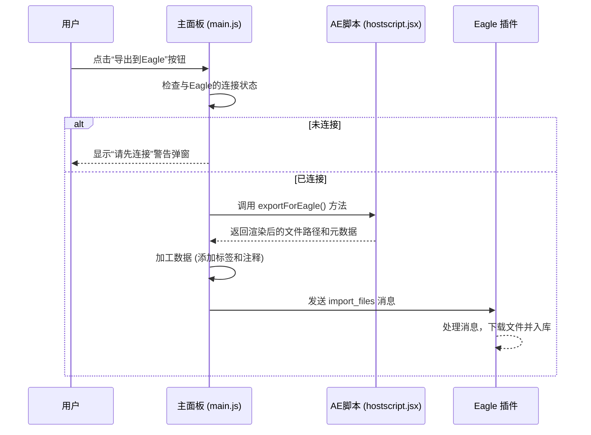

# “导出到Eagle”按钮功能说明

## 1. 功能概述

“导出到Eagle”按钮提供了一个从 After Effects 到 Eagle 的无缝工作流。它允许用户将AE合成中的图层（或整个合成）渲染为临时文件，并自动将这些文件连同丰富的元数据（如标签、注释）一起发送到 Eagle 插件，由Eagle完成最终的入库操作。这极大地简化了从AE中收集和管理素材的过程。

## 2. 工作流程

该功能横跨AE插件、AE脚本和Eagle插件，其核心是一个“AE渲染 -> JS加工 -> Eagle入库”的三段式流程。



## 3. 代码调用链详解

### 3.1 前置条件：连接检查

当用户点击ID为 `export-to-eagle-btn` 的按钮后，`main.js` 中的 `exportToEagle()` 方法会首先检查 `this.connectionState` 属性。

- 如果状态不是 `CONNECTED`，函数会立即中止，并调用 `showPanelWarning()` 显示一个模态对话框，提示用户“请先连接到Eagle插件”。
- 这是确保后续网络通信能够成功执行的关键前置步骤。

### 3.2 步骤一: JSX 在 AE 中执行渲染

连接检查通过后，`main.js` 会调用 `this.executeExtendScript('exportForEagle', {})` 来执行 `hostscript.jsx` 中的 `exportForEagle()` 函数。

这个JSX函数负责：
1.  根据用户的选择（例如选中的图层），在AE内部执行渲染操作。
2.  将渲染结果保存到一个临时的文件位置。
3.  收集这次导出的核心信息，包括渲染出的文件路径列表 (`exportedLayers`)、当前项目名称 (`projectName`) 和合成名称 (`compName`)。
4.  将这些信息打包成一个JSON对象返回给 `main.js`。

### 3.3 步骤二: `main.js` 加工并丰富元数据

`main.js` 在收到JSX返回的数据后，并不会直接将其转发，而是会执行一个重要的“数据再加工”步骤。

```javascript
// AEExtension.exportToEagle() in main.js (核心逻辑)

// ... 连接检查 ...

// 2. 调用ExtendScript执行导出并获取文件路径
const result = await this.executeExtendScript('exportForEagle', {});

if (result.success) {
    // 3. 构造文件列表并丰富元数据
    const filesToImport = result.exportedLayers.map(layer => ({
        path: layer.filePath,
        name: layer.fileName,
        // 自动添加标签
        tags: ['AE导出', result.projectName, result.compName],
        // 自动生成注释
        annotation: `从AE项目 "${result.projectName}" 的合成 "${result.compName}" 中导出。`
    }));

    // 4. 发送导入请求到Eagle
    const eagleResponse = await this.sendToEagle({
        type: 'import_files',
        data: {
            files: filesToImport,
            source: 'ae_export'
        }
    });
}
```

如上所示，`main.js` 遍历了返回的文件列表，并为每个文件自动添加了包含来源信息的 **标签 (tags)** 和 **注释 (annotation)**。这使得用户在Eagle中可以轻松地追溯素材来源。

### 3.4 步骤三: 发送指令，由 Eagle 完成入库

数据加工完成后，`main.js` 调用 `sendToEagle()` 方法，将一个包含文件信息和元数据的 `import_files` 消息通过WebSocket或HTTP发送给Eagle插件。

Eagle插件接收到这个消息后，会负责后续所有的入库工作，例如：
- 从AE插件返回的临时路径下载或移动文件。
- 将文件添加到Eagle资源库。
- 应用 `main.js` 中附加的标签和注释。

---

**相关文档**:
- [UI组件说明](../api/ui-components.md)
- [函数功能映射](../api/function-mapping.md)