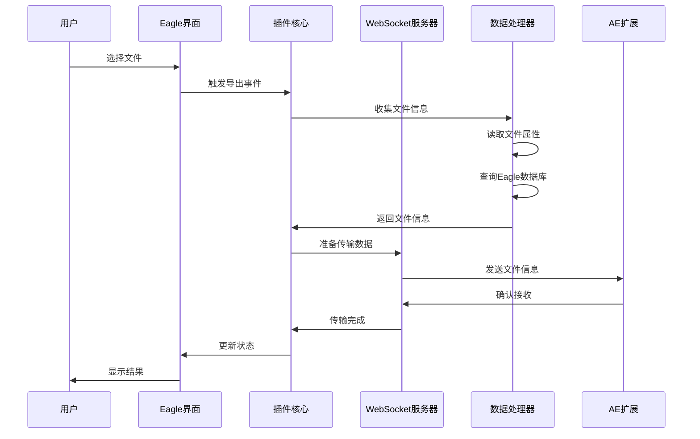
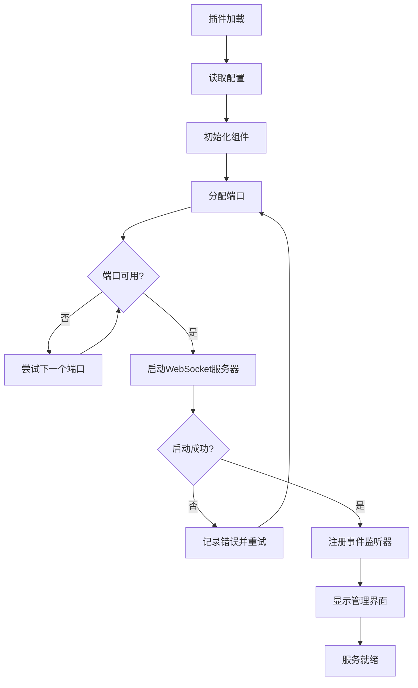

# Eagle 插件架构设计

## 概述

Eagle2Ae-Eagle 是基于 Eagle 插件 API 开发的服务型插件，采用模块化架构设计，实现了文件选择、数据传输、WebSocket 通信和后台服务等核心功能。插件以服务模式运行，提供持续的后台服务和用户交互界面。

## 整体架构

### 架构图

```
┌─────────────────────────────────────────────────────────────┐
│                        Eagle 应用                          │
│  ┌─────────────────────────────────────────────────────┐    │
│  │              Eagle2Ae 插件                          │    │
│  │                                                     │    │
│  │  ┌─────────────┐    ┌─────────────┐    ┌─────────┐  │    │
│  │  │   管理界面   │    │   服务核心   │    │ 配置管理 │  │    │
│  │  │ (HTML/JS)   │◄──►│ (plugin.js) │◄──►│ (JSON)  │  │    │
│  │  └─────────────┘    └─────────────┘    └─────────┘  │    │
│  │         │                   │                       │    │
│  │         ▼                   ▼                       │    │
│  │  ┌─────────────────────────────────────────────────┐  │    │
│  │  │              Eagle API 接口层                  │  │    │
│  │  └─────────────────────────────────────────────────┘  │    │
│  │                           │                          │    │
│  │                           ▼                          │    │
│  │  ┌─────────────────────────────────────────────────┐  │    │
│  │  │            WebSocket 服务器模块                 │  │    │
│  │  │  ┌─────────────┐  ┌─────────────┐  ┌─────────┐  │  │    │
│  │  │  │ 连接管理器   │  │ 消息路由器   │  │ 端口分配 │  │  │    │
│  │  │  └─────────────┘  └─────────────┘  └─────────┘  │  │    │
│  │  └─────────────────────────────────────────────────┘  │    │
│  │                           │                          │    │
│  │                           ▼                          │    │
│  │  ┌─────────────────────────────────────────────────┐  │    │
│  │  │              数据处理模块                       │  │    │
│  │  │  ┌─────────────┐  ┌─────────────┐  ┌─────────┐  │  │    │
│  │  │  │ 文件读取器   │  │ 数据库访问   │  │ 剪贴板   │  │  │    │
│  │  │  └─────────────┘  └─────────────┘  └─────────┘  │  │    │
│  │  └─────────────────────────────────────────────────┘  │    │
│  └─────────────────────────────────────────────────────┘    │
└─────────────────────────────────────────────────────────────┘
                              │
                              ▼ (WebSocket)
┌─────────────────────────────────────────────────────────────┐
│                   After Effects CEP 扩展                   │
└─────────────────────────────────────────────────────────────┘
```

### 核心组件

#### 1. 插件主体 (Plugin Core)
- **技术栈**: JavaScript ES6+, Eagle Plugin API
- **职责**: 插件生命周期管理、用户交互处理
- **特点**: 服务模式运行、事件驱动架构
- **文件位置**: `js/plugin.js`

#### 2. WebSocket 服务器 (WebSocket Server)
- **技术栈**: Node.js ws 库
- **职责**: 与 AE 扩展建立通信、消息传输
- **特点**: 动态端口分配、自动重启、连接管理
- **文件位置**: `js/websocket-server.js`

#### 3. 数据处理模块 (Data Processing)
- **技术栈**: fs-extra, SQLite 读取
- **职责**: 文件信息收集、数据库查询、数据格式化
- **特点**: 异步处理、错误恢复、数据验证
- **文件位置**: `js/database/`, `js/utils/`

#### 4. 剪贴板集成 (Clipboard Integration)
- **技术栈**: @crosscopy/clipboard
- **职责**: 文件路径读写、数据交换
- **特点**: 跨平台兼容、格式转换、错误处理
- **文件位置**: `js/clipboard/`

#### 5. 通信协议模块 (Communication Protocol)
- **技术栈**: WebSocket, JSON
- **职责**: 消息格式化、协议兼容性处理
- **特点**: 标准化消息格式、版本兼容
- **文件位置**: `js/websocket-protocol.js`, `js/websocket-eagle-compatible.js`

#### 6. 端口管理模块 (Port Management)
- **技术栈**: Node.js net 模块
- **职责**: 动态端口分配、端口冲突检测
- **特点**: 自动端口发现、冲突避免
- **文件位置**: `js/dynamic-port-allocator.js`

## 模块详细设计

### 插件主体模块

#### 生命周期管理
```javascript
/**
 * 插件主类
 */
class Eagle2AePlugin {
    constructor() {
        this.isServiceMode = true;
        this.server = null;
        this.config = null;
        this.status = 'stopped';
    }

    /**
     * 插件初始化
     */
    async initialize() {
        try {
            // 加载配置
            this.config = await this.loadConfig();
            
            // 初始化 WebSocket 服务器
            this.server = new WebSocketServer(this.config.port);
            
            // 注册事件监听器
            this.registerEventListeners();
            
            // 启动服务
            await this.startService();
            
            this.status = 'running';
            this.log('插件初始化完成');
        } catch (error) {
            this.handleError('初始化失败', error);
        }
    }

    /**
     * 插件销毁
     */
    async destroy() {
        try {
            // 停止服务
            await this.stopService();
            
            // 清理资源
            this.cleanup();
            
            this.status = 'stopped';
            this.log('插件已停止');
        } catch (error) {
            this.handleError('停止失败', error);
        }
    }
}
```

#### 事件系统
```javascript
/**
 * 事件管理器
 */
class EventManager {
    constructor() {
        this.listeners = new Map();
    }

    /**
     * 注册事件监听器
     */
    on(event, callback) {
        if (!this.listeners.has(event)) {
            this.listeners.set(event, []);
        }
        this.listeners.get(event).push(callback);
    }

    /**
     * 触发事件
     */
    emit(event, data) {
        const callbacks = this.listeners.get(event);
        if (callbacks) {
            callbacks.forEach(callback => {
                try {
                    callback(data);
                } catch (error) {
                    console.error(`事件处理错误 [${event}]:`, error);
                }
            });
        }
    }
}
```

### WebSocket 服务器模块

#### 服务器架构
```javascript
/**
 * WebSocket 服务器
 */
class WebSocketServer {
    constructor(options = {}) {
        this.options = {
            port: 8080,
            host: '127.0.0.1',
            maxConnections: 5,
            heartbeatInterval: 30000,
            ...options
        };
        
        this.server = null;
        this.clients = new Map();
        this.isRunning = false;
    }

    /**
     * 启动服务器
     */
    async start() {
        return new Promise((resolve, reject) => {
            try {
                const WebSocket = require('ws');
                
                // 创建 WebSocket 服务器
                this.server = new WebSocket.Server({
                    port: this.options.port,
                    host: this.options.host
                });
                
                // 监听连接事件
                this.server.on('connection', (ws, req) => {
                    this.handleConnection(ws, req);
                });
                
                // 监听服务器事件
                this.server.on('listening', () => {
                    this.isRunning = true;
                    this.log(`WebSocket 服务器启动: ${this.options.host}:${this.options.port}`);
                    resolve();
                });
                
                this.server.on('error', (error) => {
                    this.handleServerError(error);
                    reject(error);
                });
                
            } catch (error) {
                reject(error);
            }
        });
    }

    /**
     * 处理客户端连接
     */
    handleConnection(ws, req) {
        const clientId = this.generateClientId();
        const clientInfo = {
            id: clientId,
            ws: ws,
            ip: req.socket.remoteAddress,
            connected: Date.now(),
            lastActivity: Date.now()
        };
        
        // 存储客户端信息
        this.clients.set(clientId, clientInfo);
        
        // 设置事件监听器
        ws.on('message', (data) => {
            this.handleMessage(clientId, data);
        });
        
        ws.on('close', (code, reason) => {
            this.handleDisconnection(clientId, code, reason);
        });
        
        ws.on('error', (error) => {
            this.handleClientError(clientId, error);
        });
        
        // 发送欢迎消息
        this.sendWelcomeMessage(clientId);
        
        this.log(`客户端连接: ${clientId} (${clientInfo.ip})`);
    }
}
```

#### 动态端口分配
```javascript
/**
 * 动态端口分配器
 */
class PortAllocator {
    constructor(startPort = 8080, endPort = 8090) {
        this.startPort = startPort;
        this.endPort = endPort;
        this.usedPorts = new Set();
    }

    /**
     * 查找可用端口
     */
    async findAvailablePort() {
        for (let port = this.startPort; port <= this.endPort; port++) {
            if (!this.usedPorts.has(port) && await this.isPortAvailable(port)) {
                this.usedPorts.add(port);
                return port;
            }
        }
        throw new Error('没有可用端口');
    }

    /**
     * 检查端口是否可用
     */
    async isPortAvailable(port) {
        return new Promise((resolve) => {
            const net = require('net');
            const server = net.createServer();
            
            server.listen(port, '127.0.0.1', () => {
                server.close(() => resolve(true));
            });
            
            server.on('error', () => resolve(false));
        });
    }

    /**
     * 释放端口
     */
    releasePort(port) {
        this.usedPorts.delete(port);
    }
}
```

### 数据处理模块

#### 文件信息收集器
```javascript
/**
 * 文件信息收集器
 */
class FileInfoCollector {
    constructor() {
        this.fs = require('fs-extra');
        this.path = require('path');
    }

    /**
     * 收集文件信息
     */
    async collectFileInfo(filePaths) {
        const fileInfos = [];
        
        for (const filePath of filePaths) {
            try {
                const info = await this.getFileInfo(filePath);
                if (info) {
                    fileInfos.push(info);
                }
            } catch (error) {
                console.error(`获取文件信息失败: ${filePath}`, error);
            }
        }
        
        return fileInfos;
    }

    /**
     * 获取单个文件信息
     */
    async getFileInfo(filePath) {
        try {
            const stats = await this.fs.stat(filePath);
            const parsed = this.path.parse(filePath);
            
            return {
                path: filePath,
                name: parsed.name,
                ext: parsed.ext,
                size: stats.size,
                mtime: stats.mtime,
                type: this.getFileType(parsed.ext),
                metadata: await this.getFileMetadata(filePath)
            };
        } catch (error) {
            console.error(`读取文件信息失败: ${filePath}`, error);
            return null;
        }
    }

    /**
     * 获取文件类型
     */
    getFileType(ext) {
        const imageExts = ['.jpg', '.jpeg', '.png', '.gif', '.bmp', '.tiff', '.webp'];
        const videoExts = ['.mp4', '.avi', '.mov', '.mkv', '.wmv', '.flv'];
        const audioExts = ['.mp3', '.wav', '.aac', '.flac', '.ogg'];
        
        ext = ext.toLowerCase();
        
        if (imageExts.includes(ext)) return 'image';
        if (videoExts.includes(ext)) return 'video';
        if (audioExts.includes(ext)) return 'audio';
        
        return 'other';
    }
}
```

#### Eagle 数据库访问器
```javascript
/**
 * Eagle 数据库访问器
 */
class EagleDatabase {
    constructor(dbPath) {
        this.dbPath = dbPath;
        this.db = null;
    }

    /**
     * 连接数据库
     */
    async connect() {
        try {
            const sqlite3 = require('sqlite3');
            
            return new Promise((resolve, reject) => {
                this.db = new sqlite3.Database(this.dbPath, sqlite3.OPEN_READONLY, (err) => {
                    if (err) {
                        reject(err);
                    } else {
                        resolve();
                    }
                });
            });
        } catch (error) {
            throw new Error(`数据库连接失败: ${error.message}`);
        }
    }

    /**
     * 查询文件信息
     */
    async queryFileInfo(filePath) {
        return new Promise((resolve, reject) => {
            const sql = `
                SELECT 
                    id, name, size, ext, tags, 
                    width, height, duration,
                    palettes, annotation
                FROM items 
                WHERE filePath = ?
            `;
            
            this.db.get(sql, [filePath], (err, row) => {
                if (err) {
                    reject(err);
                } else {
                    resolve(row);
                }
            });
        });
    }

    /**
     * 查询文件夹信息
     */
    async queryFolderInfo(folderId) {
        return new Promise((resolve, reject) => {
            const sql = `
                SELECT id, name, description, iconColor
                FROM folders 
                WHERE id = ?
            `;
            
            this.db.get(sql, [folderId], (err, row) => {
                if (err) {
                    reject(err);
                } else {
                    resolve(row);
                }
            });
        });
    }

    /**
     * 关闭数据库连接
     */
    async close() {
        if (this.db) {
            return new Promise((resolve) => {
                this.db.close((err) => {
                    if (err) {
                        console.error('关闭数据库失败:', err);
                    }
                    resolve();
                });
            });
        }
    }
}
```

### 剪贴板集成模块

#### 剪贴板处理器
```javascript
/**
 * 剪贴板处理器
 */
class ClipboardHandler {
    constructor() {
        this.clipboard = require('@crosscopy/clipboard');
    }

    /**
     * 读取剪贴板文件路径
     */
    async readFilePaths() {
        try {
            // 读取剪贴板内容
            const clipboardData = await this.clipboard.read();
            
            // 解析文件路径
            const filePaths = this.parseFilePaths(clipboardData);
            
            return filePaths;
        } catch (error) {
            console.error('读取剪贴板失败:', error);
            return [];
        }
    }

    /**
     * 写入文件路径到剪贴板
     */
    async writeFilePaths(filePaths) {
        try {
            // 格式化文件路径
            const formattedPaths = this.formatFilePaths(filePaths);
            
            // 写入剪贴板
            await this.clipboard.write(formattedPaths);
            
            return true;
        } catch (error) {
            console.error('写入剪贴板失败:', error);
            return false;
        }
    }

    /**
     * 解析剪贴板中的文件路径
     */
    parseFilePaths(clipboardData) {
        const filePaths = [];
        
        if (clipboardData.text) {
            // 处理文本格式的路径
            const lines = clipboardData.text.split('\n');
            for (const line of lines) {
                const trimmed = line.trim();
                if (trimmed && this.isValidFilePath(trimmed)) {
                    filePaths.push(trimmed);
                }
            }
        }
        
        if (clipboardData.files) {
            // 处理文件对象格式
            for (const file of clipboardData.files) {
                if (file.path && this.isValidFilePath(file.path)) {
                    filePaths.push(file.path);
                }
            }
        }
        
        return filePaths;
    }

    /**
     * 验证文件路径有效性
     */
    isValidFilePath(path) {
        const fs = require('fs');
        try {
            return fs.existsSync(path) && fs.statSync(path).isFile();
        } catch {
            return false;
        }
    }
}
```

## 数据流设计

### 文件选择和传输流程



### 服务启动流程



## 配置管理

### 配置文件结构
```javascript
/**
 * 插件配置
 */
const defaultConfig = {
    // 服务器配置
    server: {
        host: '127.0.0.1',
        portRange: {
            start: 8080,
            end: 8090
        },
        maxConnections: 5,
        heartbeatInterval: 30000
    },
    
    // 文件处理配置
    fileProcessing: {
        maxFileSize: 100 * 1024 * 1024, // 100MB
        supportedTypes: ['image', 'video', 'audio'],
        batchSize: 10
    },
    
    // 日志配置
    logging: {
        level: 'info', // debug, info, warn, error
        maxLogFiles: 5,
        maxLogSize: 10 * 1024 * 1024 // 10MB
    },
    
    // UI 配置
    ui: {
        theme: 'auto', // light, dark, auto
        language: 'zh-CN',
        showNotifications: true
    }
};
```

### 配置管理器
```javascript
/**
 * 配置管理器
 */
class ConfigManager {
    constructor(configPath) {
        this.configPath = configPath;
        this.config = null;
    }

    /**
     * 加载配置
     */
    async load() {
        try {
            const fs = require('fs-extra');
            
            if (await fs.pathExists(this.configPath)) {
                const configData = await fs.readJson(this.configPath);
                this.config = { ...defaultConfig, ...configData };
            } else {
                this.config = { ...defaultConfig };
                await this.save();
            }
            
            return this.config;
        } catch (error) {
            console.error('加载配置失败:', error);
            this.config = { ...defaultConfig };
            return this.config;
        }
    }

    /**
     * 保存配置
     */
    async save() {
        try {
            const fs = require('fs-extra');
            await fs.ensureDir(require('path').dirname(this.configPath));
            await fs.writeJson(this.configPath, this.config, { spaces: 2 });
            return true;
        } catch (error) {
            console.error('保存配置失败:', error);
            return false;
        }
    }

    /**
     * 获取配置值
     */
    get(key, defaultValue = null) {
        const keys = key.split('.');
        let value = this.config;
        
        for (const k of keys) {
            if (value && typeof value === 'object' && k in value) {
                value = value[k];
            } else {
                return defaultValue;
            }
        }
        
        return value;
    }

    /**
     * 设置配置值
     */
    set(key, value) {
        const keys = key.split('.');
        let target = this.config;
        
        for (let i = 0; i < keys.length - 1; i++) {
            const k = keys[i];
            if (!(k in target) || typeof target[k] !== 'object') {
                target[k] = {};
            }
            target = target[k];
        }
        
        target[keys[keys.length - 1]] = value;
    }
}
```

## 错误处理和恢复

### 错误分类
```javascript
/**
 * 错误类型定义
 */
const ErrorTypes = {
    // 网络错误
    NETWORK_ERROR: 'network_error',
    CONNECTION_FAILED: 'connection_failed',
    PORT_IN_USE: 'port_in_use',
    
    // 文件错误
    FILE_NOT_FOUND: 'file_not_found',
    FILE_ACCESS_DENIED: 'file_access_denied',
    INVALID_FILE_TYPE: 'invalid_file_type',
    
    // 数据库错误
    DATABASE_ERROR: 'database_error',
    QUERY_FAILED: 'query_failed',
    
    // 系统错误
    INSUFFICIENT_MEMORY: 'insufficient_memory',
    PERMISSION_DENIED: 'permission_denied',
    UNKNOWN_ERROR: 'unknown_error'
};
```

### 错误处理器
```javascript
/**
 * 错误处理器
 */
class ErrorHandler {
    constructor() {
        this.errorCounts = new Map();
        this.maxRetries = 3;
    }

    /**
     * 处理错误
     */
    handleError(error, context = {}) {
        const errorInfo = {
            type: this.classifyError(error),
            message: error.message,
            stack: error.stack,
            context: context,
            timestamp: Date.now()
        };
        
        // 记录错误
        this.logError(errorInfo);
        
        // 尝试恢复
        this.attemptRecovery(errorInfo);
        
        // 通知用户
        this.notifyUser(errorInfo);
    }

    /**
     * 错误分类
     */
    classifyError(error) {
        if (error.code === 'EADDRINUSE') {
            return ErrorTypes.PORT_IN_USE;
        }
        if (error.code === 'ENOENT') {
            return ErrorTypes.FILE_NOT_FOUND;
        }
        if (error.code === 'EACCES') {
            return ErrorTypes.PERMISSION_DENIED;
        }
        
        return ErrorTypes.UNKNOWN_ERROR;
    }

    /**
     * 尝试错误恢复
     */
    attemptRecovery(errorInfo) {
        const errorType = errorInfo.type;
        const retryCount = this.errorCounts.get(errorType) || 0;
        
        if (retryCount < this.maxRetries) {
            this.errorCounts.set(errorType, retryCount + 1);
            
            switch (errorType) {
                case ErrorTypes.PORT_IN_USE:
                    this.recoverPortError();
                    break;
                case ErrorTypes.CONNECTION_FAILED:
                    this.recoverConnectionError();
                    break;
                case ErrorTypes.DATABASE_ERROR:
                    this.recoverDatabaseError();
                    break;
            }
        }
    }
}
```

## 性能优化

### 内存管理
```javascript
/**
 * 内存管理器
 */
class MemoryManager {
    constructor() {
        this.memoryThreshold = 100 * 1024 * 1024; // 100MB
        this.checkInterval = 30000; // 30秒
        this.timer = null;
    }

    /**
     * 开始内存监控
     */
    startMonitoring() {
        this.timer = setInterval(() => {
            this.checkMemoryUsage();
        }, this.checkInterval);
    }

    /**
     * 检查内存使用情况
     */
    checkMemoryUsage() {
        const memUsage = process.memoryUsage();
        
        if (memUsage.heapUsed > this.memoryThreshold) {
            console.warn('内存使用过高:', {
                heapUsed: Math.round(memUsage.heapUsed / 1024 / 1024) + 'MB',
                heapTotal: Math.round(memUsage.heapTotal / 1024 / 1024) + 'MB'
            });
            
            // 触发垃圾回收
            if (global.gc) {
                global.gc();
            }
        }
    }

    /**
     * 停止监控
     */
    stopMonitoring() {
        if (this.timer) {
            clearInterval(this.timer);
            this.timer = null;
        }
    }
}
```

### 连接池管理
```javascript
/**
 * 连接池管理器
 */
class ConnectionPool {
    constructor(maxConnections = 5) {
        this.maxConnections = maxConnections;
        this.activeConnections = new Map();
        this.waitingQueue = [];
    }

    /**
     * 获取连接
     */
    async getConnection() {
        if (this.activeConnections.size < this.maxConnections) {
            const connection = await this.createConnection();
            this.activeConnections.set(connection.id, connection);
            return connection;
        } else {
            return new Promise((resolve) => {
                this.waitingQueue.push(resolve);
            });
        }
    }

    /**
     * 释放连接
     */
    releaseConnection(connectionId) {
        this.activeConnections.delete(connectionId);
        
        if (this.waitingQueue.length > 0) {
            const resolve = this.waitingQueue.shift();
            this.getConnection().then(resolve);
        }
    }
}
```

## 更新记录

| 日期 | 版本 | 更新内容 | 作者 |
|------|------|----------|------|
| 2024-01-05 | 1.0 | 初始架构设计文档 | 开发团队 |

---

**相关文档**:
- [WebSocket通信设计](./websocket-communication.md)
- [剪贴板集成设计](./clipboard-integration.md)
- [服务模式设计](./service-mode-design.md)