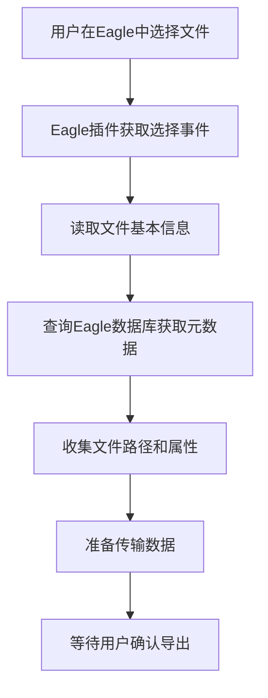
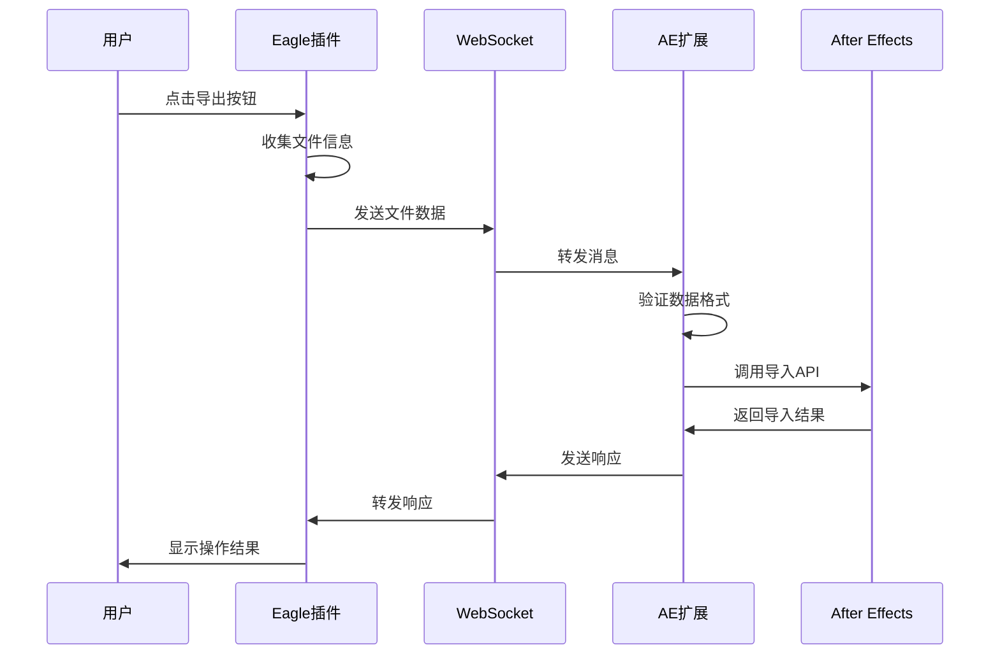
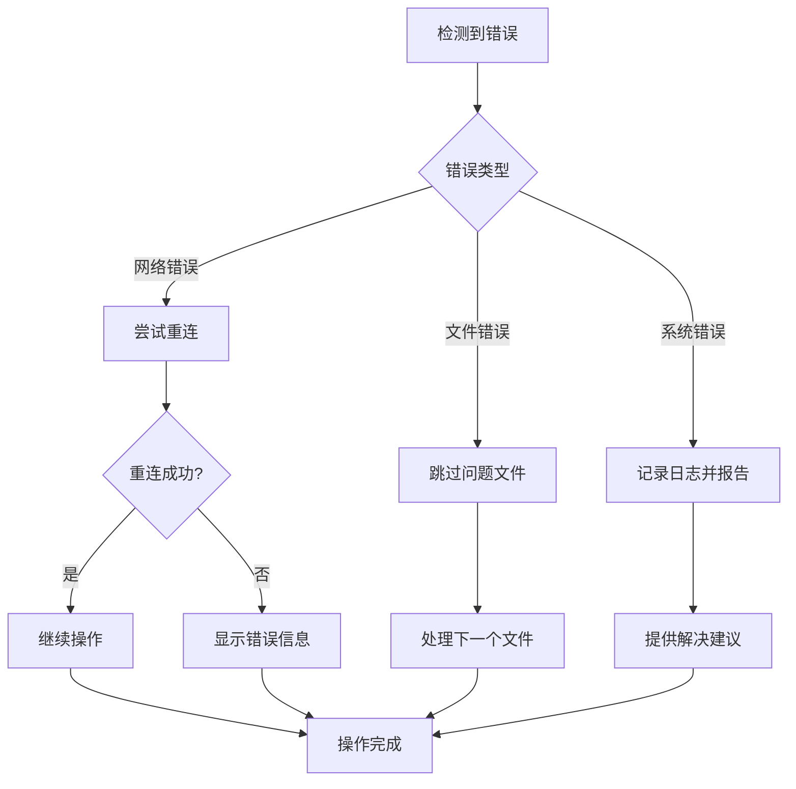

# Eagle2Ae 系统概览

## 概述

Eagle2Ae 是一个双端插件系统，实现了 Eagle 图片管理软件与 Adobe After Effects 之间的无缝文件传输功能。系统采用客户端-服务器架构，通过 WebSocket 协议进行实时通信，为用户提供高效、稳定的文件导入体验。

## 系统架构

### 整体架构图

```
┌─────────────────────────────────────────────────────────────┐
│                        用户工作流                           │
│  ┌─────────────────┐              ┌─────────────────┐      │
│  │   Eagle 软件     │              │ After Effects   │      │
│  │                 │              │                 │      │
│  │  ┌─────────────┐ │              │ ┌─────────────┐ │      │
│  │  │ 文件管理界面 │ │              │ │ 项目面板     │ │      │
│  │  └─────────────┘ │              │ └─────────────┘ │      │
│  └─────────────────┘              └─────────────────┘      │
└─────────────────────────────────────────────────────────────┘
                              │
                              ▼
┌─────────────────────────────────────────────────────────────┐
│                      插件系统层                             │
│  ┌─────────────────┐              ┌─────────────────┐      │
│  │ Eagle2Ae-Eagle  │◄────────────►│ Eagle2Ae-Ae     │      │
│  │   (Eagle插件)    │   WebSocket   │  (CEP扩展)      │      │
│  │                 │              │                 │      │
│  │ ┌─────────────┐ │              │ ┌─────────────┐ │      │
│  │ │WebSocket服务│ │              │ │WebSocket客户│ │      │
│  │ │文件信息收集 │ │              │ │文件导入处理 │ │      │
│  │ │剪贴板操作   │ │              │ │界面状态管理 │ │      │
│  │ │后台服务     │ │              │ │ExtendScript │ │      │
│  │ └─────────────┘ │              │ └─────────────┘ │      │
│  └─────────────────┘              └─────────────────┘      │
└─────────────────────────────────────────────────────────────┘
                              │
                              ▼
┌─────────────────────────────────────────────────────────────┐
│                      通信协议层                             │
│  ┌─────────────────────────────────────────────────────┐    │
│  │              WebSocket 通信协议                     │    │
│  │  ┌─────────────┐  ┌─────────────┐  ┌─────────────┐  │    │
│  │  │ 连接管理     │  │ 消息路由     │  │ 错误处理     │  │    │
│  │  │ 心跳检测     │  │ 数据传输     │  │ 状态同步     │  │    │
│  │  └─────────────┘  └─────────────┘  └─────────────┘  │    │
│  └─────────────────────────────────────────────────────┘    │
└─────────────────────────────────────────────────────────────┘
                              │
                              ▼
┌─────────────────────────────────────────────────────────────┐
│                      系统基础层                             │
│  ┌─────────────────┐              ┌─────────────────┐      │
│  │   Eagle API     │              │   Adobe API     │      │
│  │   Node.js       │              │   CEP SDK       │      │
│  │   文件系统       │              │   ExtendScript  │      │
│  └─────────────────┘              └─────────────────┘      │
└─────────────────────────────────────────────────────────────┘
```

### 核心组件

#### 1. Eagle2Ae-Eagle (Eagle 插件)
- **运行环境**: Eagle 3.0+ 插件系统
- **核心功能**: 文件选择、信息收集、WebSocket 服务
- **技术栈**: JavaScript, Node.js, Eagle Plugin API
- **运行模式**: 服务模式 (后台持续运行)

#### 2. Eagle2Ae-Ae (CEP 扩展)
- **运行环境**: Adobe After Effects CEP 框架
- **核心功能**: 文件接收、项目导入、用户界面
- **技术栈**: HTML/CSS/JavaScript, ExtendScript (JSX)
- **运行模式**: 面板模式 (集成在 AE 界面中)

#### 3. 通信协议
- **主要协议**: WebSocket (实时双向通信)
- **备用协议**: HTTP (状态查询和简单操作)
- **数据格式**: JSON (结构化消息传递)
- **安全机制**: 本地网络通信 (127.0.0.1)

## 系统特性

### 核心特性

#### 1. 实时通信
- **WebSocket 连接**: 低延迟的实时双向通信
- **自动重连**: 连接断开时自动尝试重连
- **心跳检测**: 定期检测连接状态
- **消息队列**: 离线时缓存消息，连接恢复后发送

#### 2. 智能文件处理
- **多格式支持**: 图片、视频、音频等多种媒体格式
- **批量处理**: 支持同时处理多个文件
- **元数据保留**: 保留文件的标签、颜色等 Eagle 元数据
- **路径解析**: 智能处理不同操作系统的文件路径

#### 3. 用户体验优化
- **状态反馈**: 实时显示操作进度和结果
- **错误处理**: 友好的错误提示和恢复建议
- **配置管理**: 灵活的导入设置和用户偏好
- **界面集成**: 无缝集成到 Eagle 和 AE 的工作流中

#### 4. 稳定性保障
- **错误恢复**: 自动处理各种异常情况
- **资源管理**: 合理使用内存和 CPU 资源
- **日志记录**: 详细的操作日志便于问题诊断
- **兼容性**: 支持多个版本的 Eagle 和 After Effects

### 技术特性

#### 1. 模块化架构
- **松耦合设计**: 各模块独立开发和测试
- **插件化扩展**: 支持功能模块的动态加载
- **配置驱动**: 通过配置文件控制功能行为
- **事件驱动**: 基于事件的异步处理机制

#### 2. 跨平台兼容
- **操作系统**: Windows 10+, macOS 10.14+
- **软件版本**: Eagle 3.0+, After Effects CC 2018+
- **文件系统**: 支持不同文件系统的路径格式
- **字符编码**: 统一使用 UTF-8 编码

#### 3. 性能优化
- **异步处理**: 非阻塞的文件操作和网络通信
- **内存管理**: 及时释放不再使用的资源
- **缓存机制**: 合理使用缓存提高响应速度
- **批量操作**: 减少单个文件操作的开销

## 数据流分析

### 主要数据流

#### 1. 文件选择流程


#### 2. 文件传输流程


#### 3. 错误处理流程


## 系统接口

### 外部接口

#### 1. Eagle API 接口
- **插件生命周期**: 初始化、运行、销毁
- **事件监听**: 文件选择、用户操作
- **数据库访问**: 读取文件元数据和标签信息
- **UI 集成**: 插件界面和菜单项

#### 2. Adobe CEP 接口
- **扩展框架**: CEP 扩展的加载和运行
- **UI 容器**: HTML 界面的渲染和交互
- **脚本桥接**: JavaScript 与 ExtendScript 通信
- **系统集成**: 菜单项和面板管理

#### 3. After Effects API 接口
- **项目管理**: 创建和管理项目素材
- **文件导入**: 导入各种媒体文件
- **合成操作**: 创建合成和图层
- **属性设置**: 设置素材属性和参数

### 内部接口

#### 1. WebSocket 通信接口
```javascript
// 消息格式
{
    type: 'string',        // 消息类型
    version: 'string',     // 协议版本
    id: 'string',         // 消息ID
    timestamp: 'number',   // 时间戳
    data: 'object',       // 消息数据
    replyTo: 'string',    // 回复消息ID (可选)
    error: 'object'       // 错误信息 (可选)
}
```

#### 2. 文件信息接口
```javascript
// 文件信息结构
{
    path: 'string',           // 文件绝对路径
    name: 'string',           // 文件名
    size: 'number',           // 文件大小
    type: 'string',           // 文件类型
    mtime: 'string',          // 修改时间
    metadata: {               // Eagle 元数据
        tags: ['string'],     // 标签列表
        rating: 'number',     // 评分
        annotation: 'string', // 注释
        palette: ['string']   // 调色板
    }
}
```

#### 3. 配置管理接口
```javascript
// 配置结构
{
    server: {                 // 服务器配置
        host: 'string',
        port: 'number',
        maxConnections: 'number'
    },
    import: {                 // 导入配置
        mode: 'string',       // 导入模式
        createComposition: 'boolean',
        organizeFolders: 'boolean'
    },
    ui: {                     // 界面配置
        theme: 'string',
        language: 'string',
        notifications: 'boolean'
    }
}
```

## 部署架构

### 安装部署

#### 1. Eagle 插件部署
```
Eagle插件目录/
├── Eagle2Ae-Eagle/
│   ├── manifest.json      # 插件配置
│   ├── package.json       # 依赖管理
│   ├── js/               # 核心逻辑
│   ├── index.html        # 管理界面
│   └── service.html      # 服务界面
```

#### 2. CEP 扩展部署
```
CEP扩展目录/
├── com.eagle.eagle2ae/
│   ├── CSXS/
│   │   └── manifest.xml   # CEP配置
│   ├── js/               # 前端逻辑
│   ├── jsx/              # ExtendScript
│   ├── public/           # 静态资源
│   └── index.html        # 主界面
```

### 运行环境

#### 1. 系统要求
- **操作系统**: Windows 10+ 或 macOS 10.14+
- **内存**: 最少 8GB RAM
- **存储**: 至少 1GB 可用空间
- **网络**: 本地回环网络支持

#### 2. 软件依赖
- **Eagle**: 3.0 或更高版本
- **After Effects**: CC 2018 或更高版本
- **Node.js**: 14.x 或更高版本 (Eagle 插件)
- **Chrome**: 用于 CEP 调试 (开发环境)

### 配置管理

#### 1. 环境配置
- **开发环境**: 启用调试模式，详细日志
- **生产环境**: 优化性能，简化日志
- **测试环境**: 模拟数据，自动化测试

#### 2. 用户配置
- **导入设置**: 文件导入的默认参数
- **界面偏好**: 主题、语言、通知设置
- **网络配置**: 端口范围、连接超时

## 监控和维护

### 系统监控

#### 1. 性能监控
- **内存使用**: 监控内存占用和泄漏
- **CPU 使用**: 监控处理器使用率
- **网络延迟**: 监控通信延迟和吞吐量
- **文件处理**: 监控文件操作的性能

#### 2. 状态监控
- **连接状态**: WebSocket 连接的健康状况
- **服务状态**: 各个服务模块的运行状态
- **错误统计**: 错误发生频率和类型分析
- **用户活动**: 用户操作的统计和分析

### 日志管理

#### 1. 日志分级
- **DEBUG**: 详细的调试信息
- **INFO**: 重要的操作信息
- **WARN**: 警告信息和潜在问题
- **ERROR**: 错误信息和异常情况

#### 2. 日志存储
- **文件日志**: 本地文件存储，支持轮转
- **内存日志**: 临时存储，用于实时查看
- **结构化日志**: JSON 格式，便于分析

## 安全考虑

### 数据安全

#### 1. 通信安全
- **本地通信**: 仅使用本地网络 (127.0.0.1)
- **端口绑定**: 只绑定本地回环地址
- **连接验证**: 验证连接来源的合法性
- **消息验证**: 验证消息格式和内容

#### 2. 文件安全
- **权限控制**: 只访问用户明确授权的文件
- **路径验证**: 防止路径遍历攻击
- **文件类型**: 验证文件类型和大小
- **临时文件**: 及时清理临时文件

### 隐私保护

#### 1. 数据处理
- **最小化原则**: 只收集必要的文件信息
- **本地处理**: 数据不离开用户设备
- **透明性**: 明确告知用户数据使用方式
- **用户控制**: 用户可以控制数据的使用

#### 2. 日志安全
- **敏感信息**: 日志中不包含敏感信息
- **访问控制**: 限制日志文件的访问权限
- **数据脱敏**: 对敏感数据进行脱敏处理

## 扩展性设计

### 功能扩展

#### 1. 插件架构
- **模块化设计**: 功能模块可独立开发
- **插件接口**: 标准化的插件开发接口
- **动态加载**: 支持运行时加载新功能
- **配置驱动**: 通过配置控制功能开关

#### 2. API 扩展
- **版本管理**: 支持多个 API 版本并存
- **向后兼容**: 保持旧版本 API 的兼容性
- **文档化**: 完整的 API 文档和示例
- **测试覆盖**: 全面的 API 测试用例

### 平台扩展

#### 1. 软件支持
- **多版本兼容**: 支持不同版本的 Eagle 和 AE
- **新版本适配**: 快速适配软件的新版本
- **功能检测**: 动态检测可用的功能特性
- **降级处理**: 在功能不可用时提供替代方案

#### 2. 系统支持
- **跨平台**: 支持 Windows 和 macOS
- **架构适配**: 支持不同的 CPU 架构
- **系统集成**: 与操作系统的深度集成
- **性能优化**: 针对不同平台的性能优化

## 更新记录

| 日期 | 版本 | 更新内容 | 作者 |
|------|------|----------|------|
| 2024-01-05 | 1.0 | 初始系统概览文档 | 开发团队 |

---

**相关文档**:
- [通信流程设计](./communication-flow.md)
- [集成设计方案](./integration-design.md)
- [开发工作流程](./development-workflow.md)